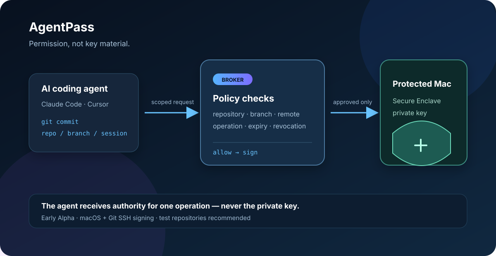

# AgentPass

[English](README.md) · **日本語**

> AIエージェントに秘密鍵を渡さず、許可したGit操作だけを実行させるmacOS向けOSS。


## これは何？

Claude Code、CursorなどのAIコーディングエージェントへ、SSH秘密鍵や広すぎるGit権限を渡す代わりに、短時間・限定範囲の「権限」だけを与えるローカルポリシーブローカーです。

## 誰向け？

- AIにコミットや開発作業を任せたい開発者
- バイブコーディングで秘密鍵をAIに渡したくない人
- リポジトリ、ブランチ、操作、期限を制限したいチーム
- 無人の開発自動化に失効可能な権限を使いたい人

## 解決する課題

- AIエージェントに秘密鍵を直接渡してしまう
- AIが意図せず別リポジトリや本番ブランチを操作する
- 無人実行のために権限を広く開けてしまう
- 何を許可し、何を拒否したか追跡できない

AgentPassでは、秘密鍵はMac側に残り、エージェントはポリシー検査済みの署名要求だけを送ります。

<p align="center"><a href="#クイックスタート">まずローカルで試す →</a></p>

### 権限境界のしくみ



## Small Software Cloud（Early Alpha）

Claude CodeやCursorで、自分専用CRM、社内workflow、dashboard、顧客専用ツールを数分で作れるようになりました。AgentPassは、その後に残るdeploy・権限・共有の境界を扱います。プロジェクトを検査し、source bundleとpublish planを作り、資格情報をエージェントへ渡さずに共有できます。

```sh
agentpass small-software inspect
agentpass small-software bundle
agentpass small-software prepare
agentpass small-software publish --plan-only
```

現在のOSS経路は意図的にplan-onlyです。実Cloudflare/GitHub/PostgreSQLの資格確認と本番証跡は別の外部ゲートです。詳細は [Small Software CLI](docs/SMALL_SOFTWARE_CLI.md)、[Cloud spec](docs/SMALL_SOFTWARE_CLOUD_SPEC.md)、[Self-Maintaining API PR workflow](docs/runbooks/SELF_MAINTAINING_API_PR_WORKFLOW.md)、[Product Hunt Early Alpha launch guide](docs/PRODUCT_HUNT_EARLY_ALPHA_LAUNCH.md) を参照してください。

## クイックスタート

```sh
git clone https://github.com/Torutesu/AIagentpass.git
cd AIagentpass
npm install
npm link
agentpass init
agentpass check
agentpass doctor
```

macOSの保護鍵とBrokerを初期化します。

```sh
agentpass setup-macos
agentpass broker install
agentpass broker ping
```

Claude CodeまたはCursor連携は任意です。

```sh
agentpass integrate claude-code --install
agentpass integrate cursor --install
```

## 現在のステータス

AgentPassは **Early Alpha** です。現在の中心機能はmacOS上のGit SSH署名です。まずテスト用リポジトリで評価してください。重要な本番鍵、本番リポジトリ、無検証の配布PKGには使用しないでください。

本番資格確認やHosted運用の選択肢は、[Hosted deployment options](docs/HOSTED_DEPLOYMENT_OPTIONS.md) と英語READMEにまとめています。

## セキュリティモデル

- 秘密鍵はエージェントに渡さない
- リポジトリ、ブランチ、リモート、操作、期限、失効状態を検査する
- Broker停止時は署名を許可しない
- AgentPassはローカルMacのマルウェア耐性を保証しない

詳細は [THREAT_MODEL.md](THREAT_MODEL.md) と [DETAILED_DESIGN.md](docs/DETAILED_DESIGN.md) を読んでください。

## コントリビュート

Issue、改善提案、ドキュメント修正を歓迎します。セキュリティ問題は公開Issueではなく [SECURITY.md](SECURITY.md) の手順で報告してください。

## License

MIT
