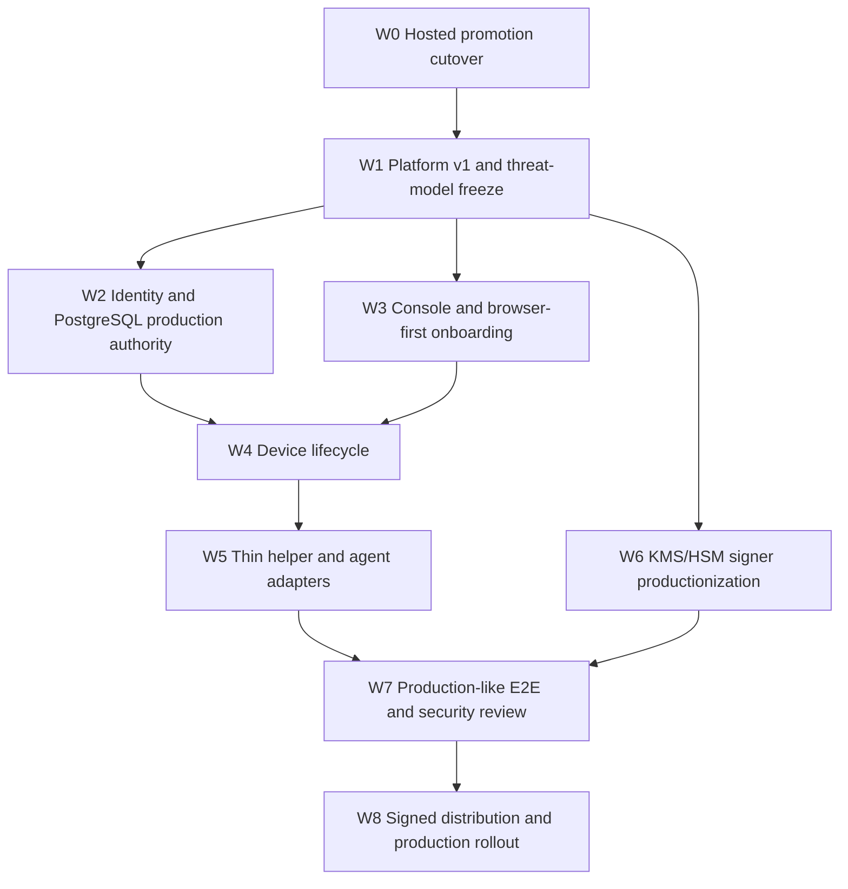

# AgentPass execution plan

Status: active
Baseline commit: `6b2f7f1`
Branch: `codex/agent-platform`
Updated: 2026-08-15

This document turns `IMPLEMENTATION_ROADMAP.md` into an ordered implementation backlog. The roadmap defines the product and release gates; this plan defines what is built next, which work may run in parallel, and the evidence required to close each work item.

## 1. Current checkpoint

Completed at the baseline:

- PostgreSQL migrations through 0056, including server-side Platform Session
  bootstrap and atomic identity/session epoch invalidation.
- Frozen Platform v1 challenge/assertion/revoke contract and browser-safe public promotion intent.
- Hosted composition of Platform Session bootstrap, WebAuthn ceremony, repository, HTTP boundary, and readiness.
- Atomic PostgreSQL adapter that consumes a Platform authorization proof and reserves a promotion in one transaction.
- Platform promotion issue-only HTTP boundary, strict request parser, rate limiter, frozen schemas/OpenAPI/fixtures, and adversarial tests.
- PostgreSQL runtime exposure of the authorized promotion repository when lifecycle metadata is complete.
- Stable SQLSTATE/constraint-based authorization failure classification without propagating PostgreSQL messages or causes.
- Hosted runtime composition of the authorized service, issue-only HTTP API, shared Platform limiter, dynamic signer/lifecycle readiness, and in-flight drain tracking.
- Raw route dispatch before Human/Device authentication, with legacy hosted issue/replay composition removed and downgrade tests green.
- Lost commit responses reconcile through the same authenticated atomic reservation function without a public replay/get surface or second signature.
- Contract catalog, authority manifest, migration qualification, lint, and focused Platform Session tests at the generated current migration head.
- Deterministic PostgreSQL 17 qualification lanes for Platform authorization
  concurrency, rollback/failure convergence, and the app/signer least-privilege
  boundary, plus source-bound CI evidence generation and retention.
- Frozen hosted/evaluation/development route-authority matrix, synchronized
  Platform OpenAPI/schema/fixture/digest validation, downgrade guards, and a
  threat-to-test/external-evidence ledger.
- Frozen Hosted GitHub identity/first-organization/WebAuthn bootstrap v1
  contract with a dedicated validator and CI gate.
- One generated PostgreSQL schema-head authority consumed by readiness,
  authority manifests, privilege qualification, and evidence writers.

Not completed at the baseline:

- The previous PostgreSQL 16/17 CI run exposed excessive app-role DML on
  `platform_*` tables. The role reconciliation is fixed locally and the
  privilege checker now emits safe failed-check names, but a successful
  external artifact for the new immutable candidate is not yet retained.
- Console onboarding, managed infrastructure, physical-Mac qualification, notarized distribution, independent review, and production deployment remain open.

The immediate release blocker is now real PostgreSQL race, rollback, tenant,
and least-privilege qualification for the cut-over route. UI expansion must not
create another authority path before that evidence closes W0.

## 2. Execution rules

1. PostgreSQL is the authority for tenant membership, assignment, generation, credential eligibility, proof state, idempotency, and reservation.
2. Browser bodies contain public intent only. Authority identifiers are derived server-side.
3. Platform Session, Human Session, and Device authentication are distinct transports and may not fall through to one another.
4. The production issue path has one mutation route. Legacy issue/replay paths are absent in hosted mode until an equally strong authenticated replay contract exists.
5. Every security-sensitive work item lands with negative tests and a fail-closed configuration test.
6. A work item is complete only when implementation, focused tests, contract/catalog changes, and operational evidence agree.
7. External evidence is tracked separately from code completion; mocks do not satisfy managed PostgreSQL, KMS/HSM, WebAuthn browser, or physical-Mac gates.

## 3. Critical path



W2 and W3 may run in parallel after W1. W4 and W6 may run in parallel. W7 starts only when the same immutable candidate contains the completed browser, database, device, native, and signer boundaries.

## 4. Wave W0 — hosted promotion cutover

Target: close P0/PS-03 through PS-05 without preserving the old hosted bypass.

### W0-00 Harden the existing Platform Session boundary

Status: implemented and focused-validated on 2026-08-15. Managed PostgreSQL
contention evidence remains part of W0-05.

Change scope:

- `apps/cloud-api/src/platform-session-http-api.mjs`
- `apps/cloud-api/test/platform-session-http-api.test.mjs`
- `contracts/schemas/platform-session-response-v1.schema.json`
- `contracts/openapi/platform-v1.json`

Required behavior:

- Challenge and assertion reject any Platform Session cookie, including one that is otherwise valid; challenge accepts only the Human Session bootstrap namespace and assertion depends only on its durable challenge.
- Revoke accepts only the Platform Session cookie plus Platform CSRF namespace.
- Challenge, assertion, and revoke receive dedicated, fail-closed admission/rate limiting with bounded keys and `Retry-After`; direct dispatch before generic routes must not mean unlimited access.
- Session JSON is reduced to the minimum browser state (`session_id`, operation/capability, timestamps, status). `principal_id`, `assignment_id`, authority generation, credential IDs, and request digest remain server-side.

Acceptance:

- Valid, invalid, and duplicate Platform cookies are rejected on challenge/assertion; the same valid cookie is accepted only for revoke/authorized issue with matching CSRF.
- Limiter failure denies the request, and high-cardinality attacker input cannot manufacture unlimited buckets.
- OpenAPI, response schema, fixtures, implementation projection, and redaction tests agree.

### W0-01 Freeze promotion proof transport

Status: implemented and focused-validated on 2026-08-15.

Change scope:

- `contracts/openapi/platform-v1.json`
- new or existing Platform promotion request/result schemas and fixtures under `contracts/`
- `contracts/catalog-v1.json`
- `apps/cloud-api/src/platform-promotion-http-contract.mjs`

Decisions to encode:

- `POST /api/platform/v1/promotions` is issue-only.
- Authentication is the `__Host-agentpass_platform_session` cookie.
- CSRF uses `agentpass-platform-csrf`.
- Proof ID is the completed challenge ID unless the SQL/repository contract requires a separately named identifier; the public contract must use one name consistently.
- The raw one-use JTI is transported in one dedicated header, never a URL, cookie, log field, or response after consumption.
- `Idempotency-Key` remains transport metadata and participates in the canonical request digest.
- Organization is bound to the session/proof. If it remains in public intent for challenge binding, issue must compare it to trusted state rather than treat it as authority.
- The response contains only safe promotion state/evidence metadata; it excludes cookie, CSRF, proof, JTI, claim token, raw signer response, and authority internals.

Acceptance:

- Unknown and duplicate fields, duplicate security headers, query strings, wrong content type, oversized body, ambiguous cookies, and forbidden authority headers are rejected.
- OpenAPI, schemas, fixtures, catalog, JavaScript digest vectors, and PostgreSQL digest vectors agree byte-for-byte.
- No replay/get endpoint is documented.

### W0-02 Implement the promotion HTTP boundary

Status: implemented and focused-validated on 2026-08-15. Hosted runtime
composition and legacy route retirement remain W0-03/W0-04.

Change scope:

- new `apps/cloud-api/src/platform-promotion-http-api.mjs`
- focused tests under `apps/cloud-api/test/`

Required behavior:

- Parse the raw Node request at the boundary and own cookie/header/body normalization.
- Require exact Origin, Platform Session cookie, matching CSRF, proof, JTI, and idempotency metadata.
- Hash cookie material before the repository/service boundary.
- Pass one exact object to `issuePlatformPromotion`; never accept member, principal, role, assignment, authority generation, or credential IDs from the caller.
- Map replay, conflict, in-progress, uncertain, stale lifecycle, signer failure, and database failure to stable retry-safe errors.
- Apply no-store/nosniff headers and a bounded admission/rate-limit policy.

Acceptance:

- Happy-path unit test proves the raw bearer is not passed to SQL.
- Negative matrix covers wrong/missing Origin, cookie, CSRF, proof/JTI, digest, tenant, expiry, revocation, and concurrent replay.
- Redaction test scans serialized responses and captured logs for all sensitive values.

### W0-03 Compose the atomic service

Status: implemented and focused-validated in `fa8f87e`. Managed PostgreSQL
contention evidence remains W0-05.

Change scope:

- `apps/cloud-api/src/postgres/index.mjs`
- `apps/cloud-api/src/runtime.mjs`
- hosted runtime tests

Required behavior:

- Construct `createPostgresPlatformAuthorizationRepository` with the durable promotion repository and lifecycle metadata.
- Construct `createPlatformAuthorizedPromotionService` with the purpose-bound signer and public-key resolver.
- Construct the new HTTP API only when Platform Session, PostgreSQL authority, signer lifecycle, and rate limiting are all available.
- Include this dependency in hosted readiness and graceful in-flight draining.
- Reject injected development repositories/verifiers in hosted production where they could replace PostgreSQL authority.

Acceptance:

- Hosted startup fails closed for every missing dependency.
- Evaluation/local profile remains explicitly separate and cannot accidentally advertise hosted readiness.
- The composed service calls only the 0054 atomic reservation function for online issue.

### W0-04 Remove the hosted legacy bypass

Status: implemented and focused-validated in `e2f8ee5` and `fa8f87e`. The five
previous attack-test failures are green, and runtime downgrade guards reject
legacy hosted composition.

Change scope:

- `apps/cloud-api/src/server.mjs`
- `apps/cloud-api/src/runtime.mjs`
- routing/composition tests
- compatibility documentation

Required behavior:

- Route `/api/platform/v1/promotions` directly to the Platform promotion HTTP boundary before generic Cloud/Human authentication.
- Do not compose legacy `platformPromotionIssuanceService + platformOperatorAuthorizer` in hosted mode.
- Return 404 or a documented retirement response for legacy issue/replay paths in hosted mode.
- Keep any evaluation-only legacy behavior behind an explicit non-hosted profile with tests proving the profiles cannot be confused.

Acceptance:

- A Human Session plus recent-auth cannot issue a promotion in hosted mode.
- A Platform Session request cannot fall through to generic Human or Device authentication.
- Legacy replay/get is not publicly exposed.

### W0-05 Real PostgreSQL race qualification

Status: qualification implementation and CI evidence pipeline complete on
2026-08-15. Local unit/contract coverage is green; this workstation has no
reachable PostgreSQL server, so a successful PostgreSQL 17 CI artifact for the
current source commit is still required to close W0.

Required scenarios:

- Two identical concurrent issues produce one durable reservation/outcome.
- Same idempotency key with different intent conflicts.
- Same proof/JTI with a second idempotency key is denied.
- Wrong organization, stale generation, revoked assignment/session/credential, expired proof, and CSRF mismatch are denied.
- Transaction abort before and after reservation converges to an explicit retry-safe or uncertain state without a second signature.
- Least-privilege application role cannot directly mutate proof/session/reservation tables.

Exit command set:

```sh
npm run contracts:validate
npm run lint
node --test apps/cloud-api/test/*platform-session*.test.mjs apps/cloud-api/test/*platform-promotion*.test.mjs
node --test --test-concurrency=1 apps/cloud-api/test/postgres/*platform*.integration.test.mjs
git diff --check
```

W0 exit gate: the hosted production issue route is atomic and Platform-Session-only, focused suites pass, and real PostgreSQL evidence is retained.

## 5. Wave W1 — contract and threat-model freeze

### W1-01 Contract completeness

- Finish versioned schemas/fixtures for session challenge, assertion, revoke, promotion issue/result, and errors.
- Add compatibility rules: additive fields, version negotiation, unknown-field rejection, cookie/header changes, and no-downgrade policy.
- Pin implementation references and authority owners in the contract catalog.

### W1-02 Threat model update

- Model browser compromise, CSRF, malicious extensions, stolen Human/Platform sessions, proof replay, confused deputy, tenant substitution, helper impersonation, local malware, KMS uncertainty, and supply-chain compromise.
- Record trust boundaries and explicit mitigations in `docs/`/security material.
- Add abuse cases as tests or tracked external-review scenarios.

### W1-03 Legacy retirement policy

- Define hosted, evaluation, and development profiles.
- Document route availability by profile and version.
- Add CI tests that fail if a retired hosted route reappears.

W1 exit gate: schemas, OpenAPI, catalog, threat model, and compatibility matrix are reviewed as one boundary.

## 6. Wave W2 — identity and PostgreSQL authority

Parallel lanes after W1:

### Lane W2-A: identity/session authority

1. Decide and freeze the hosted initial identity contract: supported identity provider(s), first-user bootstrap, organization creation, and whether WebAuthn can be used for subsequent sign-in. The current Console-specific ChatGPT identity path is not automatically the hosted product identity contract.
2. Session epoch invalidation for membership removal, role downgrade, credential revoke, recovery transition, and organization security events.
3. WebAuthn credential register, authenticate, rename, revoke, clone/sign-count handling, last-credential protection, recovery re-enrollment, and recent-auth operation binding.
4. Organization/role matrix for owner, admin, auditor, viewer, plus a separate platform-operator namespace.
5. Tenant-bound immutable audit records for all high-risk changes.

Acceptance: concurrent stale requests fail; no caller-supplied role/member/org becomes authority; browser role matrix and SQL race tests pass.

### Lane W2-B: managed PostgreSQL profile

1. Eliminate schema-head drift: regenerate `scripts/postgres/authority-manifest.v1.json` at head 55 and update or remove the stale `EXPECTED_POSTGRES_SCHEMA_VERSION = 41` default in `apps/cloud-api/src/postgres/operational-health.mjs`; add a head-consistency test.
2. TLS verification, least-privilege roles, pool size, statement/lock timeout, transaction retry, graceful drain.
3. Fresh install, every-head upgrade, checksum drift, dirty/interrupted migration, concurrent migration, and privilege-negative tests.
4. Index/query-plan review for session, challenge, proof, idempotency, activity, audit, device refresh, and ACK paths.
5. Encrypted backup/PITR, isolated restore drill, invariant comparison, and recorded RTO/RPO.

Acceptance: readiness stays false for wrong schema/role/TLS/signer state; managed-service evidence and restore report are retained.

## 7. Wave W3 — Console and browser-first onboarding

Implementation order:

1. Replace sample/presentation state with typed Cloud API clients and a single authenticated BFF/session model.
2. Build the onboarding state machine: sign in → organization → WebAuthn → device enrollment → helper handoff → Agent Session policy/scope/TTL → Claude Code or Cursor setup → signed-commit verification.
3. Complete Dashboard, Devices, Agent Setup, Activity, and Security pages with loading, empty, stale, revoked, unauthorized, and failure states.
4. Add safe recovery and credential lifecycle UX with recent WebAuthn confirmation for high-risk actions.
5. Add deployed-like Playwright coverage for roles, CSRF/origin, cross-tenant denial, storage inspection, keyboard navigation, labels, and responsive layouts.

Browser acceptance:

- No bearer, proof, JTI, assertion, private key, or reusable agent secret appears in local/session storage, URL, rendered HTML, analytics, or captured logs.
- A new user completes normal onboarding without opening a native app window.
- The only platform-specific UI step is installing/starting the thin helper and returning a possession/enrollment result.
- The production profile never renders the one-time enrollment credential in the DOM. Any manual-secret fallback is removed or isolated behind an explicit non-production recovery profile and covered by secret-leakage tests.
- The Agent Session screen exposes scope and expiry, not a long-lived token, and issuance/revoke produce durable audit activity.

## 8. Wave W4 — Device API lifecycle

1. Close one-time enrollment issue/complete and possession proof against durable PostgreSQL.
2. Deliver signed ControlBundle with monotonic sequence/epoch and reject old, future, reordered, or substituted bundles.
3. Persist signed ACKs; implement retry, reconnect, manual wake, and bounded refresh propagation.
4. Implement revoke and organization-security invalidation through to the helper.
5. Specify the offline/restart state machine for expiry, clock skew, process death, stale authority, and reconnect.

Exit evidence: real helper over TLS; restart/reorder/replay tests; measured revoke bound; no private material in payloads or telemetry.

## 9. Wave W5 — thin helper and coding-agent adapters

### W5-01 Local protocol

- Versioned request ID, grant/lease, repository/worktree/branch, process evidence, single-sign transaction, error taxonomy, and audit correlation.
- Local transport permissions and peer/process authentication.
- Replace the current intentional `signGitCommit` unavailable response in `native/macos/Sources/AgentPassNativeService/main.swift` only after the complete authorization pipeline is connected: connection revalidation → session/lease lookup → TTL/revoke/signature-count check → live process/ancestry/worktree revalidation → atomic signing reservation → Git namespace signing → durable audit → safe response.

### W5-02 Hardware-backed key lifecycle

- Secure Enclave/TPM non-exportable generation and signing.
- Public key/fingerprint exposure only.
- Rotate/revoke, uninstall-preserve, reinstall, and separately confirmed purge.
- Explicit unsupported-hardware denial; no production software fallback.

### W5-03 Process binding

- Bind executable identity, PID/parent/ancestry evidence where reliable, configured agent identity, repository/worktree/branch, organization/device/session, operation, and TTL.
- Deny replay, process substitution, wrong repository/branch, expired/revoked grant, and helper restart without fresh authority.

### W5-04 Claude Code and Cursor

- Use the common helper/session contract for both adapters.
- Keep reusable secrets out of argv, environment, stdin, config files, repositories, and logs.
- Qualify two unattended signed commits per adapter, followed by revoke and a blocked next commit.
- Treat existing release-qualification scenarios as evidence harnesses, not production adapters; fixed paths, qualification clients, privileged execution, and unsafe agent flags may not leak into shipped configuration.

Exit evidence: physical Apple Silicon plus Intel/T2 where claimed supported, Git signature verification, crash/restart tests, and secret scans.

## 10. Wave W6 — KMS/HSM cloud signers

1. Map each of the eight signing purposes to an explicit provider key ID/version and IAM role.
2. Extend dynamic hosted readiness from the currently checked four purposes to all eight: Agent Session, qualification manifest, possession receipt, refresh hint, capability, ControlBundle, audit anchor, and promotion evidence.
3. Decide whether first lifecycle registration is an operator/migrator provisioning action or an application-startup action; encode the authority rule and a privilege-negative test.
4. Make hosted startup/readiness reject file-backed/development signers and purpose/key/fingerprint/version mismatches.
5. Implement rotation with dual-read verification, issuance cutover, retention window, fencing, and retirement.
6. Handle timeout, throttling, duplicate request, stale lifecycle, and uncertain provider result without unsafe retry.
7. Retain safe provider operation receipts and reconcile uncertain operations across at least two API instances.

Exit evidence: real sandbox provider tests, key-version substitution denial, outage/rotation/reconciliation drills, and IAM review.

## 11. Wave W7 — production-like E2E and security review

One immutable candidate must pass:

1. Account → organization → WebAuthn → device → helper → Claude Code/Cursor → two commits → Console activity → revoke → blocked third commit.
2. Cross-tenant, CSRF/origin, replay, stale epoch, process substitution, wrong repo/branch, signer uncertainty, DB failover, helper kill/restart, and migration interruption scenarios.
3. Parser fuzzing, dependency/SBOM review, secret scan, log/trace redaction review, and audit-chain verification.
4. Independent review of threat model, code, deployment, IAM, TLS, key management, native boundary, and release pipeline.

Exit rule: all critical/high findings are fixed and re-tested, or explicitly accepted by the named security owner with scope and expiry.

## 12. Wave W8 — distribution and production rollout

1. Build universal CLI/helper package and generate SBOM/manifest/provenance.
2. Developer ID sign and notarize; independently verify stapling, signatures, entitlements, package scripts, and bundled hashes.
3. Test clean install, upgrade, rollback, uninstall-preserve, reinstall, and separately confirmed purge without Xcode.
4. Add missing deployable infrastructure for Console, Cloud API, workers, PostgreSQL references, KMS references, secrets, DNS/TLS, migration jobs, readiness, and rollback. GitHub Release publication alone is not production deployment.
5. Deploy immutable Console/API artifacts with migration gate, canary, readiness, drain, rollback, alerts, and retained evidence.
6. Connect full-product alerts/SLOs/on-call for signer, database, refresh/ACK lag, revoke propagation, helper crashes, backup/PITR, and authorization anomalies; existing recovery-focused alerts are insufficient.
7. Perform PITR restore and incident drills before general availability.

Production exit: release Gates A–E in `IMPLEMENTATION_ROADMAP.md` pass for the same source commit and artifact digests.

## 13. Parallel work allocation

After W0/W1, maintain these independent lanes:

| Lane | Scope | Blocks |
| --- | --- | --- |
| Authority | identity epochs, roles, WebAuthn, PostgreSQL controls | Console high-risk actions, Device authority |
| Console | BFF/client, onboarding, pages, browser E2E | Product journey |
| Device/native | enrollment, bundles, ACK, helper protocol, hardware key | Real agent signing |
| Signer/ops | KMS lifecycle, telemetry, alerts, backup/restore | Hosted readiness |
| Security/evidence | negative matrix, threat model, fuzzing, evidence bundle | Every release gate |

Each lane owns a disjoint file set within an implementation wave. Shared schemas and migration contracts are merged first; downstream lanes rebase on that frozen contract rather than editing it concurrently.

## 14. Next pull requests

Completed sequence:

1. **PR-0: Platform Session transport hardening** — `f52dbe1`.
2. **PR-1: Platform promotion v1 contract and HTTP boundary** — `b13145d` and `fe9d251`.
3. **PR-2: Cutover attack tests and PostgreSQL authorization runtime seam** — `b745d99`, `a8ece5a`, and `e0c6c02`.
4. **PR-3: Hosted atomic composition, route cutover, and commit reconciliation** — `c90301b`, `e2f8ee5`, `acf4952`, and `fa8f87e`.

Next sequence:

1. **PR-4: PostgreSQL race qualification** — W0-05 with real database contention, tenant-negative, privilege-negative, rollback, and lost-response cases retained as evidence.
2. **PR-5: Contract/threat freeze** — W1 compatibility matrix, threat model, route inventory, and CI no-downgrade guard.
3. **PR-6: Identity epoch and schema-head consistency** — begin W2-A/W2-B with session invalidation and one authoritative migration-head source.
4. **PR-7: Console production-client cutover** — begin W3 only after PR-5 freezes the browser boundary.
5. **PR-8: Device enrollment/ACK closure** — complete durable enrollment, bundle, refresh, ACK, and revoke propagation.
6. **PR-9: Thin helper protocol and process binding** — freeze the local boundary before enabling production Git signing.

PR-4 is the immediate critical path. Contract/threat documentation may proceed
in parallel, but W0 does not close until the same candidate has real PostgreSQL
evidence.

## 15. External prerequisites

The following must be provisioned before their gates can close:

- Managed PostgreSQL staging instance with enforced TLS, backup/PITR, and least-privilege application/migration roles.
- Sandbox and production KMS/HSM projects with purpose-separated keys and IAM owners.
- Stable HTTPS Console/API origins and WebAuthn RP ID.
- Apple Developer Program team, Developer ID Installer/Application certificates, notarization credentials, and clean test Macs.
- Physical supported Macs for Apple Silicon and Intel/T2 claims.
- Independent security reviewer and a named internal risk-acceptance owner.
- Monitoring/alert destinations, on-call owner, incident channel, and evidence retention location.

Lack of an external prerequisite does not block local implementation, but the affected release gate remains open and must be reported as such.

## 16. Progress reporting

For every implementation wave, report:

- commit and changed trust boundary;
- completed work-item IDs;
- exact tests run and pass/skip/fail counts;
- checks not runnable locally and why;
- remaining security risks and external evidence;
- next unblocked work item.

Do not report the product as complete until all five release gates pass on one immutable candidate.

## 17. Exact execution backlog from `fa8f87e`

This section is the implementation handoff order. A later item may start in
parallel only when its write set is disjoint and it does not assume an unfrozen
contract from an earlier item.

### Slice S0 — close the hosted promotion boundary

Status: implementation and focused validation complete. The six items below
are retained as regression requirements; S1 supplies the external database
evidence needed to close W0.

| ID | Change | Primary files | Completion evidence |
| --- | --- | --- | --- |
| S0-01 | Replace the authorized service's internal lost-commit placeholder with scoped re-entry through `reservePlatformPromotion`; never expose replay/get publicly. | `apps/cloud-api/src/postgres/platform-authorization-repository.mjs` and focused test | Lost commit response returns the durable committed result, signs once, and repeats the exact authenticated atomic request. |
| S0-02 | Map the new repository error taxonomy to stable HTTP statuses/codes. Keep conflict/replay/stale/authorization unavailable/database unavailable distinguishable only to the degree needed for safe retry. | `apps/cloud-api/src/platform-promotion-http-api.mjs` and adversarial test | No SQL text/cause/secret is serialized; status and retry behavior are deterministic. |
| S0-03 | Construct the authorized service and promotion HTTP API from PostgreSQL repository, promotion signer/resolver, Platform Session limiter, and exact hosted origin. | `apps/cloud-api/src/runtime.mjs` and runtime tests | Every missing dependency fails startup/readiness; hosted overrides cannot substitute development authority. |
| S0-04 | Add `platformPromotionHttpApi` validation and raw-path dispatch before generic Human/Device auth. | `apps/cloud-api/src/server.mjs` and routing attack test | New path reaches only the new handler; no injection returns 404; no fallthrough occurs. |
| S0-05 | Stop composing the legacy promotion service/authorizer in hosted mode; preserve it only in an explicit evaluation profile. | `apps/cloud-api/src/runtime.mjs`, server/runtime tests, compatibility docs | Human Session cannot issue/replay in hosted mode; legacy routes are absent; evaluation behavior is opt-in and tested. |
| S0-06 | Extend readiness and in-flight drain to the complete promotion boundary. | runtime/readiness modules and tests | `/ready` is false for missing DB/session/signer/limiter/route dependencies and becomes false during drain. |

Merge gate for S0: all five tests in
`server-platform-promotion-http-routing-attack.test.mjs` and
`platform-promotion-hosted-composition-attack.test.mjs` turn green, existing
Platform Session/promotion suites remain green, and hosted route inventory has
exactly one promotion mutation path.

### Slice S1 — real PostgreSQL authority qualification

Status: implemented locally on 2026-08-15; external PostgreSQL 17 CI execution
and retained source-bound evidence remain pending. The application role can
only consume authorization and reserve through migration 0054. Promotion
commit/uncertain finalization is routed through the signer pool and those are
the only legacy promotion functions granted to the signer role.

1. Build a deterministic fixture at the generated current migration head with two organizations,
   active and stale assignments, two credentials, one revoked session, and
   least-privilege application/migration roles.
2. Execute identical requests concurrently from separate pool connections;
   assert one signature/provider operation and one durable promotion result.
3. Exercise idempotency conflict, proof/JTI reuse, CSRF mismatch, tenant
   substitution, credential/session/assignment revoke, stale generation,
   expiry, and signer lifecycle change.
4. Inject rollback before reservation, lost response after commit, database
   disconnect, serialization failure, and signer uncertainty; prove each state
   converges without a second signature.
5. Run privilege-negative SQL showing the application role cannot mutate
   session/proof/reservation tables or call legacy mutation functions directly.
6. Save sanitized test output, PostgreSQL version, role, migration checksums,
   source commit, and fixture digest under the release-evidence convention.

S1 exit: W0 closes only when the same candidate passes unit/contract/HTTP tests
and the real PostgreSQL evidence above.

### Slice S2 — freeze contracts and the threat model

Status: local implementation and focused validation complete on 2026-08-15.
The frozen route/profile matrix, contract synchronization validator, hosted
downgrade tests, and Platform threat evidence ledger are committed. External
browser, physical-device, cloud-provider, supply-chain, and production
topology artifacts remain release gates rather than local-test claims.

1. Publish a route/profile matrix for hosted, evaluation, and development.
2. Add CI assertions that the hosted legacy routes cannot reappear and that
   OpenAPI, catalog, schemas, fixtures, digest vectors, and implementation paths
   remain synchronized.
3. Define additive versus breaking changes, explicit version negotiation,
   cookie/header migration rules, and downgrade rejection.
4. Update the threat model for browser compromise, malicious extensions,
   stolen sessions, confused deputy, proof replay, tenant substitution, local
   malware, signer uncertainty, database rollback, and supply-chain compromise.
5. Convert every locally testable abuse case into a negative test and track
   physical/cloud-only cases in the release evidence matrix.

### Slice S3 — identity and managed PostgreSQL in parallel

Status: first foundation increment implemented locally on 2026-08-15. Migration
0056, schema-head derivation, Hosted identity/bootstrap v1 contract, CI contract
gate, and focused tests are green. Real PostgreSQL application/race tests for
0056 and the 0057 Hosted bootstrap implementation remain next.

Identity lane:

1. Freeze the hosted identity provider and first-organization bootstrap flow.
2. Implement one epoch-invalidation primitive used by membership removal, role
   downgrade, credential revoke, recovery transition, and organization security
   events.
3. Finish WebAuthn register/authenticate/rename/revoke/clone handling and
   last-credential/recovery safeguards.
4. Enforce owner/admin/auditor/viewer permissions in PostgreSQL-backed services;
   keep platform operator as a separate authority namespace.
5. Emit immutable tenant-bound audit events for every high-risk mutation.

Database lane:

1. Replace hard-coded schema-head expectations with one generated authoritative
   value and test manifest/migration/readiness agreement.
2. Qualify TLS verification, least-privilege roles, pool bounds,
   statement/lock timeouts, transaction retry, and graceful drain.
3. Add fresh-install, every-head upgrade, checksum drift, dirty migration,
   concurrent migration, and privilege-negative tests.
4. Review query plans/indexes for session, proof, idempotency, audit, activity,
   device refresh, and ACK paths.
5. Automate encrypted backup/PITR restore into isolation and compare authority,
   tenant, and audit invariants with recorded RTO/RPO.

### Slice S4 — browser Console and onboarding

1. Inventory every screen and remove sample/local presentation state from the
   production build.
2. Introduce generated/typed API clients and one authenticated BFF/session
   model with safe error projection.
3. Implement the resumable onboarding state machine: identity → organization →
   WebAuthn → device enrollment → helper handoff → Agent Session scope/TTL →
   Claude Code/Cursor setup → signed-commit verification.
4. Complete Dashboard, Devices, Agent Setup, Activity, and Security states for
   loading, empty, stale, revoked, unauthorized, partial failure, and recovery.
5. Add Playwright coverage for roles, CSRF/origin, cross-tenant denial, storage
   inspection, keyboard/screen-reader behavior, and responsive layouts.

S4 exit: a new user completes normal setup in the browser; the native component
has no primary UI and no reusable secret appears in browser storage or DOM.

### Slice S5 — device, helper, and agent adapters

1. Close enrollment issue/complete, possession proof, signed ControlBundle,
   monotonic sequence/epoch, durable ACK, refresh, reconnect, and revoke.
2. Freeze the local helper protocol and peer/process authentication before
   enabling Git signing.
3. Implement Secure Enclave/TPM non-exportable key lifecycle, explicit unsupported
   hardware denial, preserve-by-default uninstall, and separately confirmed purge.
4. Bind grants to executable/process ancestry where reliable, repository,
   worktree, branch, operation, signature count, TTL, organization, device, and
   session; revalidate immediately before signing.
5. Ship Claude Code and Cursor adapters over the same local protocol and prove
   two unattended signed commits followed by revoke and a blocked third commit.

### Slice S6 — signer, operations, release, and production

1. Require purpose-separated managed KMS/HSM keys for all eight signing
   purposes; reject file/development signers in hosted readiness.
2. Implement exact key-version lifecycle, dual-read rotation, timeout/throttle/
   duplicate/uncertain reconciliation, and provider-operation fencing.
3. Add redacted structured logs, metrics, traces, alerts, SLOs, incident owners,
   backup/recovery and signer/revoke runbooks.
4. Run the complete production-like journey on managed PostgreSQL, HTTPS,
   sandbox KMS/HSM, deployed Console/API, real browser, CLI/helper, and physical
   supported Macs.
5. Complete independent security review and close or explicitly accept every
   critical/high finding with owner and expiry.
6. Produce universal signed/notarized packages, verify install/upgrade/rollback/
   uninstall/reinstall/purge on clean Macs, and deploy immutable artifacts using
   migration gate, canary, readiness, drain, rollback, and retained evidence.

Final completion means S0–S6 and release Gates A–E pass on the same source
commit, schema set, migration checksums, signer key metadata, and artifact
digests. Passing local mocks alone never satisfies this definition.

## 18. Detailed implementation sequence after the S3 foundation push

This is the ordered backlog for the next implementation run. A pull request may
contain multiple steps, but each gate must remain independently testable and
revertible.

### P1 — qualify and stabilize migration 0056

1. Apply 0001–0056 on clean PostgreSQL 16 and 17 databases, then upgrade seeded
   0024, 0025, 0052, 0053, 0054, and 0055 databases to head.
2. Add real-DB tests for role downgrade/removal, membership deletion, Human and
   Platform credential revoke, owner-recovery transitions, and organization
   revocation. Assert epoch advancement, session/recent-auth/challenge revoke,
   capability revoke, tenant isolation, and transaction rollback atomically.
3. Test concurrent invalidations in the documented advisory-lock order and
   prove no deadlock, lost increment, cross-tenant mutation, or caller timestamp
   authority.
4. Re-run reconciled app/signer/migrator/backup role checks. Retain PostgreSQL
   version, source SHA, migration checksums, failed-check-free privilege report,
   and sanitized race results as CI artifacts.

Gate: PostgreSQL 16/17 qualification and the main CI job pass for one SHA; no
0056 runtime route is enabled before this evidence exists.

### P2 — implement migration 0057 and Hosted identity authority

1. Add durable OAuth attempts containing only hashed state/code selectors,
   PKCE binding metadata, exact redirect binding, expiry, consume state, and
   bounded failure counters. Never persist or log the GitHub access token.
2. Add bootstrap attempts, first-organization idempotency ledger, CSRF hash,
   state/version, server-derived member/organization bindings, and a one-use
   WebAuthn registration challenge binding.
3. Implement the GitHub adapter: authorization redirect, callback state/PKCE
   verification, server-side code exchange, server-side `/user` lookup, numeric
   subject normalization, timeout/rate-limit handling, and stable redacted
   errors. Keep the provider behind a narrow testable interface.
4. Implement one PostgreSQL transaction for immutable upstream identity bind,
   member creation/reuse, zero-membership proof, first organization plus owner
   membership, and exact idempotent replay. Revoked membership history must
   return `no_membership`, not create a new owner organization.
5. Implement bootstrap status, WebAuthn options/verify, bootstrap-cookie rotation,
   ordinary Human Session issuance only after verified WebAuthn, and terminal
   attempt cleanup.
6. Add HTTP/OpenAPI/schema/catalog fixtures and negative tests for caller role,
   member/org injection, OAuth replay, wrong redirect/state/PKCE, duplicate
   callback, cross-attempt WebAuthn, CSRF/origin, stale epoch, and concurrency.

Gate: the six frozen routes match the v1 contract exactly; no ChatGPT ambient
identity or legacy signed-console assertion is accepted as Hosted authority.

### P3 — Organization, role, session, and WebAuthn completion

1. Move owner/admin/auditor/viewer authorization decisions into exact
   PostgreSQL-backed service operations with a deny-by-default matrix.
2. Complete credential authenticate/rename/revoke, clone/sign-count handling,
   last-usable-credential protection, recovery re-enrollment, session listing,
   self/admin revoke, and operation-bound recent authentication.
3. Add immutable, tenant-bound audit events for organization, membership,
   invitation, credential, session, recovery, Platform assignment, and policy
   changes. Every authority reduction invokes 0056 in the same transaction.
4. Add two-connection race tests for last-owner, last-credential, invitation
   acceptance, role downgrade, session revoke, and recovery activation.

Gate: all caller-supplied authority identifiers are ignored or rejected, stale
requests fail, and every high-risk mutation has correlated audit evidence.

### P4 — production Console and browser onboarding

1. Generate typed clients from frozen OpenAPI and introduce one BFF/session
   boundary; remove sample/local production state.
2. Build resumable pages for GitHub sign-in, organization creation, WebAuthn,
   device enrollment, helper handoff, Agent Session scope/TTL, Claude Code and
   Cursor setup, and signed-commit verification.
3. Complete Dashboard, Devices, Agent Setup, Activity, and Security for loading,
   empty, stale, revoked, unauthorized, retryable, terminal, and recovery states.
4. Run deployed-like Playwright tests for all roles, keyboard/screen-reader use,
   responsive layouts, CSRF/origin/cross-tenant denial, and browser storage/DOM/
   URL/network-log secret scans.

Gate: normal onboarding is browser-first; the native component is a thin helper,
not a required desktop UI, and no reusable secret is exposed to the browser.

### P5 — Device API, helper, and cloud signer

1. Close durable enrollment/possession, signed bundle, monotonic ACK, reconnect,
   wake, revoke propagation, and offline/restart state machines.
2. Freeze peer-authenticated local protocol and implement Secure Enclave/TPM
   non-exportable key generation/signing, lifecycle, preserve-by-default
   uninstall, and separately confirmed purge.
3. Bind each Agent Session to device, agent, process evidence, repository,
   worktree, branch, operation, TTL, and signature count; revalidate immediately
   before signing.
4. Implement Claude Code and Cursor adapters without secrets in argv, env,
   stdin, config, repository, or logs.
5. Productionize all eight purpose-separated KMS/HSM signers with exact IAM,
   lifecycle fencing, dual-read rotation, outage/throttle/uncertain-result
   convergence, readiness, and safe receipts.

Gate: each adapter performs two unattended verified commits; revoke blocks the
third within the measured bound; cloud signer uncertainty never double-signs.

### P6 — release evidence and production rollout

1. Run the full journey against managed PostgreSQL, HTTPS Console/API, sandbox
   KMS/HSM, real browsers, the shipped helper, and each claimed physical Mac.
2. Complete dependency/SBOM, parser fuzzing, secret/log/trace review, IAM/TLS/
   backup review, independent security review, and finding closure.
3. Produce universal Developer ID signed/notarized packages and verify clean
   install, upgrade, rollback, uninstall-preserve, reinstall, and purge.
4. Deploy immutable artifacts through migration gate, canary, readiness, drain,
   rollback, alerts, PITR restore drill, incident drill, and retained provenance.

Gate: release Gates A–E pass on the exact same source SHA, schema checksums,
signer metadata, package digests, and deployed artifact digests.
