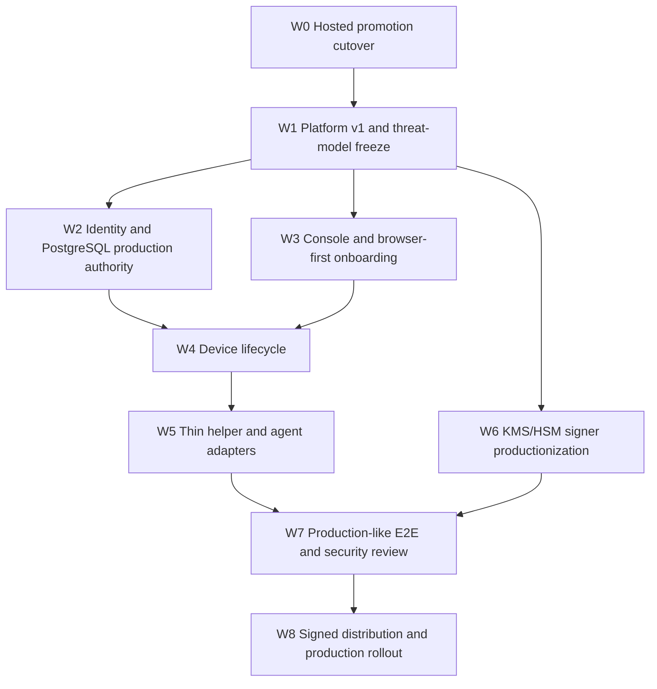

# AgentPass execution plan

Status: active
Baseline commit: `9d82663`
Branch: `codex/agent-platform`
Updated: 2026-08-15

This document turns `IMPLEMENTATION_ROADMAP.md` into an ordered implementation backlog. The roadmap defines the product and release gates; this plan defines what is built next, which work may run in parallel, and the evidence required to close each work item.

## 1. Current checkpoint

Completed at the baseline:

- PostgreSQL migrations through 0055, including server-side Platform Session bootstrap.
- Frozen Platform v1 challenge/assertion/revoke contract and browser-safe public promotion intent.
- Hosted composition of Platform Session bootstrap, WebAuthn ceremony, repository, HTTP boundary, and readiness.
- Atomic PostgreSQL adapter that consumes a Platform authorization proof and reserves a promotion in one transaction.
- Contract catalog, authority manifest, migration qualification, lint, and focused Platform Session tests at migration head 55.

Not completed at the baseline:

- The hosted promotion issue HTTP route still uses the legacy Human Session, recent-auth, platform-operator authorizer, and non-atomic promotion repository.
- The atomic authorized promotion service is not composed into the hosted server.
- The browser contract does not yet freeze the proof transport used by promotion issue.
- A real PostgreSQL contention qualification for the complete HTTP-to-reservation flow has not been retained as release evidence.
- Console onboarding, managed infrastructure, physical-Mac qualification, notarized distribution, independent review, and production deployment remain open.

The immediate release blocker is therefore the hosted promotion route cutover. UI expansion must not create another authority path before this boundary is closed.

## 2. Execution rules

1. PostgreSQL is the authority for tenant membership, assignment, generation, credential eligibility, proof state, idempotency, and reservation.
2. Browser bodies contain public intent only. Authority identifiers are derived server-side.
3. Platform Session, Human Session, and Device authentication are distinct transports and may not fall through to one another.
4. The production issue path has one mutation route. Legacy issue/replay paths are absent in hosted mode until an equally strong authenticated replay contract exists.
5. Every security-sensitive work item lands with negative tests and a fail-closed configuration test.
6. A work item is complete only when implementation, focused tests, contract/catalog changes, and operational evidence agree.
7. External evidence is tracked separately from code completion; mocks do not satisfy managed PostgreSQL, KMS/HSM, WebAuthn browser, or physical-Mac gates.

## 3. Critical path



W2 and W3 may run in parallel after W1. W4 and W6 may run in parallel. W7 starts only when the same immutable candidate contains the completed browser, database, device, native, and signer boundaries.

## 4. Wave W0 — hosted promotion cutover

Target: close P0/PS-03 through PS-05 without preserving the old hosted bypass.

### W0-00 Harden the existing Platform Session boundary

Status: implemented and focused-validated on 2026-08-15. Managed PostgreSQL
contention evidence remains part of W0-05.

Change scope:

- `apps/cloud-api/src/platform-session-http-api.mjs`
- `apps/cloud-api/test/platform-session-http-api.test.mjs`
- `contracts/schemas/platform-session-response-v1.schema.json`
- `contracts/openapi/platform-v1.json`

Required behavior:

- Challenge and assertion reject any Platform Session cookie, including one that is otherwise valid; challenge accepts only the Human Session bootstrap namespace and assertion depends only on its durable challenge.
- Revoke accepts only the Platform Session cookie plus Platform CSRF namespace.
- Challenge, assertion, and revoke receive dedicated, fail-closed admission/rate limiting with bounded keys and `Retry-After`; direct dispatch before generic routes must not mean unlimited access.
- Session JSON is reduced to the minimum browser state (`session_id`, operation/capability, timestamps, status). `principal_id`, `assignment_id`, authority generation, credential IDs, and request digest remain server-side.

Acceptance:

- Valid, invalid, and duplicate Platform cookies are rejected on challenge/assertion; the same valid cookie is accepted only for revoke/authorized issue with matching CSRF.
- Limiter failure denies the request, and high-cardinality attacker input cannot manufacture unlimited buckets.
- OpenAPI, response schema, fixtures, implementation projection, and redaction tests agree.

### W0-01 Freeze promotion proof transport

Change scope:

- `contracts/openapi/platform-v1.json`
- new or existing Platform promotion request/result schemas and fixtures under `contracts/`
- `contracts/catalog-v1.json`
- `apps/cloud-api/src/platform-promotion-http-contract.mjs`

Decisions to encode:

- `POST /api/platform/v1/promotions` is issue-only.
- Authentication is the `__Host-agentpass_platform_session` cookie.
- CSRF uses `agentpass-platform-csrf`.
- Proof ID is the completed challenge ID unless the SQL/repository contract requires a separately named identifier; the public contract must use one name consistently.
- The raw one-use JTI is transported in one dedicated header, never a URL, cookie, log field, or response after consumption.
- `Idempotency-Key` remains transport metadata and participates in the canonical request digest.
- Organization is bound to the session/proof. If it remains in public intent for challenge binding, issue must compare it to trusted state rather than treat it as authority.
- The response contains only safe promotion state/evidence metadata; it excludes cookie, CSRF, proof, JTI, claim token, raw signer response, and authority internals.

Acceptance:

- Unknown and duplicate fields, duplicate security headers, query strings, wrong content type, oversized body, ambiguous cookies, and forbidden authority headers are rejected.
- OpenAPI, schemas, fixtures, catalog, JavaScript digest vectors, and PostgreSQL digest vectors agree byte-for-byte.
- No replay/get endpoint is documented.

### W0-02 Implement the promotion HTTP boundary

Change scope:

- new `apps/cloud-api/src/platform-promotion-http-api.mjs`
- focused tests under `apps/cloud-api/test/`

Required behavior:

- Parse the raw Node request at the boundary and own cookie/header/body normalization.
- Require exact Origin, Platform Session cookie, matching CSRF, proof, JTI, and idempotency metadata.
- Hash cookie material before the repository/service boundary.
- Pass one exact object to `issuePlatformPromotion`; never accept member, principal, role, assignment, authority generation, or credential IDs from the caller.
- Map replay, conflict, in-progress, uncertain, stale lifecycle, signer failure, and database failure to stable retry-safe errors.
- Apply no-store/nosniff headers and a bounded admission/rate-limit policy.

Acceptance:

- Happy-path unit test proves the raw bearer is not passed to SQL.
- Negative matrix covers wrong/missing Origin, cookie, CSRF, proof/JTI, digest, tenant, expiry, revocation, and concurrent replay.
- Redaction test scans serialized responses and captured logs for all sensitive values.

### W0-03 Compose the atomic service

Change scope:

- `apps/cloud-api/src/postgres/index.mjs`
- `apps/cloud-api/src/runtime.mjs`
- hosted runtime tests

Required behavior:

- Construct `createPostgresPlatformAuthorizationRepository` with the durable promotion repository and lifecycle metadata.
- Construct `createPlatformAuthorizedPromotionService` with the purpose-bound signer and public-key resolver.
- Construct the new HTTP API only when Platform Session, PostgreSQL authority, signer lifecycle, and rate limiting are all available.
- Include this dependency in hosted readiness and graceful in-flight draining.
- Reject injected development repositories/verifiers in hosted production where they could replace PostgreSQL authority.

Acceptance:

- Hosted startup fails closed for every missing dependency.
- Evaluation/local profile remains explicitly separate and cannot accidentally advertise hosted readiness.
- The composed service calls only the 0054 atomic reservation function for online issue.

### W0-04 Remove the hosted legacy bypass

Change scope:

- `apps/cloud-api/src/server.mjs`
- `apps/cloud-api/src/runtime.mjs`
- routing/composition tests
- compatibility documentation

Required behavior:

- Route `/api/platform/v1/promotions` directly to the Platform promotion HTTP boundary before generic Cloud/Human authentication.
- Do not compose legacy `platformPromotionIssuanceService + platformOperatorAuthorizer` in hosted mode.
- Return 404 or a documented retirement response for legacy issue/replay paths in hosted mode.
- Keep any evaluation-only legacy behavior behind an explicit non-hosted profile with tests proving the profiles cannot be confused.

Acceptance:

- A Human Session plus recent-auth cannot issue a promotion in hosted mode.
- A Platform Session request cannot fall through to generic Human or Device authentication.
- Legacy replay/get is not publicly exposed.

### W0-05 Real PostgreSQL race qualification

Required scenarios:

- Two identical concurrent issues produce one durable reservation/outcome.
- Same idempotency key with different intent conflicts.
- Same proof/JTI with a second idempotency key is denied.
- Wrong organization, stale generation, revoked assignment/session/credential, expired proof, and CSRF mismatch are denied.
- Transaction abort before and after reservation converges to an explicit retry-safe or uncertain state without a second signature.
- Least-privilege application role cannot directly mutate proof/session/reservation tables.

Exit command set:

```sh
npm run contracts:validate
npm run lint
node --test apps/cloud-api/test/*platform-session*.test.mjs apps/cloud-api/test/*platform-promotion*.test.mjs
node --test --test-concurrency=1 apps/cloud-api/test/postgres/*platform*.integration.test.mjs
git diff --check
```

W0 exit gate: the hosted production issue route is atomic and Platform-Session-only, focused suites pass, and real PostgreSQL evidence is retained.

## 5. Wave W1 — contract and threat-model freeze

### W1-01 Contract completeness

- Finish versioned schemas/fixtures for session challenge, assertion, revoke, promotion issue/result, and errors.
- Add compatibility rules: additive fields, version negotiation, unknown-field rejection, cookie/header changes, and no-downgrade policy.
- Pin implementation references and authority owners in the contract catalog.

### W1-02 Threat model update

- Model browser compromise, CSRF, malicious extensions, stolen Human/Platform sessions, proof replay, confused deputy, tenant substitution, helper impersonation, local malware, KMS uncertainty, and supply-chain compromise.
- Record trust boundaries and explicit mitigations in `docs/`/security material.
- Add abuse cases as tests or tracked external-review scenarios.

### W1-03 Legacy retirement policy

- Define hosted, evaluation, and development profiles.
- Document route availability by profile and version.
- Add CI tests that fail if a retired hosted route reappears.

W1 exit gate: schemas, OpenAPI, catalog, threat model, and compatibility matrix are reviewed as one boundary.

## 6. Wave W2 — identity and PostgreSQL authority

Parallel lanes after W1:

### Lane W2-A: identity/session authority

1. Decide and freeze the hosted initial identity contract: supported identity provider(s), first-user bootstrap, organization creation, and whether WebAuthn can be used for subsequent sign-in. The current Console-specific ChatGPT identity path is not automatically the hosted product identity contract.
2. Session epoch invalidation for membership removal, role downgrade, credential revoke, recovery transition, and organization security events.
3. WebAuthn credential register, authenticate, rename, revoke, clone/sign-count handling, last-credential protection, recovery re-enrollment, and recent-auth operation binding.
4. Organization/role matrix for owner, admin, auditor, viewer, plus a separate platform-operator namespace.
5. Tenant-bound immutable audit records for all high-risk changes.

Acceptance: concurrent stale requests fail; no caller-supplied role/member/org becomes authority; browser role matrix and SQL race tests pass.

### Lane W2-B: managed PostgreSQL profile

1. Eliminate schema-head drift: regenerate `scripts/postgres/authority-manifest.v1.json` at head 55 and update or remove the stale `EXPECTED_POSTGRES_SCHEMA_VERSION = 41` default in `apps/cloud-api/src/postgres/operational-health.mjs`; add a head-consistency test.
2. TLS verification, least-privilege roles, pool size, statement/lock timeout, transaction retry, graceful drain.
3. Fresh install, every-head upgrade, checksum drift, dirty/interrupted migration, concurrent migration, and privilege-negative tests.
4. Index/query-plan review for session, challenge, proof, idempotency, activity, audit, device refresh, and ACK paths.
5. Encrypted backup/PITR, isolated restore drill, invariant comparison, and recorded RTO/RPO.

Acceptance: readiness stays false for wrong schema/role/TLS/signer state; managed-service evidence and restore report are retained.

## 7. Wave W3 — Console and browser-first onboarding

Implementation order:

1. Replace sample/presentation state with typed Cloud API clients and a single authenticated BFF/session model.
2. Build the onboarding state machine: sign in → organization → WebAuthn → device enrollment → helper handoff → Agent Session policy/scope/TTL → Claude Code or Cursor setup → signed-commit verification.
3. Complete Dashboard, Devices, Agent Setup, Activity, and Security pages with loading, empty, stale, revoked, unauthorized, and failure states.
4. Add safe recovery and credential lifecycle UX with recent WebAuthn confirmation for high-risk actions.
5. Add deployed-like Playwright coverage for roles, CSRF/origin, cross-tenant denial, storage inspection, keyboard navigation, labels, and responsive layouts.

Browser acceptance:

- No bearer, proof, JTI, assertion, private key, or reusable agent secret appears in local/session storage, URL, rendered HTML, analytics, or captured logs.
- A new user completes normal onboarding without opening a native app window.
- The only platform-specific UI step is installing/starting the thin helper and returning a possession/enrollment result.
- The production profile never renders the one-time enrollment credential in the DOM. Any manual-secret fallback is removed or isolated behind an explicit non-production recovery profile and covered by secret-leakage tests.
- The Agent Session screen exposes scope and expiry, not a long-lived token, and issuance/revoke produce durable audit activity.

## 8. Wave W4 — Device API lifecycle

1. Close one-time enrollment issue/complete and possession proof against durable PostgreSQL.
2. Deliver signed ControlBundle with monotonic sequence/epoch and reject old, future, reordered, or substituted bundles.
3. Persist signed ACKs; implement retry, reconnect, manual wake, and bounded refresh propagation.
4. Implement revoke and organization-security invalidation through to the helper.
5. Specify the offline/restart state machine for expiry, clock skew, process death, stale authority, and reconnect.

Exit evidence: real helper over TLS; restart/reorder/replay tests; measured revoke bound; no private material in payloads or telemetry.

## 9. Wave W5 — thin helper and coding-agent adapters

### W5-01 Local protocol

- Versioned request ID, grant/lease, repository/worktree/branch, process evidence, single-sign transaction, error taxonomy, and audit correlation.
- Local transport permissions and peer/process authentication.
- Replace the current intentional `signGitCommit` unavailable response in `native/macos/Sources/AgentPassNativeService/main.swift` only after the complete authorization pipeline is connected: connection revalidation → session/lease lookup → TTL/revoke/signature-count check → live process/ancestry/worktree revalidation → atomic signing reservation → Git namespace signing → durable audit → safe response.

### W5-02 Hardware-backed key lifecycle

- Secure Enclave/TPM non-exportable generation and signing.
- Public key/fingerprint exposure only.
- Rotate/revoke, uninstall-preserve, reinstall, and separately confirmed purge.
- Explicit unsupported-hardware denial; no production software fallback.

### W5-03 Process binding

- Bind executable identity, PID/parent/ancestry evidence where reliable, configured agent identity, repository/worktree/branch, organization/device/session, operation, and TTL.
- Deny replay, process substitution, wrong repository/branch, expired/revoked grant, and helper restart without fresh authority.

### W5-04 Claude Code and Cursor

- Use the common helper/session contract for both adapters.
- Keep reusable secrets out of argv, environment, stdin, config files, repositories, and logs.
- Qualify two unattended signed commits per adapter, followed by revoke and a blocked next commit.
- Treat existing release-qualification scenarios as evidence harnesses, not production adapters; fixed paths, qualification clients, privileged execution, and unsafe agent flags may not leak into shipped configuration.

Exit evidence: physical Apple Silicon plus Intel/T2 where claimed supported, Git signature verification, crash/restart tests, and secret scans.

## 10. Wave W6 — KMS/HSM cloud signers

1. Map each of the eight signing purposes to an explicit provider key ID/version and IAM role.
2. Extend dynamic hosted readiness from the currently checked four purposes to all eight: Agent Session, qualification manifest, possession receipt, refresh hint, capability, ControlBundle, audit anchor, and promotion evidence.
3. Decide whether first lifecycle registration is an operator/migrator provisioning action or an application-startup action; encode the authority rule and a privilege-negative test.
4. Make hosted startup/readiness reject file-backed/development signers and purpose/key/fingerprint/version mismatches.
5. Implement rotation with dual-read verification, issuance cutover, retention window, fencing, and retirement.
6. Handle timeout, throttling, duplicate request, stale lifecycle, and uncertain provider result without unsafe retry.
7. Retain safe provider operation receipts and reconcile uncertain operations across at least two API instances.

Exit evidence: real sandbox provider tests, key-version substitution denial, outage/rotation/reconciliation drills, and IAM review.

## 11. Wave W7 — production-like E2E and security review

One immutable candidate must pass:

1. Account → organization → WebAuthn → device → helper → Claude Code/Cursor → two commits → Console activity → revoke → blocked third commit.
2. Cross-tenant, CSRF/origin, replay, stale epoch, process substitution, wrong repo/branch, signer uncertainty, DB failover, helper kill/restart, and migration interruption scenarios.
3. Parser fuzzing, dependency/SBOM review, secret scan, log/trace redaction review, and audit-chain verification.
4. Independent review of threat model, code, deployment, IAM, TLS, key management, native boundary, and release pipeline.

Exit rule: all critical/high findings are fixed and re-tested, or explicitly accepted by the named security owner with scope and expiry.

## 12. Wave W8 — distribution and production rollout

1. Build universal CLI/helper package and generate SBOM/manifest/provenance.
2. Developer ID sign and notarize; independently verify stapling, signatures, entitlements, package scripts, and bundled hashes.
3. Test clean install, upgrade, rollback, uninstall-preserve, reinstall, and separately confirmed purge without Xcode.
4. Add missing deployable infrastructure for Console, Cloud API, workers, PostgreSQL references, KMS references, secrets, DNS/TLS, migration jobs, readiness, and rollback. GitHub Release publication alone is not production deployment.
5. Deploy immutable Console/API artifacts with migration gate, canary, readiness, drain, rollback, alerts, and retained evidence.
6. Connect full-product alerts/SLOs/on-call for signer, database, refresh/ACK lag, revoke propagation, helper crashes, backup/PITR, and authorization anomalies; existing recovery-focused alerts are insufficient.
7. Perform PITR restore and incident drills before general availability.

Production exit: release Gates A–E in `IMPLEMENTATION_ROADMAP.md` pass for the same source commit and artifact digests.

## 13. Parallel work allocation

After W0/W1, maintain these independent lanes:

| Lane | Scope | Blocks |
| --- | --- | --- |
| Authority | identity epochs, roles, WebAuthn, PostgreSQL controls | Console high-risk actions, Device authority |
| Console | BFF/client, onboarding, pages, browser E2E | Product journey |
| Device/native | enrollment, bundles, ACK, helper protocol, hardware key | Real agent signing |
| Signer/ops | KMS lifecycle, telemetry, alerts, backup/restore | Hosted readiness |
| Security/evidence | negative matrix, threat model, fuzzing, evidence bundle | Every release gate |

Each lane owns a disjoint file set within an implementation wave. Shared schemas and migration contracts are merged first; downstream lanes rebase on that frozen contract rather than editing it concurrently.

## 14. Recommended next six pull requests

1. **PR-1: Platform promotion v1 contract** — W0-01 only; schemas/OpenAPI/fixtures/catalog/digest vectors.
2. **PR-2: Platform promotion HTTP boundary** — W0-02; framework-free boundary and negative tests.
3. **PR-3: Hosted atomic composition** — W0-03; PostgreSQL repository/service/signer/readiness wiring.
4. **PR-4: Legacy hosted route retirement** — W0-04; route cutover and downgrade/bypass tests.
5. **PR-5: PostgreSQL race qualification** — W0-05; real DB concurrency, privilege, and failure tests.
6. **PR-6: Contract/threat freeze** — W1; compatibility matrix, threat model, CI no-downgrade guard.

Before PR-1, land a small **PR-0: Platform Session transport hardening** for W0-00. PR-1 and implementation scaffolding for PR-2 may then be developed in parallel, but PR-2 must consume the merged PR-1 contract. PR-3 may begin against the existing atomic repository. PR-4 merges only after PR-2 and PR-3. PR-5 qualifies the merged result.

## 15. External prerequisites

The following must be provisioned before their gates can close:

- Managed PostgreSQL staging instance with enforced TLS, backup/PITR, and least-privilege application/migration roles.
- Sandbox and production KMS/HSM projects with purpose-separated keys and IAM owners.
- Stable HTTPS Console/API origins and WebAuthn RP ID.
- Apple Developer Program team, Developer ID Installer/Application certificates, notarization credentials, and clean test Macs.
- Physical supported Macs for Apple Silicon and Intel/T2 claims.
- Independent security reviewer and a named internal risk-acceptance owner.
- Monitoring/alert destinations, on-call owner, incident channel, and evidence retention location.

Lack of an external prerequisite does not block local implementation, but the affected release gate remains open and must be reported as such.

## 16. Progress reporting

For every implementation wave, report:

- commit and changed trust boundary;
- completed work-item IDs;
- exact tests run and pass/skip/fail counts;
- checks not runnable locally and why;
- remaining security risks and external evidence;
- next unblocked work item.

Do not report the product as complete until all five release gates pass on one immutable candidate.
