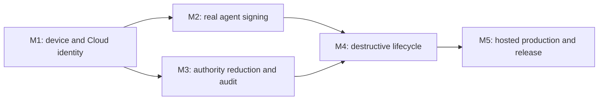

# AgentPass forward implementation plan

Status: active

Updated: 2026-08-14

Baseline branch: `codex/agent-platform`

## 1. Current boundary

AgentPass has a locally verified Cloud/Console/native foundation and a fail-closed physical-release harness. The physical harness fixes 16 gates and 20 tests to one source commit, one notarized PKG digest, one Developer ID Team ID, and two independently operated Mac hardware lanes.

Three physical scenarios are implemented:

1. exact PKG, Gatekeeper, signature, notarization, and install verification;
2. launchd, XPC, installed ownership, nested signature, and Team ID verification;
3. Secure Enclave enrollment-key existence, uniqueness, fixed tag/access group, non-exportability, live signature possession, and ControlBundle v2 key binding.

The remaining 13 scenarios are not production-qualified. A passing modeled test, simulator test, ad-hoc signed build, or operator assertion cannot replace execution of the exact scenario on both protected hardware lanes.

The process-bound Agent-session foundation now also includes the frozen Human Grant and Device Lease contracts, PostgreSQL-backed issuance/consumption, a split privileged Agent XPC service, a fixed-FD activation document, and a signed Agent Host lifecycle. The protected qualification runner now has a candidate-checkpoint-bound release trust, fixed root release staging, one-shot root-private input consumption, per-step run-binding materialization, durable fired-evidence recovery across daemon loss, bounded Controller/Agent Host supervision, and a seven-step unarmed-plus-six-scenario suite. Both hardware lanes pin and invoke the installed composition and fail when the protected seven-Grant inbox is absent. These changes are locally verified only: the Device API relay that writes that inbox and execution on both physical lanes remain open, and none of these local or modeled results is physical-release evidence.

## 2. Delivery rule

Work proceeds in five ordered milestones. A later milestone may be developed in parallel but cannot be called qualified until all of its dependencies and evidence gates pass.

Every implementation slice must keep these invariants:

- no private key or reusable capability crosses the Secure Enclave boundary;
- no scenario accepts an executable, endpoint, path, identity, or test name from mutable job input;
- every authority increase comes only from a verified, current ControlBundle; wake notifications carry no authority;
- every reduction is durable before it is observable and remains effective after process or OS restart;
- all evidence is public metadata or a hash of bounded private evidence;
- release, Cloud, device, browser, and qualification results bind to the same source and artifact identities.

## 3. Milestone M1 — device and Cloud identity closure

### M1.1 Cloud possession verification

Status: the strict v2 contracts, deterministic candidate-bound challenge, P-256 proof verification, canonical Cloud receipt signer, file/PostgreSQL persistence, device-authenticated receipt read, native v2 Secure Enclave signing, and a fail-closed physical scenario are implemented and locally verified on 2026-08-13. A one-time operator-authorized qualification ticket/relay, production KMS/HSM wiring, and execution from both physical qualification runners remain open.

Implement `cloud-possession-verification` as an authenticated enrollment round trip, not a local signature-only assertion.

Required flow:

1. request a single-use enrollment challenge from the pinned Device API;
2. bind the challenge to organization, enrollment, candidate artifact SHA-256, source commit, Team ID, public-key fingerprint, expiry, and server nonce;
3. sign the exact canonical preimage through the pinned native service executable;
4. submit the public key and signature over trusted TLS;
5. require a signed server receipt containing the same bindings and the committed device/key epoch;
6. fetch the device identity through an independently authenticated read and compare the committed key fingerprint and epoch;
7. retain only the receipt hash and allow-listed public identity fields in qualification evidence.

Server changes:

- add an idempotent, one-time challenge/receipt repository contract;
- consume the challenge in the same transaction that activates the device key;
- reject replay, cross-tenant/device substitution, stale challenge, public-key replacement, wrong artifact binding, and ambiguous commit outcome;
- emit a non-secret enrollment audit event and expose an authenticated receipt lookup.

Exit evidence: exact duplicate is idempotent; conflicting duplicate, expired challenge, wrong key, wrong candidate, TLS failure, database rollback, and process loss after commit all fail closed or recover the same receipt.

### M1.2 Candidate-bound machine identity

Status: checkpoint creation, six nested identity bindings, before/after revalidation, and execution from a root-private immutable copy created from the already verified bytes are implemented and locally verified on 2026-08-13. Execution against the first real notarized candidate remains open.

Replace static candidate executable assumptions with a two-level identity model:

- machine baseline: root-owned paths, service label, approved agent locations, OS/hardware identity;
- release checkpoint: installed code-object identities and hashes derived only after exact PKG installation.

The Gatekeeper scenario atomically writes a root-owned, exclusive candidate checkpoint after successful installation. Later scenarios read and verify that checkpoint before and after use. It binds source commit, artifact digest, Team ID, nested designated requirements, CodeDirectory hashes, and file identities. Reinstall or upgrade creates a new checkpoint through an explicit transition; it never edits the active checkpoint in place.

Exit evidence: same-content replacement, symlink/hard-link substitution, stale checkpoint replay, mixed nested binaries, original-path replacement after snapshot, and mutation of the private execution copy are rejected. The private copy is removed after child completion.

### M1.3 Negative identity and entitlement probe

Status: the strict four-role manifest/verifier, release signing helper, four probe applications, physical scenario, and service-side exact Developer ID/Team ID/approval-entitlement requirement are implemented and locally verified. Production Developer ID signing and physical XPC allow/deny execution against the notarized candidate remain open.

Implement `negative-identity-and-entitlement-cases` with signed probe binaries created by the release pipeline:

- approved client with the exact designated requirement and entitlement;
- same-Team-ID client without the required entitlement;
- differently signed client with a look-alike bundle identifier;
- unsigned/ad-hoc client;
- approved client launched through an unapproved identity/path mutation.

The scenario must prove the approved probe reaches only the allow-listed XPC method and every negative probe is denied before signing. Service audit must record stable denial classes without code-signature blobs, repository data, or secrets.

Exit evidence: denial remains effective after service restart and cannot be bypassed by PID reuse, copied binaries, parent-process substitution, or concurrent approved/unapproved calls.

## 4. Milestone M2 — unattended Claude Code and Cursor signing

The frozen implementation sequence, process/ancestry boundary, contracts, migrations, state machine, tests, and rollout gates are specified in `PROCESS_BOUND_AGENT_IMPLEMENTATION_PLAN.md`.

### M2.1 Agent adapter contract

Foundation status (2026-08-13): frozen grant/lease/request-v2 schemas, Human issuance and Device consumption OpenAPI operations, PostgreSQL migrations 0018–0022, the atomic PostgreSQL Human issuance repository, low-level consumption authority, separate Cloud/device audit-chain schemas, protected process-policy registry, purpose-separated hosted signer boundary, exact hosted runtime route composition, and injectable native process/ancestry identity model are implemented. External KMS/drain qualification, consumption audit runtime integration/outbox completion, audit-token-scoped Darwin peer observation, the split Agent XPC service, and physical qualification remain open.

Freeze one local adapter contract shared by Claude Code and Cursor:

- agent executable identity is captured at setup and revalidated for every session;
- a session is short-lived, process-bound, repository/worktree-bound, operation-bound, and ControlBundle-bound;
- Git receives only a signing response; it never receives key bytes or a reusable bearer secret;
- setup may involve a human once, but normal policy-authorized commits require no recurring biometric prompt;
- agent authentication material is obtained through a service-mediated handoff and is never stored in the machine scenario configuration.

Implement a root-owned broker endpoint that exchanges a one-time, short-expiry bootstrap nonce for a process-bound agent session after code-identity and policy checks. The broker must not trust environment variables as identity.

### M2.2 `claude-code-unattended-sign`

Run the pinned Claude Code executable in its documented non-interactive mode against a dedicated root-validated test repository. The scenario creates a deterministic change, requests one commit, verifies the Git signature and signer fingerprint, confirms repository/worktree scope, and waits through a configured unattended interval before a second authorized commit.

Negative cases: different repository, expired session, changed executable, child process with a different identity, extra signing request, and policy-disallowed branch/path.

### M2.3 `cursor-code-unattended-sign`

Apply the same contract to Cursor Agent using its production-supported headless interface. Cursor-specific authentication must be provisioned through the protected runner environment and exposed only to the exact process for the bounded run. Qualification refuses to start when a stable supported headless/auth contract is unavailable.

Exit evidence for M2: both agents produce verified signed commits without biometric interaction, cannot export or directly invoke the key, cannot cross repository/session scope, and stop signing immediately when the installed bundle no longer authorizes the operation.

## 5. Milestone M3 — authority reduction, expiry, and audit

### M3.1 `policy-reduction-refresh-ack`

Issue an initially valid bounded signing policy, prove one authorized signature, narrow the policy transactionally, and require the online Mac to poll, verify, atomically install, enforce, and ACK the exact newer bundle. The formerly valid operation must be denied after activation. Console must show the signed ACK only after the authoritative database commit.

Fault matrix: duplicate/reordered wake, stale bundle, sequence/generation rollback, statement-hash substitution, ACK replay, activation crash, ACK timeout, and concurrent signing at the activation boundary.

### M3.2 `offline-expiry`

Install a short-expiry bundle, disconnect all network routes to the Device API, prove allowed operation before expiry, and prove denial at and after expiry using monotonic-safe evaluation. Wall-clock rollback or forward adjustment must not widen authority. Reconnection may install only a valid newer bundle.

### M3.3 `revoke-emergency-stop`

Test device revoke and organization emergency stop as separate reductions. Each mutation, authority generation, refresh outbox, and admin audit must commit atomically. An online device must deny after refresh/ACK; an offline device must deny no later than its already-installed expiry. No wake, reenrollment replay, stale session, or old bundle may restore authority.

### M3.4 `audit-upload-observation`

Add a native audit uploader that authenticates with the Secure Enclave device key and uploads a hash-chained, bounded batch over trusted TLS. Cloud verifies device signature, sequence, previous hash, event schema, and tenant/device binding before committing. Console reads only the authoritative committed projection.

The scenario performs an allowed sign and a denied sign, uploads both, then independently queries Console/API until both public event summaries appear. It must verify ordering and linkage without retaining repository content, command text, policy bodies, or signature material.

Exit evidence for M3: every reduction is visible end-to-end, audit loss/reorder/equivocation is detected, offline expiry cannot be bypassed, and no Cloud or Console path can grant authority.

## 6. Milestone M4 — destructive lifecycle and environmental recovery

### M4.1 `crash-restart-recovery`

Use a supervisor outside the tested service to inject `SIGKILL` at every durable boundary: refresh snapshot, bundle staging/fsync/publication, active-pointer update, local audit append/checkpoint, session revocation, ACK submission, ACK persistence, and audit upload. Each case restarts launchd and proves convergence to the old valid state or the complete new state, never a mixed state.

OS reboot is a separate two-phase protocol because one GitHub Actions job cannot survive reboot honestly:

1. `prepare` creates a root-owned candidate-bound reboot checkpoint and schedules a one-shot continuation LaunchDaemon;
2. the machine reboots through an operator-controlled runner action;
3. `resume` validates boot identity, checkpoint freshness, candidate binding, pre-reboot hashes, launchd state, key identity, bundle state, and pending ACK/audit convergence;
4. completion consumes the checkpoint and unregisters the continuation.

### M4.2 `sleep-wake-network-clock`

Drive real system sleep/wake and network loss/restoration through protected runner controls. Apply bounded forward/backward wall-clock changes only on isolated qualification machines, always restore time synchronization, and verify that monotonic deadlines and signed server times prevent authority widening. Test long-poll cancellation, retry bounds, DNS/TLS failure, and wake coalescing.

### M4.3 `upgrade-preserves-state`

Install the previous qualified PKG, enroll and activate a bundle, create pending ACK/audit state, then install the exact candidate. Verify root ownership, state/key continuity, schema migration, rollback protection, launchd replacement, and completion of pending work. A failed upgrade must preserve the previous usable installation or fail closed with a documented recovery action.

### M4.4 `uninstall-reinstall-recovery`

Define uninstall semantics explicitly: binaries and launchd jobs are removed; protected device identity and audit continuity are retained by default. Reinstalling the same or newer qualified build must recover only after code identity, organization/device continuity, and current Cloud state are reverified. A different Team ID or tenant cannot claim retained state.

### M4.5 `current-user-purge`

Provide a separate, explicit destructive purge operation requiring local administrator authorization and recent owner WebAuthn. It revokes the Cloud device first, records a receipt, unloads services, removes retained keys/state using exact root-owned paths, and verifies absence. Partial failure leaves a resumable purge journal and signing remains denied.

Exit evidence for M4: process loss, OS reboot, sleep, network loss, clock changes, upgrade, uninstall/reinstall, and purge have deterministic recovery with no authority widening and no orphaned signing path.

## 7. Milestone M5 — hosted production and release

Run these lanes after the physical behavior exists:

1. PostgreSQL-backed shared abuse controls and organization/member session epochs;
2. purpose-separated managed KMS/HSM adapters for bundle, capability, refresh, Console identity, and release evidence signing;
3. threshold owner recovery and secret-free notifications;
4. immutable Cloud/Console deployment, forward-only migration job, trusted TLS, backup/PITR, restore, canary, rollback, metrics, and alerts;
5. independent security review covering native authorization, XPC identity, canonical signing, tenant SQL, WebAuthn/recovery, KMS IAM, release provenance, and the physical runner trust boundary;
6. first Developer ID/notarized universal PKG release and CLI/Homebrew bootstrap that install and verify that same PKG.

Production exit requires zero unresolved critical/high findings and one promotion record that binds source commit, PKG digest, nested code identities, notarization ticket, Cloud/Console image digests, migration set, signer key versions, browser evidence, and both physical-Mac reports.

## 8. Parallel work lanes

| Lane | Immediate work | May run with | Integration lock |
| --- | --- | --- | --- |
| A — native identity | candidate checkpoint, negative probes | B, C | entitlements and designated requirements |
| B — Cloud device | possession challenge/receipt, audit ingest | A, D | Device API/OpenAPI and migrations |
| C — agent adapters | broker contract, Claude/Cursor fixtures | A, B | local XPC protocol and session schema |
| D — authority | policy/revoke/offline scenarios | A, C | ControlBundle/ACK contracts |
| E — lifecycle | crash supervisor, reboot continuation | after checkpoint contract | installer and durable-state layout |
| F — hosted | abuse controls, signer provider, deployment | B–E development | migration numbers and signer purposes |

One integration owner serializes schema migrations, OpenAPI changes, entitlement changes, release identities, and durable native storage changes. Parallel lanes may not independently change these shared boundaries.

## 9. Implementation order and merge gates

1. Candidate checkpoint and signed negative probes.
2. Cloud possession challenge/receipt and physical scenario.
3. Native audit upload plus Cloud ingest/Console observation.
4. Process-bound agent session broker.
5. Claude Code unattended signing, then Cursor unattended signing.
6. Policy reduction, offline expiry, revoke, and emergency-stop scenarios.
7. Crash supervisor and two-phase reboot continuation.
8. Sleep/wake/network/clock scenario.
9. Previous-build fixture and upgrade scenario.
10. Uninstall/reinstall retention and explicit purge scenarios.
11. Execute all 16 gates on Apple Silicon and Intel T2 against one candidate.
12. Complete hosted production, review, restore, and promotion gates.

Each merge requires:

- contract/schema validation where affected;
- full Node, Swift, Console, and lint/build gates;
- deterministic unit and adversarial tests with injected boundaries;
- real PostgreSQL or real macOS boundary evidence where applicable;
- fail-closed timeout, replay, substitution, and restart behavior;
- log, artifact, browser-storage, and evidence secret scans;
- operator runbook and compatibility/migration note;
- no production-ready claim for a scenario not physically executed on both lanes.

## 10. Next executable slice

The next slice converts the locally verified seven-step N3-E suite into independently verifiable physical-release evidence. The fixed materializers, candidate-bound release trust, distinct-Grant suite, and installed workflow entrypoint are already implemented. Work now proceeds through four ordered boundaries:

1. add a device-authenticated qualification relay that obtains seven independent, operation-bound Grants and publishes exactly one closed suite document to the fixed root inbox;
2. version the hardware report schema so it binds the suite digest, ordered public step digests, release-trust digest, candidate-checkpoint digest, source commit, PKG digest, Team ID, lane identity, and timestamps, then verify the report independently before upload;
3. inject interruption at every release publication, inbox publication, run-binding, fired-receipt, restart, disarm, restoration, and cleanup boundary and prove deterministic recovery with no reusable authority or partial trust root left behind;
4. execute the same source commit and notarized PKG on Apple Silicon and Intel T2, preserve both untouched signed reports, and cross-check that every bound identity agrees.

The relay must use the existing Device API authentication and lease/grant verification boundaries; proof bytes may exist only in bounded protected memory and root-private files and must never appear in argv, environment, stdout/stderr, workflow logs, cache, or uploaded artifacts. Publication must be exclusive, canonical, fsynced, one-shot, and rejected if the fixed inbox or active run already exists.

The evidence change must be additive and versioned. The workflow may print only bounded result classes and public digests. A report is invalid if a step is missing, reordered, duplicated, uses a repeated Grant or run binding, disagrees with the candidate checkpoint, or was signed by an unapproved lane/operator key.

The slice is complete only when all adversarial relay/report/recovery tests pass, the full Node/Swift/contracts/package gates pass from a clean source tree, both physical lanes validate independently, and the two signed reports bind the same candidate. Until then, N3-E remains locally verified rather than physically qualified.

## 11. Detailed execution waves after N3-E

### Wave 1 — protected qualification closure

Implementation status (2026-08-14): the fixed `run`/`recover` entrypoint, root-private input/inbox materializers, candidate-checkpoint-bound release trust and staging, per-step run-binding lifecycle, six-scenario driver, daemon-restart receipt recovery, Controller durable-receipt preference, seven-distinct-Grant suite, package inventory, immutable workflow preflight, and installed workflow invocation are implemented and locally verified. The remaining closure work is to implement the authenticated Device API relay that writes the fixed root inbox, complete release-stage recovery/cleanup qualification, retain schema-validated suite evidence in the lane report, and execute the exact flow on both protected Mac lanes.

Implementation:

- replace the remaining injected runner callbacks with fixed packaged commands and closed schemas;
- bind the activation document to the exact canonical signed Grant without putting proof bytes in argv, environment, stdout, logs, or evidence;
- supervise Controller, Agent Host, launchd restart, and timeout as separate processes with bounded termination;
- distinguish expected daemon-loss outcomes from Host lifecycle failures without accepting a missing fired receipt;
- add stale-run recovery that proves no active run, validates every durable identity, and deletes in least-authority-first order;
- add source/symbol/entitlement checks proving the qualification listener and receipt writer are unavailable in production configuration.

Acceptance:

- six scenarios each fire exactly once and a seventh unarmed control run has no injected outcome;
- kill at every receipt write/rename/fsync/cleanup boundary converges to a valid old or complete new state;
- replay, symlink, hard-link, ownership, mode, digest, generation, scenario, and phase substitution tests fail closed;
- one cleanup-safe command produces a canonical evidence report bound to source commit, PKG digest, Team ID, code identities, OS/hardware lane, and scenario result.

Dependencies: the notarized candidate checkpoint, protected runner entitlement, real Device API Grant/Lease route, and both Mac runners. Work on packaging tests and evidence schema can proceed in parallel; edits to the XPC protocol, durable receipt schema, and root storage layout are serialized.

Immediate remaining gates:

1. implement a device-authenticated relay that issues seven independent Grants and atomically writes the closed suite document to `/private/var/db/agentpass-qualification/input.inbox.json` without exposing proof bytes to workflow argv, environment, logs, or artifacts;
2. bind the suite digest and seven public step digests into the canonical hardware report and independent verifier rather than relying on workflow log output;
3. finish release-stage recovery and prove interruption behavior at every release copy/trust publication, input publication, run-binding, receipt, restart, disarm, restore, and cleanup boundary;
4. execute the exact source commit and notarized PKG on Apple Silicon and Intel T2 lanes and retain the untouched signed reports;
5. only after both reports independently validate, change the six scenarios and unarmed control from locally verified to physically qualified.

### Wave 2 — first usable Claude Code path

Implementation:

- ship `agentpass install`, `agentpass setup`, `agentpass doctor`, `agentpass launch --agent claude-code`, and repository-local Git signing configuration;
- enroll the Secure Enclave device identity, select organization/repository/worktree/branch/scope/TTL, and install a least-authority policy;
- launch the pinned Claude Code process through the signed Agent Host so the process/ancestry observation and FD handoff are created by one trusted path;
- implement status, close, expiry, revoke, offline-deny, and actionable diagnostics without exposing authority-bearing material;
- preserve existing Git configuration and provide an exact, resumable uninstall/rollback path.

Acceptance:

- a new user completes setup and two unattended verified commits using documented commands;
- changed executable, PID reuse, ancestry, repository, worktree, branch, operation, TTL, generation, and proof replay are denied;
- secrets and reusable capabilities are absent from process listings, environment, shell history, repository files, logs, crash reports, and browser storage;
- install/upgrade/uninstall tests preserve or deliberately purge state according to the documented lifecycle.

Dependencies: Wave 1, current ControlBundle apply/ACK path, Human Grant issuance, Device Lease consumption, and a pinned supported Claude Code execution contract. CLI/onboarding copy and Git integration tests may proceed in parallel with native lifecycle work.

### Wave 3 — Cursor parity and real Console onboarding

Implementation:

- add Cursor only through a pinned, production-supported headless process identity and reuse the common Agent Host/session contract;
- remove all sample operational state from Console views;
- complete the guided flow for organization creation/selection, invitation and role administration, passkey lifecycle, device enrollment, repository policy, Agent launch instructions, session/audit visibility, revoke, and emergency stop;
- show pending/fetched/applied/blocked/stale/offline/revoked states from authoritative PostgreSQL data and signed ACKs, never from optimistic browser state;
- add keyboard, screen-reader, localization, conflict, expiry, recovery, and lockout behavior.

Acceptance:

- owner/admin/auditor/viewer Playwright matrices pass over production-built Console and Cloud with real PostgreSQL TLS and virtual WebAuthn;
- Claude Code and Cursor pass the same authorization and negative-substitution suite;
- a non-engineer can enroll, launch, verify commits, inspect audit, and revoke from one guided journey;
- revoke and emergency stop remain reductions only and cannot mint or widen native authority.

Dependencies: Wave 2 common session contract and authoritative audit upload/read model. Cursor adapter work and Console presentation may run in parallel after the shared API DTOs are frozen.

### Wave 4 — recovery, abuse resistance, and managed signing

Implementation:

- add PostgreSQL-backed shared rate limits, concurrent-session ceilings, organization session epochs, bounded WebAuthn ceremonies, and enumeration-safe errors;
- implement versioned threshold owner recovery with hashed one-time material, restricted recovery sessions, passkey re-enrollment, and fresh operation-bound recent WebAuthn;
- move bundle, capability, refresh, Console identity, and qualification/release evidence signing behind purpose-separated KMS/HSM keys and IAM;
- implement rotation, retiring-key verification windows, drain, rollback refusal, audit, alerts, and disaster-recovery procedures;
- finish native hash-chain audit upload and authoritative Cloud/Console observation.

Acceptance:

- two-instance race tests prove shared throttles and one-time recovery consumption;
- no support operator or single lost owner can silently seize an organization;
- KMS outage, timeout, response loss, version rollback, and cross-purpose/key substitution fail closed or replay the exact committed result;
- backup/PITR restore and signer rotation drills preserve tenant isolation, generations, audit continuity, and revocations.

Dependencies: stable hosted schemas from Waves 2–3. Recovery and KMS adapters can be built in parallel but promotion waits for joint incident and restore drills.

### Wave 5 — signed distribution and production promotion

Implementation:

- build universal, reproducible release artifacts; generate SBOM, provenance, nested code-identity manifest, and checksums;
- sign with Developer ID, notarize, staple, and publish one immutable PKG consumed by direct download, Homebrew bootstrap, and CI qualification;
- deploy immutable Cloud/Console images, run forward-only migrations through a separate role, and add canary, rollback, monitoring, paging, backup, and incident runbooks;
- commission an independent review of native/XPC/process binding, WebAuthn/recovery, tenant SQL/RLS, KMS IAM, installer lifecycle, evidence, and log redaction;
- promote through an allow-listed tenant cohort before general availability.

Acceptance:

- both physical Mac lanes and both Agent adapters pass against the same source commit and notarized PKG;
- browser, Cloud, PostgreSQL, native, packaging, upgrade, recovery, and rollback gates are linked from one signed promotion record;
- secret scans and artifact inspection pass, and there are zero unresolved critical/high findings or P0/P1 defects;
- rollback disables new authority without invalidating already-required audit and recovery evidence.

Dependencies: Waves 1–4 and external Apple/KMS/deployment credentials. Credential-dependent execution may be scheduled later, but no production-ready claim is made before the evidence exists.

## 12. Workstream ownership and merge cadence

Use four parallel workstreams with one integration owner:

| Workstream | Owns | Must not independently change |
| --- | --- | --- |
| Native/session | Agent Host, XPC service, Secure Enclave, process binding, local durable state | OpenAPI, SQL migration numbering, release identities |
| Cloud/data | Human/Device APIs, PostgreSQL transactions/RLS, audit ingest, KMS adapters | native XPC DTOs, installer paths |
| Console/onboarding | BFF DTOs, setup journey, WebAuthn UI, device/session/activity views | authority semantics, browser-held credentials |
| Qualification/release | protected runners, evidence schemas, package/notarization, deployment gates | product protocol or storage changes without integration review |

Merge cadence:

1. freeze or version any shared contract first;
2. land implementation plus deterministic negative tests in its owning workstream;
3. run cross-boundary integration and secret scans;
4. update the operator/user documentation and compatibility notes;
5. record modeled, integration, physical, and production evidence as different evidence classes;
6. promote only a clean commit that passes every gate required by the affected boundary.
