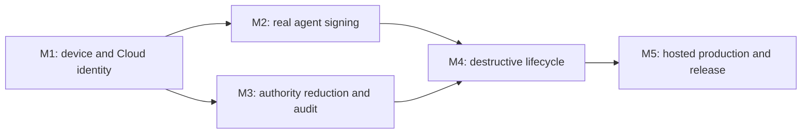

# AgentPass forward implementation plan

Status: active

Updated: 2026-08-13

Baseline branch: `codex/agent-platform`

## 1. Current boundary

AgentPass has a locally verified Cloud/Console/native foundation and a fail-closed physical-release harness. The physical harness fixes 16 gates and 20 tests to one source commit, one notarized PKG digest, one Developer ID Team ID, and two independently operated Mac hardware lanes.

Three physical scenarios are implemented:

1. exact PKG, Gatekeeper, signature, notarization, and install verification;
2. launchd, XPC, installed ownership, nested signature, and Team ID verification;
3. Secure Enclave enrollment-key existence, uniqueness, fixed tag/access group, non-exportability, live signature possession, and ControlBundle v2 key binding.

The remaining 13 scenarios are not production-qualified. A passing modeled test, simulator test, ad-hoc signed build, or operator assertion cannot replace execution of the exact scenario on both protected hardware lanes.

## 2. Delivery rule

Work proceeds in five ordered milestones. A later milestone may be developed in parallel but cannot be called qualified until all of its dependencies and evidence gates pass.

Every implementation slice must keep these invariants:

- no private key or reusable capability crosses the Secure Enclave boundary;
- no scenario accepts an executable, endpoint, path, identity, or test name from mutable job input;
- every authority increase comes only from a verified, current ControlBundle; wake notifications carry no authority;
- every reduction is durable before it is observable and remains effective after process or OS restart;
- all evidence is public metadata or a hash of bounded private evidence;
- release, Cloud, device, browser, and qualification results bind to the same source and artifact identities.

## 3. Milestone M1 — device and Cloud identity closure

### M1.1 Cloud possession verification

Implement `cloud-possession-verification` as an authenticated enrollment round trip, not a local signature-only assertion.

Required flow:

1. request a single-use enrollment challenge from the pinned Device API;
2. bind the challenge to organization, enrollment, candidate artifact SHA-256, source commit, Team ID, public-key fingerprint, expiry, and server nonce;
3. sign the exact canonical preimage through the pinned native service executable;
4. submit the public key and signature over trusted TLS;
5. require a signed server receipt containing the same bindings and the committed device/key epoch;
6. fetch the device identity through an independently authenticated read and compare the committed key fingerprint and epoch;
7. retain only the receipt hash and allow-listed public identity fields in qualification evidence.

Server changes:

- add an idempotent, one-time challenge/receipt repository contract;
- consume the challenge in the same transaction that activates the device key;
- reject replay, cross-tenant/device substitution, stale challenge, public-key replacement, wrong artifact binding, and ambiguous commit outcome;
- emit a non-secret enrollment audit event and expose an authenticated receipt lookup.

Exit evidence: exact duplicate is idempotent; conflicting duplicate, expired challenge, wrong key, wrong candidate, TLS failure, database rollback, and process loss after commit all fail closed or recover the same receipt.

### M1.2 Candidate-bound machine identity

Replace static candidate executable assumptions with a two-level identity model:

- machine baseline: root-owned paths, service label, approved agent locations, OS/hardware identity;
- release checkpoint: installed code-object identities and hashes derived only after exact PKG installation.

The Gatekeeper scenario atomically writes a root-owned, exclusive candidate checkpoint after successful installation. Later scenarios read and verify that checkpoint before and after use. It binds source commit, artifact digest, Team ID, nested designated requirements, CodeDirectory hashes, and file identities. Reinstall or upgrade creates a new checkpoint through an explicit transition; it never edits the active checkpoint in place.

Exit evidence: same-content replacement, symlink/hard-link substitution, path replacement during execution, stale checkpoint replay, and mixed nested binaries are rejected.

### M1.3 Negative identity and entitlement probe

Implement `negative-identity-and-entitlement-cases` with signed probe binaries created by the release pipeline:

- approved client with the exact designated requirement and entitlement;
- same-Team-ID client without the required entitlement;
- differently signed client with a look-alike bundle identifier;
- unsigned/ad-hoc client;
- approved client launched through an unapproved identity/path mutation.

The scenario must prove the approved probe reaches only the allow-listed XPC method and every negative probe is denied before signing. Service audit must record stable denial classes without code-signature blobs, repository data, or secrets.

Exit evidence: denial remains effective after service restart and cannot be bypassed by PID reuse, copied binaries, parent-process substitution, or concurrent approved/unapproved calls.

## 4. Milestone M2 — unattended Claude Code and Cursor signing

### M2.1 Agent adapter contract

Freeze one local adapter contract shared by Claude Code and Cursor:

- agent executable identity is captured at setup and revalidated for every session;
- a session is short-lived, process-bound, repository/worktree-bound, operation-bound, and ControlBundle-bound;
- Git receives only a signing response; it never receives key bytes or a reusable bearer secret;
- setup may involve a human once, but normal policy-authorized commits require no recurring biometric prompt;
- agent authentication material is obtained through a service-mediated handoff and is never stored in the machine scenario configuration.

Implement a root-owned broker endpoint that exchanges a one-time, short-expiry bootstrap nonce for a process-bound agent session after code-identity and policy checks. The broker must not trust environment variables as identity.

### M2.2 `claude-code-unattended-sign`

Run the pinned Claude Code executable in its documented non-interactive mode against a dedicated root-validated test repository. The scenario creates a deterministic change, requests one commit, verifies the Git signature and signer fingerprint, confirms repository/worktree scope, and waits through a configured unattended interval before a second authorized commit.

Negative cases: different repository, expired session, changed executable, child process with a different identity, extra signing request, and policy-disallowed branch/path.

### M2.3 `cursor-code-unattended-sign`

Apply the same contract to Cursor Agent using its production-supported headless interface. Cursor-specific authentication must be provisioned through the protected runner environment and exposed only to the exact process for the bounded run. Qualification refuses to start when a stable supported headless/auth contract is unavailable.

Exit evidence for M2: both agents produce verified signed commits without biometric interaction, cannot export or directly invoke the key, cannot cross repository/session scope, and stop signing immediately when the installed bundle no longer authorizes the operation.

## 5. Milestone M3 — authority reduction, expiry, and audit

### M3.1 `policy-reduction-refresh-ack`

Issue an initially valid bounded signing policy, prove one authorized signature, narrow the policy transactionally, and require the online Mac to poll, verify, atomically install, enforce, and ACK the exact newer bundle. The formerly valid operation must be denied after activation. Console must show the signed ACK only after the authoritative database commit.

Fault matrix: duplicate/reordered wake, stale bundle, sequence/generation rollback, statement-hash substitution, ACK replay, activation crash, ACK timeout, and concurrent signing at the activation boundary.

### M3.2 `offline-expiry`

Install a short-expiry bundle, disconnect all network routes to the Device API, prove allowed operation before expiry, and prove denial at and after expiry using monotonic-safe evaluation. Wall-clock rollback or forward adjustment must not widen authority. Reconnection may install only a valid newer bundle.

### M3.3 `revoke-emergency-stop`

Test device revoke and organization emergency stop as separate reductions. Each mutation, authority generation, refresh outbox, and admin audit must commit atomically. An online device must deny after refresh/ACK; an offline device must deny no later than its already-installed expiry. No wake, reenrollment replay, stale session, or old bundle may restore authority.

### M3.4 `audit-upload-observation`

Add a native audit uploader that authenticates with the Secure Enclave device key and uploads a hash-chained, bounded batch over trusted TLS. Cloud verifies device signature, sequence, previous hash, event schema, and tenant/device binding before committing. Console reads only the authoritative committed projection.

The scenario performs an allowed sign and a denied sign, uploads both, then independently queries Console/API until both public event summaries appear. It must verify ordering and linkage without retaining repository content, command text, policy bodies, or signature material.

Exit evidence for M3: every reduction is visible end-to-end, audit loss/reorder/equivocation is detected, offline expiry cannot be bypassed, and no Cloud or Console path can grant authority.

## 6. Milestone M4 — destructive lifecycle and environmental recovery

### M4.1 `crash-restart-recovery`

Use a supervisor outside the tested service to inject `SIGKILL` at every durable boundary: refresh snapshot, bundle staging/fsync/publication, active-pointer update, local audit append/checkpoint, session revocation, ACK submission, ACK persistence, and audit upload. Each case restarts launchd and proves convergence to the old valid state or the complete new state, never a mixed state.

OS reboot is a separate two-phase protocol because one GitHub Actions job cannot survive reboot honestly:

1. `prepare` creates a root-owned candidate-bound reboot checkpoint and schedules a one-shot continuation LaunchDaemon;
2. the machine reboots through an operator-controlled runner action;
3. `resume` validates boot identity, checkpoint freshness, candidate binding, pre-reboot hashes, launchd state, key identity, bundle state, and pending ACK/audit convergence;
4. completion consumes the checkpoint and unregisters the continuation.

### M4.2 `sleep-wake-network-clock`

Drive real system sleep/wake and network loss/restoration through protected runner controls. Apply bounded forward/backward wall-clock changes only on isolated qualification machines, always restore time synchronization, and verify that monotonic deadlines and signed server times prevent authority widening. Test long-poll cancellation, retry bounds, DNS/TLS failure, and wake coalescing.

### M4.3 `upgrade-preserves-state`

Install the previous qualified PKG, enroll and activate a bundle, create pending ACK/audit state, then install the exact candidate. Verify root ownership, state/key continuity, schema migration, rollback protection, launchd replacement, and completion of pending work. A failed upgrade must preserve the previous usable installation or fail closed with a documented recovery action.

### M4.4 `uninstall-reinstall-recovery`

Define uninstall semantics explicitly: binaries and launchd jobs are removed; protected device identity and audit continuity are retained by default. Reinstalling the same or newer qualified build must recover only after code identity, organization/device continuity, and current Cloud state are reverified. A different Team ID or tenant cannot claim retained state.

### M4.5 `current-user-purge`

Provide a separate, explicit destructive purge operation requiring local administrator authorization and recent owner WebAuthn. It revokes the Cloud device first, records a receipt, unloads services, removes retained keys/state using exact root-owned paths, and verifies absence. Partial failure leaves a resumable purge journal and signing remains denied.

Exit evidence for M4: process loss, OS reboot, sleep, network loss, clock changes, upgrade, uninstall/reinstall, and purge have deterministic recovery with no authority widening and no orphaned signing path.

## 7. Milestone M5 — hosted production and release

Run these lanes after the physical behavior exists:

1. PostgreSQL-backed shared abuse controls and organization/member session epochs;
2. purpose-separated managed KMS/HSM adapters for bundle, capability, refresh, Console identity, and release evidence signing;
3. threshold owner recovery and secret-free notifications;
4. immutable Cloud/Console deployment, forward-only migration job, trusted TLS, backup/PITR, restore, canary, rollback, metrics, and alerts;
5. independent security review covering native authorization, XPC identity, canonical signing, tenant SQL, WebAuthn/recovery, KMS IAM, release provenance, and the physical runner trust boundary;
6. first Developer ID/notarized universal PKG release and CLI/Homebrew bootstrap that install and verify that same PKG.

Production exit requires zero unresolved critical/high findings and one promotion record that binds source commit, PKG digest, nested code identities, notarization ticket, Cloud/Console image digests, migration set, signer key versions, browser evidence, and both physical-Mac reports.

## 8. Parallel work lanes

| Lane | Immediate work | May run with | Integration lock |
| --- | --- | --- | --- |
| A — native identity | candidate checkpoint, negative probes | B, C | entitlements and designated requirements |
| B — Cloud device | possession challenge/receipt, audit ingest | A, D | Device API/OpenAPI and migrations |
| C — agent adapters | broker contract, Claude/Cursor fixtures | A, B | local XPC protocol and session schema |
| D — authority | policy/revoke/offline scenarios | A, C | ControlBundle/ACK contracts |
| E — lifecycle | crash supervisor, reboot continuation | after checkpoint contract | installer and durable-state layout |
| F — hosted | abuse controls, signer provider, deployment | B–E development | migration numbers and signer purposes |

One integration owner serializes schema migrations, OpenAPI changes, entitlement changes, release identities, and durable native storage changes. Parallel lanes may not independently change these shared boundaries.

## 9. Implementation order and merge gates

1. Candidate checkpoint and signed negative probes.
2. Cloud possession challenge/receipt and physical scenario.
3. Native audit upload plus Cloud ingest/Console observation.
4. Process-bound agent session broker.
5. Claude Code unattended signing, then Cursor unattended signing.
6. Policy reduction, offline expiry, revoke, and emergency-stop scenarios.
7. Crash supervisor and two-phase reboot continuation.
8. Sleep/wake/network/clock scenario.
9. Previous-build fixture and upgrade scenario.
10. Uninstall/reinstall retention and explicit purge scenarios.
11. Execute all 16 gates on Apple Silicon and Intel T2 against one candidate.
12. Complete hosted production, review, restore, and promotion gates.

Each merge requires:

- contract/schema validation where affected;
- full Node, Swift, Console, and lint/build gates;
- deterministic unit and adversarial tests with injected boundaries;
- real PostgreSQL or real macOS boundary evidence where applicable;
- fail-closed timeout, replay, substitution, and restart behavior;
- log, artifact, browser-storage, and evidence secret scans;
- operator runbook and compatibility/migration note;
- no production-ready claim for a scenario not physically executed on both lanes.

## 10. Next executable slice

The next slice is M1.2 plus M1.3: candidate-bound installed identity and negative entitlement probes. It removes the largest trust ambiguity in every later physical scenario and provides the process-identity primitive required by both agent adapters. In parallel, the Device API contract for M1.1 can be frozen without modifying the native durable-state layout.

The slice is complete when an exact installed candidate can mint a protected checkpoint, every later scenario consumes it, the approved probe reaches the XPC service, all negative identities are denied, and replacement/replay tests pass before any Cloud credential or physical qualification secret is introduced.
