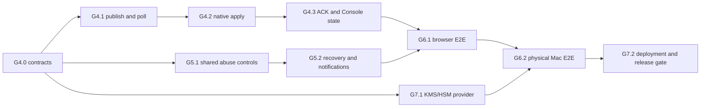

# AgentPass G4–G7 implementation plan

Status: active execution baseline; G4.0 qualified, G4.1 correctness path implemented but production qualification remains open

Updated: 2026-08-13

Branch baseline: `codex/agent-platform`

## 1. Production outcome

The remaining program delivers one verifiable product path:

1. an owner signs in to the Web Console with a passkey;
2. the owner creates a short-lived device enrollment;
3. the headless macOS service creates non-exportable device and Git-signing keys;
4. Claude Code or Cursor obtains only a bounded signing capability;
5. an authority reduction causes an online Mac to refresh immediately and fail closed;
6. the Console shows the authoritative signed ACK and audit result;
7. the exact Developer ID-signed and notarized artifact is qualified and deployed with recoverable hosted infrastructure.

The browser is the human control plane. The CLI and background macOS service are the device plane. A visible Mac application is optional; the production boundary remains the signed launchd/XPC service installed by PKG.

## 2. Non-negotiable invariants

- The Git signing private key is non-exportable and never leaves Secure Enclave.
- A refresh notification is only a hint. It cannot grant authority, extend expiry, or carry a usable capability.
- A device installs only a newer, issuer-pinned, statement-hash-verified ControlBundle.
- Every ACK is bound to organization, device, key epoch, bundle sequence, statement hash, result, and nonce.
- Offline behavior never exceeds the already installed bundle's expiry and scope.
- Human recovery restores account access but does not satisfy operation-bound recent WebAuthn.
- Cloud signing keys are purpose-separated and versioned; old evidence remains verifiable after rotation.
- Production claims are made only for one source commit and one immutable artifact digest with linked evidence.

## 3. Execution graph

G5.1 and G7.1 can proceed in parallel after G4.0 freezes the shared identifiers and event vocabulary. G6 cannot certify production until G4, G5, and the hosted signer boundary have passed their own security gates.

## 4. G4 — revocation propagation and authoritative ACK

### G4.0 Contract freeze

Status: complete on 2026-08-13. The frozen contract is implemented by the two JSON Schemas, Device OpenAPI, shared positive fixtures, strict Node/Swift decoders, domain-separated canonical signing inputs, and the seven-value refresh-state enum. Node and Swift fixture signing-input SHA-256 vectors are identical. Local evidence: contract validator passed; Node full suite passed with 665 tests and 8 skips; Swift full suite passed with 309 tests. Replay consumption, generation/sequence state transitions, current-key-epoch lookup, and cross-device runtime enforcement remain G4.1/G4.3 responsibilities and are not claimed by this contract slice.

Deliverables:

- `refresh-hint.v1` JSON Schema with an exact version/type envelope, `organization_id`, `device_id`, `authority_generation`, `published_at`, `expires_at`, `nonce`, `key_id`, signature algorithm, and signature;
- `bundle-ack.v1` schema with an exact version/type envelope, organization/device, device-key epoch, sequence, exact ControlBundle statement hash, `applied|blocked`, stable reason code, observed time, nonce, signature algorithm, and device signature;
- Device OpenAPI routes for pending refresh state, authenticated long-poll, bundle fetch, and ACK submission;
- stable device state enum: `pending`, `fetching`, `applied`, `blocked`, `stale`, `offline`, `revoked`;
- explicit canonicalization, signature domains, size limits, time skew, retry limits, and error envelopes.

Threat tests must reject unknown fields, duplicate JSON keys, replay, cross-device substitution, generation rollback, sequence rollback, hash substitution, stale key epoch, oversized input, and invalid time windows.

Exit gate: Node and Swift decode the same fixtures and produce byte-identical signature input. OpenAPI, JSON Schema, and protocol fixtures pass in CI.

### G4.1 Cloud publication and polling

Current implementation checkpoint (2026-08-13): schema version `15` adds restart-safe nonce key identity, commit-only refresh notifications, and safe delivery-state rollover between generations to the generation/key-epoch/outbox/ACK foundation. Hosted runtime uses a purpose-separated refresh signer, reconstructs the same 16-byte nonce across restart or instance failover, records delivery evidence before returning a hint, and holds one bounded PostgreSQL listener with initial/final authoritative queries. PostgreSQL 17 evidence covers two pools racing exact reduction and ACK, rollback, notification wakeup, nonce mismatch rejection, blocked ACK observation, restart reconstruction, member removal, policy disable, standalone capability revoke, managed credential/session revoke, post-commit publisher-process loss, and injected audit failure. Device lookup pins the active immutable key epoch. Every implemented authority-reducing path now advances generation, enqueues every active device, and appends the appropriate admin audit in the owning transaction; an audit failure rolls back the authority mutation, generation, outbox, and audit together. Ordinary self logout deliberately does not trigger a device refresh. Fixed-key, label-free counters now cover waiter rejection/capacity, delivery failure, notification reconnect/wake failure, propagation observation, and timeout. The G4.1 production exit gate remains open only for hard process-kill timing injection, measured p50/p95/p99 propagation latency, production secret-manager rotation evidence, and sustained resource/lock stress.

Database work:

- add monotonic organization authority generation;
- add per-device desired/observed generation and refresh state;
- add a transactional refresh outbox keyed by organization, generation, device, and event type;
- add ACK nonce digests and an exact unique key for device/epoch/sequence/hash;
- add bounded delivery-attempt metadata and retention indexes.

Cloud work:

- increment generation and enqueue refresh work in the same transaction as membership reduction, policy reduction, device revoke, or emergency stop;
- expose authenticated long-poll with a bounded wait, jitter advice, ETag/generation, and no authority-bearing payload;
- publish optional push hints only after commit; polling remains the correctness fallback;
- fetch the current signed ControlBundle through the existing signed device request protocol;
- make duplicate publication and delivery idempotent.

Exit gate: two Cloud instances and PostgreSQL prove no pre-commit hint, no lost committed generation, no widening from duplicate/reordered delivery, bounded polling resources, and measurable propagation latency.

#### G4.1 remaining implementation sequence

1. **Restart-safe refresh nonce ownership**
   - Status: implemented and locally qualified, including key rotation/restart/cross-binding/redaction tests; production secret-manager rotation evidence remains.
   - derive each 16-byte nonce with a dedicated secret-manager HMAC key from the immutable tuple `organization_id/device_id/generation/outbox_id`;
   - persist only the nonce digest and a non-secret nonce-key version, never the raw nonce;
   - make every Cloud instance able to reconstruct the same nonce after restart or failover;
   - rotate by dual-read/single-write key version and retain old versions only through ACK/outbox retention;
   - add known-answer, rotation, restart, cross-tenant substitution, and log-redaction tests.
2. **Hosted runtime wiring**
   - Status: implemented and locally qualified against PostgreSQL 17; managed signer work remains G7.1.
   - expose `pollDeviceRefresh`, `snapshotAndAssignBundleHead`, `acknowledgeBundle`, and refresh-state reads through the PostgreSQL store facade without widening its public admin API;
   - return the active immutable `device_key_epoch` and its exact public key from the device-auth lookup path;
   - introduce a purpose-separated `refresh-hint` signer instead of treating the bundle-signing key as an implicit general signer;
   - have the Cloud layer construct and sign the hint from authoritative state; repository rows must never masquerade as signed hints;
   - fail closed when nonce key, signer, active key epoch, or authority state is unavailable.
3. **Commit-coupled authority reductions**
   - Status: implemented and locally qualified. Revocation/device/emergency-stop, policy reduction, member removal/role reduction, managed credential/session revoke, and standalone capability revoke are coupled and fail closed. Organization-first lock ordering is enforced; admin audit uses the same caller-owned transaction; an injected audit failure proves rollback of mutation, generation, refresh outbox, and audit; the capability-issue/member-removal race passes on PostgreSQL 17. Broader stress remains part of production qualification.
   - route emergency stop, device revoke, member removal/role reduction, policy narrowing, credential/session epoch invalidation, and capability revocation through one transaction helper;
   - acquire the organization authority lock in one documented order, mutate authority, increment generation, enqueue every affected device, and append admin audit before commit;
   - prove rollback leaves no mutation, generation, outbox row, audit row, or observable notification;
   - make exact idempotent replay return the committed generation without incrementing it again.
4. **Bounded publication and long-poll**
   - Status: implemented with schema `0014`, one dedicated listener, 30-second waits, bounded waiters, delivery attempts, final-query fallback, and fixed-key label-free refresh metrics. Latency histograms and production alert/SLO wiring remain qualification work.
   - add one dedicated PostgreSQL notification listener per Cloud process, with an initial query and final query as correctness fallbacks;
   - use notifications only as wake-up hints; correctness always comes from the committed generation query;
   - cap waits at 30 seconds, listeners and waiter count per process, response size, delivery retries, and retry age;
   - record only fixed-label metrics for propagation latency, active waiters, delivery failures, stale ACKs, and queue age;
   - return `204` for no change and never return policy, capability, or authority bodies from the refresh route.
5. **Real-boundary qualification**
   - Status: partial. PostgreSQL 17 two-pool races, duplicate/reordered behavior, rollback, listener wakeup, restart nonce reconstruction, nonce mismatch, blocked ACK, member removal, policy disable, capability and human-management reductions, generation rollover, and post-commit publisher-process loss pass. Hard process-kill timing and p50/p95/p99 evidence remain.
   - run migrations and repository operations against PostgreSQL 17, including two connections racing reduction, bundle assignment, polling, and ACK;
   - kill one Cloud process after commit and before publish, then prove another process serves the same generation and nonce;
   - reorder and duplicate notifications and ACKs, rotate the nonce/signing key, and inject database/signer timeouts;
   - publish a G4.1 evidence report with p50/p95/p99 propagation latency and bounded resource counts.

G4.1 is complete only when all five steps pass. HTTP contract tests or migration tests alone do not satisfy this gate.

### G4.2 Native fetch and atomic install

Native service states:

`idle → hinted/poll_due → fetching → verifying → staging → applied|blocked → acknowledged`.

Implementation requirements:

- schedule background polling through launchd with bounded exponential backoff and random jitter;
- authenticate every request with the non-exportable device key;
- pin issuer and accepted signer key versions;
- verify organization/device audience, sequence, generation, statement hash, issue/expiry time, and full ControlBundle v2 policy;
- write a staged bundle, fsync, atomically rename, reread, reverify, then switch the active pointer;
- preserve the last valid bundle on crash or verification failure;
- immediately deny signing after emergency-stop/revoke application, and always deny after installed-bundle expiry;
- emit no policy body, repository data, capability, token, or signature material to logs.

Exit gate: kill the daemon at every durable write boundary and restart. It must expose either the old valid bundle or the fully verified new bundle, never partial state.

### G4.3 Signed ACK and Console device state

- sign ACKs with the enrolled device key and a dedicated signature domain;
- atomically consume ACK nonce, validate key epoch/sequence/hash, update observed state, and append audit;
- treat duplicate exact ACK as success and conflicting ACK as a stable conflict;
- display desired versus observed generation, last successful refresh, bundle expiry, blocked reason, and offline/stale status in Console;
- add owner/admin actions for refresh, revoke, and emergency stop with operation-bound WebAuthn;
- keep timestamps and status useful without exposing policy contents or identifiers in telemetry.

Exit gate: a membership reduction and emergency stop reach an online physical Mac within the selected SLO; replayed/substituted ACKs have no effect; an offline Mac becomes visibly stale and fails closed at expiry.

## 5. G5 — recovery, abuse controls, and notifications

### G5.1 Shared abuse controls

- apply PostgreSQL token buckets to session bootstrap, WebAuthn options/verify, invitation acceptance, enrollment, recovery, and high-risk mutations;
- separate transport admission from authenticated organization/principal limits;
- add bounded concurrent sessions per human and device enrollment attempts per organization;
- add organization and member session epochs for immediate emergency invalidation;
- return stable, non-enumerating errors and `Retry-After` without exposing bucket keys;
- define alert thresholds for sustained denial, replay, lock timeout, audit gaps, stale ACKs, and refresh SLO breach.

Exit gate: two-instance race tests prove shared limits, clock-safe refill, exact one-time consumption, tenant isolation, and no reset after restart.

### G5.2 Threshold owner recovery

Recommended first production policy:

- generate offline recovery shares during owner setup;
- require a versioned threshold, initially two independent owner shares when two owners exist;
- for a single-owner organization, require one offline owner share plus a separately enrolled recovery credential; support cannot substitute for either factor;
- store only salted hashes/commitments and policy version;
- consume recovery material transactionally and rotate all used material;
- restore a restricted recovery session, then require a fresh passkey registration and normal operation-bound recent WebAuthn before high-risk actions.

Notifications use a secret-free transactional outbox for login, credential changes, recovery start/complete, role reduction, device revoke, emergency stop, signer rotation, and export. Delivery retries are idempotent and payload schemas are allow-listed.

Exit gate: replay, threshold bypass, concurrent consumption, tenant substitution, enumeration, support-only takeover, and notification secret leakage all fail.

## 6. G7.1 — KMS/HSM-backed hosted signers

Define one provider-neutral signer interface:

- `signControlBundle(statement)`;
- `signCapability(statement)`;
- `signReceipt(statement)`;
- `publicKeyMetadata()`;
- `health()`.

Each purpose has a separate key/version and IAM permission. The database stores only provider, purpose, public key, key version, activation/retirement times, and evidence references. Private key export is prohibited.

Implementation slices:

1. contract and deterministic fake provider;
2. selected managed provider adapter and least-privilege identity;
3. dual-read/single-write key rotation;
4. signer outage, timeout, throttling, and malformed-response handling;
5. historical verification and evidence export.

Exit gate: rotation preserves verification of all prior bundles/capabilities/receipts; signer or network failure cannot produce unsigned/fallback-file authority; logs and traces contain no signing input beyond approved hashes and metadata.

## 7. G6 — complete product qualification

### G6.1 Browser E2E

Use Playwright and virtual WebAuthn for:

- bootstrap/login/logout, cookie rotation, expiry, and revocation;
- passkey add/rename/revoke and recent-auth binding;
- organization create/rename, invitation, role change, last-owner denial, and conflicts;
- device enrollment one-time reveal, device state, refresh, revoke, and emergency stop;
- recovery success/failure and abuse-limit behavior;
- keyboard navigation, focus management, accessible names, loading/empty/error states, and supported viewport sizes.

Run a secret scanner over browser storage, rendered HTML, network captures, server logs, traces, screenshots metadata, and test artifacts.

### G6.2 Physical Apple-silicon E2E

Run the exact candidate PKG through:

1. Gatekeeper/notarization verification;
2. clean install and launchd/XPC approval;
3. Console enrollment and non-exportable key proof;
4. Claude Code setup and signed commit verification;
5. Cursor setup and signed commit verification;
6. audit upload and Console observation;
7. policy reduction, refresh, ACK, and denied signing;
8. offline expiry behavior;
9. upgrade, crash recovery, uninstall-preserve, reinstall, and recovery;
10. separately confirmed current-user purge.

The signed qualification report binds source commit, dependency lock digest, artifact digest, Team ID, notarization ticket, macOS version, hardware class, Cloud image digest, database migration manifest, signer key versions, and every test result.

## 8. G7.2 — deployment, review, and release

Infrastructure:

- immutable deployment manifests and image digests;
- private PostgreSQL networking, TLS verification, least-privilege roles, encrypted backups, PITR, and scheduled restore drills;
- authenticated readiness/metrics endpoints, bounded graceful drain, alerts, and redaction checks;
- canary deployment and traffic-only rollback; schema remains forward-only;
- documented RPO/RTO, incident response, key compromise, tenant isolation, and emergency shutdown procedures.

Security gate:

- dependency review, SBOM, provenance, secret scan, SAST, DAST, fuzzing of parsers/signature envelopes, and threat-model delta;
- independent review of native authorization, protocol canonicalization, WebAuthn/recovery, tenant SQL, KMS IAM, and deployment boundaries;
- no unresolved critical/high finding; every accepted lower-severity risk has an owner and expiry.

Distribution:

- Developer ID-signed/notarized PKG is the production Mac channel;
- source, npm, and Homebrew remain clearly labeled evaluation/developer channels;
- no visible Mac app is required for normal operation; an optional status UI may be added later without owning secrets or authorization.

## 9. PR sequence and parallel lanes

| Order | PR slice | Primary files/components | Required check before merge |
| --- | --- | --- | --- |
| 1 | G4.0 protocol freeze | schemas, OpenAPI, Node/Swift fixtures | cross-language canonical/signature fixtures |
| 2A | G4.1 database/outbox | migration, PostgreSQL repositories | real-PG concurrency and rollback |
| 2B | G5.1 abuse schema | migration, shared controls | two-instance limit tests |
| 2C | G7.1 signer interface | signer package, fake provider | conformance and failure tests |
| 3 | G4.1 Cloud polling | Device API, runtime, metrics | duplicate/reorder/outage tests |
| 4 | G4.2 native apply | Swift service, storage, launchd | crash matrix and expiry denial |
| 5 | G4.3 ACK/Console | API, PostgreSQL, BFF, Console | signed ACK E2E and role matrix |
| 6A | G5.2 recovery | Human API, PostgreSQL, Console | threshold/race/replay tests |
| 6B | G7.1 managed adapter | cloud signer/deployment identity | rotation and outage drills |
| 7 | G6.1 browser qualification | Playwright, secret scan | full supported-browser report |
| 8 | G6.2 physical qualification | PKG/native/Claude/Cursor | signed artifact-bound report |
| 9 | G7.2 release gate | deployment, review, evidence | staging drill and zero high findings |

Only slices 2A/2B/2C and 6A/6B are intentionally parallel. Contract changes and shared migrations are serialized to avoid incompatible authority states.

## 10. Evidence required from every slice

Every merged slice must include:

- updated machine-readable contract and compatibility statement;
- threat-model change and explicit failure behavior;
- unit plus adversarial tests;
- real PostgreSQL or real native-boundary tests where applicable;
- log/error/output redaction tests;
- migration forward/rollback-of-transaction evidence;
- operator documentation and exact remediation;
- a changelog entry and traceability from requirement to test.

“Implemented” means code and local tests exist. “Qualified” means the real boundary and exit scenario pass. “Production-ready” is reserved for the final G7.2 evidence index.

## 11. Immediate delivery backlog

| Priority | Deliverable | Depends on | Completion evidence |
| --- | --- | --- | --- |
| P0 | G4.1 production qualification harness | implemented G4.1 path | independently kill publisher after transaction commit and at listener reconnect boundaries; prove recovery from another process |
| P0 | G4.1 latency/SLO evidence | qualification harness | emit p50/p95/p99 commit-to-observation and commit-to-applied-ACK latency, queue age, waiter/connection bounds, and alert thresholds |
| P0 | production nonce-key rotation evidence | selected secret manager | dual-read/single-write rotation across two Cloud instances; old retained rows remain reconstructable and raw nonce stays absent |
| P0 | G4.1 sustained contention test | qualification harness | multi-tenant reduction/poll/ACK load keeps organization locks bounded and preserves monotonic generations without pool starvation |
| P1 | G4.2 Swift refresh state machine and atomic install | qualified G4.1 | crash-at-every-write-boundary suite plus offline-expiry denial |
| P1 | G4.3 Console device state/actions | native ACK path | Playwright role/recent-auth tests and physical-Mac ACK observation |
| P1 | G5.1 shared abuse controls | stable G4 identifiers | two-instance token-bucket and session-epoch races |
| P1 | G7.1 signer interface and managed adapter | signer purpose contract | conformance, outage, IAM, and rotation evidence |
| P2 | G5.2 threshold recovery and notifications | abuse controls | threshold/replay/concurrency/secret-scan suite |
| P2 | G6.1 browser qualification | G4.3 and G5.2 | full Playwright report and artifact secret scan |
| P2 | G6.2 physical Mac qualification | G6.1 and managed signer | notarized PKG report bound to source and artifact digest |
| P2 | G7.2 production deployment/release gate | all prior gates | restore/canary/rollback drills, independent review, zero unresolved high findings |

Recommended execution order is the table order. G5.1 and the provider-neutral portion of G7.1 may run in parallel with G4.2 after the G4.1 identifiers and signer-purpose contract are frozen; production qualification remains serialized at G6/G7.2.
