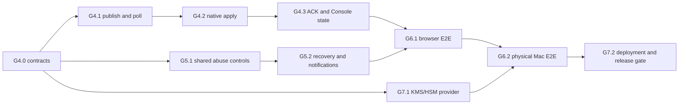

# AgentPass G4–G7 implementation plan

Status: active execution baseline; G4.0 qualified, G4.1 locally qualified, G4.2 live daemon path implemented with real-boundary qualification remaining

Updated: 2026-08-13

Branch baseline: `codex/agent-platform`

## 1. Production outcome

The remaining program delivers one verifiable product path:

1. an owner signs in to the Web Console with a passkey;
2. the owner creates a short-lived device enrollment;
3. the headless macOS service creates non-exportable device and Git-signing keys;
4. Claude Code or Cursor obtains only a bounded signing capability;
5. an authority reduction causes an online Mac to refresh immediately and fail closed;
6. the Console shows the authoritative signed ACK and audit result;
7. the exact Developer ID-signed and notarized artifact is qualified and deployed with recoverable hosted infrastructure.

The browser is the human control plane. The CLI and background macOS service are the device plane. A visible Mac application is optional; the production boundary remains the signed launchd/XPC service installed by PKG.

## 2. Non-negotiable invariants

- The Git signing private key is non-exportable and never leaves Secure Enclave.
- A refresh notification is only a hint. It cannot grant authority, extend expiry, or carry a usable capability.
- A device installs only a newer, issuer-pinned, statement-hash-verified ControlBundle.
- Every ACK is bound to organization, device, key epoch, bundle sequence, statement hash, result, and nonce.
- Offline behavior never exceeds the already installed bundle's expiry and scope.
- Human recovery restores account access but does not satisfy operation-bound recent WebAuthn.
- Cloud signing keys are purpose-separated and versioned; old evidence remains verifiable after rotation.
- Production claims are made only for one source commit and one immutable artifact digest with linked evidence.

## 3. Execution graph

G5.1 and G7.1 can proceed in parallel after G4.0 freezes the shared identifiers and event vocabulary. G6 cannot certify production until G4, G5, and the hosted signer boundary have passed their own security gates.

## 4. G4 — revocation propagation and authoritative ACK

### G4.0 Contract freeze

Status: complete on 2026-08-13. The frozen contract is implemented by the two JSON Schemas, Device OpenAPI, shared positive fixtures, strict Node/Swift decoders, domain-separated canonical signing inputs, and the seven-value refresh-state enum. Node and Swift fixture signing-input SHA-256 vectors are identical. Local evidence: contract validator passed; Node full suite passed with 665 tests and 8 skips; Swift full suite passed with 309 tests. Replay consumption, generation/sequence state transitions, current-key-epoch lookup, and cross-device runtime enforcement remain G4.1/G4.3 responsibilities and are not claimed by this contract slice.

Deliverables:

- `refresh-hint.v1` JSON Schema with an exact version/type envelope, `organization_id`, `device_id`, `authority_generation`, `published_at`, `expires_at`, `nonce`, `key_id`, signature algorithm, and signature;
- `bundle-ack.v1` schema with an exact version/type envelope, organization/device, device-key epoch, sequence, exact ControlBundle statement hash, `applied|blocked`, stable reason code, observed time, nonce, signature algorithm, and device signature;
- Device OpenAPI routes for pending refresh state, authenticated long-poll, bundle fetch, and ACK submission;
- stable device state enum: `pending`, `fetching`, `applied`, `blocked`, `stale`, `offline`, `revoked`;
- explicit canonicalization, signature domains, size limits, time skew, retry limits, and error envelopes.

Threat tests must reject unknown fields, duplicate JSON keys, replay, cross-device substitution, generation rollback, sequence rollback, hash substitution, stale key epoch, oversized input, and invalid time windows.

Exit gate: Node and Swift decode the same fixtures and produce byte-identical signature input. OpenAPI, JSON Schema, and protocol fixtures pass in CI.

### G4.1 Cloud publication and polling

Current implementation checkpoint (2026-08-13): schema version `15` adds restart-safe nonce key identity, commit-only refresh notifications, and safe delivery-state rollover between generations to the generation/key-epoch/outbox/ACK foundation. Hosted runtime uses a purpose-separated refresh signer, reconstructs the same 16-byte nonce across restart or instance failover, records delivery evidence before returning a hint, and holds one bounded PostgreSQL listener with initial/final authoritative queries. PostgreSQL 17 evidence now includes an independently forked publisher killed with `SIGKILL` after commit and before publication, survivor reconstruction of the identical generation/nonce, dual-read/single-write nonce-key rotation, multi-tenant contention, and 100 complete commit-to-observation/commit-to-applied-ACK attempts. A representative repeated local run produced p50/p95/p99 of 2.035/3.728/6.524 ms for observation and 8.001/13.317/28.659 ms for durable applied ACK, with no timeout or pool waiter. Earlier evidence also covers two pools racing exact reduction and ACK, rollback, notification wakeup, nonce mismatch rejection, blocked ACK observation, member removal, policy disable, standalone capability revoke, managed credential/session revoke, and injected audit failure. Every implemented authority-reducing path advances generation, enqueues every active device, and appends the appropriate admin audit in the owning transaction; audit failure rolls the full transaction back. Fixed-key, label-free metrics cover waiter rejection/capacity, delivery failure, notification reconnect/wake failure, propagation observation, and timeout. G4.1 is locally qualified; its production gate remains open for evidence from the selected secret manager and production-like hosted network/database topology, alert routing, sustained-duration load, and a provenance-bound signed report artifact.

Database work:

- add monotonic organization authority generation;
- add per-device desired/observed generation and refresh state;
- add a transactional refresh outbox keyed by organization, generation, device, and event type;
- add ACK nonce digests and an exact unique key for device/epoch/sequence/hash;
- add bounded delivery-attempt metadata and retention indexes.

Cloud work:

- increment generation and enqueue refresh work in the same transaction as membership reduction, policy reduction, device revoke, or emergency stop;
- expose authenticated long-poll with a bounded wait, jitter advice, ETag/generation, and no authority-bearing payload;
- publish optional push hints only after commit; polling remains the correctness fallback;
- fetch the current signed ControlBundle through the existing signed device request protocol;
- make duplicate publication and delivery idempotent.

Exit gate: two Cloud instances and PostgreSQL prove no pre-commit hint, no lost committed generation, no widening from duplicate/reordered delivery, bounded polling resources, and measurable propagation latency.

#### G4.1 remaining implementation sequence

1. **Restart-safe refresh nonce ownership**
   - Status: implemented and locally qualified in unit and real PostgreSQL tests, including two-runtime dual-read/single-write rotation, retained-old-row reconstruction, old-key retirement, cross-binding rejection, and redaction; selected production secret-manager evidence remains.
   - derive each 16-byte nonce with a dedicated secret-manager HMAC key from the immutable tuple `organization_id/device_id/generation/outbox_id`;
   - persist only the nonce digest and a non-secret nonce-key version, never the raw nonce;
   - make every Cloud instance able to reconstruct the same nonce after restart or failover;
   - rotate by dual-read/single-write key version and retain old versions only through ACK/outbox retention;
   - add known-answer, rotation, restart, cross-tenant substitution, and log-redaction tests.
2. **Hosted runtime wiring**
   - Status: implemented and locally qualified against PostgreSQL 17; managed signer work remains G7.1.
   - expose `pollDeviceRefresh`, `snapshotAndAssignBundleHead`, `acknowledgeBundle`, and refresh-state reads through the PostgreSQL store facade without widening its public admin API;
   - return the active immutable `device_key_epoch` and its exact public key from the device-auth lookup path;
   - introduce a purpose-separated `refresh-hint` signer instead of treating the bundle-signing key as an implicit general signer;
   - have the Cloud layer construct and sign the hint from authoritative state; repository rows must never masquerade as signed hints;
   - fail closed when nonce key, signer, active key epoch, or authority state is unavailable.
3. **Commit-coupled authority reductions**
   - Status: implemented and locally qualified. Revocation/device/emergency-stop, policy reduction, member removal/role reduction, managed credential/session revoke, and standalone capability revoke are coupled and fail closed. Organization-first lock ordering is enforced; admin audit uses the same caller-owned transaction; an injected audit failure proves rollback of mutation, generation, refresh outbox, and audit; the capability-issue/member-removal race passes on PostgreSQL 17. Broader stress remains part of production qualification.
   - route emergency stop, device revoke, member removal/role reduction, policy narrowing, credential/session epoch invalidation, and capability revocation through one transaction helper;
   - acquire the organization authority lock in one documented order, mutate authority, increment generation, enqueue every affected device, and append admin audit before commit;
   - prove rollback leaves no mutation, generation, outbox row, audit row, or observable notification;
   - make exact idempotent replay return the committed generation without incrementing it again.
4. **Bounded publication and long-poll**
   - Status: implemented with schema `0014`, one dedicated listener, 30-second waits, bounded waiters, delivery attempts, final-query fallback, and fixed-key label-free refresh metrics. An aggregate-only bounded qualification recorder now emits fixed-shape p50/p95/p99/max, timeout rate, and resource maxima. Production metrics export, dashboards, alert routing, and SLO burn-rate policy remain.
   - add one dedicated PostgreSQL notification listener per Cloud process, with an initial query and final query as correctness fallbacks;
   - use notifications only as wake-up hints; correctness always comes from the committed generation query;
   - cap waits at 30 seconds, listeners and waiter count per process, response size, delivery retries, and retry age;
   - record only fixed-label metrics for propagation latency, active waiters, delivery failures, stale ACKs, and queue age;
   - return `204` for no change and never return policy, capability, or authority bodies from the refresh route.
5. **Real-boundary qualification**
   - Status: locally qualified. PostgreSQL 17 passes two-pool races, duplicate/reordered behavior, rollback, listener wakeup, restart nonce reconstruction, nonce mismatch, blocked ACK, member removal, policy disable, capability and human-management reductions, generation rollover, hard `SIGKILL` between commit and publish, two-runtime nonce-key rotation, multi-tenant contention, and 100-attempt latency/resource evidence. Provider/staging qualification and signed artifact provenance remain.
   - run migrations and repository operations against PostgreSQL 17, including two connections racing reduction, bundle assignment, polling, and ACK;
   - kill one Cloud process after commit and before publish, then prove another process serves the same generation and nonce;
   - reorder and duplicate notifications and ACKs, rotate the nonce/signing key, and inject database/signer timeouts;
   - publish a G4.1 evidence report with p50/p95/p99 propagation latency and bounded resource counts.

G4.1 is complete only when all five steps pass. HTTP contract tests or migration tests alone do not satisfy this gate.

### G4.2 Native fetch and atomic install

Native service states:

`idle → hinted/poll_due → fetching → verifying → staging → applied|blocked → acknowledged`.

Implementation requirements:

- schedule background polling through launchd with bounded exponential backoff and random jitter;
- authenticate every request with the non-exportable device key;
- pin issuer and accepted signer key versions;
- verify organization/device audience, sequence, generation, statement hash, issue/expiry time, and full ControlBundle v2 policy;
- write a staged bundle, fsync, atomically rename, reread, reverify, then switch the active pointer;
- preserve the last valid bundle on crash or verification failure;
- immediately deny signing after emergency-stop/revoke application, and always deny after installed-bundle expiry;
- emit no policy body, repository data, capability, token, or signature material to logs.

Current implementation checkpoint (2026-08-13): the native durable core and live daemon path are implemented. The closed refresh machine, crash-safe snapshot, authenticated HTTPS poll/fetch/ACK transport, strict hint and ControlBundle verification, monotonic generation/sequence/hash/nonce binding, immutable atomic bundle publication, exact signed ACK, and whole-cycle coordinator all run through the ControlBundle v2 service path. Startup now constructs one bounded background runner, resumes non-idle durable state immediately, exposes redacted health/status, coalesces manual XPC refreshes, and routes activation through the existing lifecycle, audit, session-revocation, and authorization transaction. V2 cannot start the legacy `NativeControlFetcher`. Enrollment atomically provisions an exact HTTPS `/v1` API base plus service-owned refresh and bundle-store paths; the installer rejects substituted or permissive bundle-store roots. Activation is reverified at its exact timestamp and again before ACK, so an expiry crossing becomes a durable blocked result while authorization remains fail-closed. Unit and adversarial tests cover restart from every durable state, concurrent synchronization, activation replay, expiry before ACK, redaction, scheduling, cancellation, jitter/backoff, manual-refresh joining, terminal runner lifecycle, and real anonymous-XPC marshalling. A CI durability-model lane exercises seven exact `SIGSTOP`/parent-`SIGKILL` boundaries over real POSIX files, and a non-destructive installer lane checks preservation and path substitution. These two lanes do not claim production service, cryptographic, launchd, or Secure Enclave qualification. Current local evidence is 365 Swift tests passing and 796 Node tests executed (779 passing, 17 intentional skips).

G4.2 is not yet qualified at the real service boundary. Remaining work is a real XPC client matrix, subprocess `SIGKILL`/restart injection over POSIX storage and deterministic local TLS, unified-log/crash-artifact secret scanning, launchd installation/upgrade qualification, and a provenance-bound physical Apple-silicon/Secure Enclave report.

#### G4.2 completion sequence

1. **Freeze runtime configuration and protected storage layout**
   - Status: implemented and locally tested; installed upgrade/reprovision qualification remains.
   - add explicit `control_v2_api_base_url`, `control_v2_refresh_state_path`, and `control_v2_bundle_store_path` fields;
   - derive no security-sensitive endpoint by string slicing the legacy bundle URL;
   - provision the fields atomically from enrollment and reject partial or legacy-v2 mixtures;
   - create the bundle-store root as root-owned mode `0700` in the installer/setup transaction and validate every ancestor without following links;
   - add migration behavior for already-enrolled installations: preserve the active bundle, require exact organization/device/key-epoch continuity, and fail closed with a reprovision action when continuity cannot be proven.

2. **Make the coordinator the only ControlBundle v2 network path**
   - Status: implemented and locally tested; subprocess and XPC boundary evidence remains.
   - construct `NativeDeviceSyncHTTPTransport`, refresh-hint trust, snapshot store, atomic bundle store, and coordinator during service startup;
   - route verified activation through the existing authorization lock, lifecycle verification, audit checkpoint verification, session revocation, control audit, and audited-update completion transaction;
   - remove `NativeControlFetcher` from the v2 branch while retaining it only for explicitly supported legacy mode;
   - prove no second fetcher, timer, or manual XPC request can race an in-flight coordinator cycle.

3. **Add a bounded background runner and signing gate**
   - Status: implemented and locally tested; launchd timing and real XPC concurrency qualification remains.
   - run one cancellable task owned by the service with 15–3600 second base interval, bounded exponential backoff, one-sided jitter, and at most one 30-second long poll;
   - resume `fetching`, `verifying`, `staging`, `applied`, `blocked`, or `acknowledged` from the durable snapshot before scheduling a new poll;
   - expose a thread-safe summary for health and status: state, desired/observed generation, sequence, last attempt/success, next attempt, bounded failure count, and stable redacted reason;
   - make manual XPC refresh join the same actor and return only after one cycle reaches a durable result;
   - gate signing on operational ControlBundle state and exact expiry. Transport freshness must not extend authority or invalidate a still-valid installed bundle unless policy explicitly requires an online-only mode.

4. **Close activation and ACK crash gaps**
   - Status: adversarial in-process coverage is implemented; real process-kill injection at each durable boundary remains.
   - inject crashes before and after bundle-file fsync, hard-link publication, directory fsync, pointer rename, manager state persistence, audit append, session revocation, remote ACK acceptance, and local ACK persistence;
   - on restart, converge to the old valid bundle or the fully verified new bundle and replay the same logical ACK binding;
   - preserve generation and sequence high-water marks after ACK/reset, and reject nonce, key epoch, statement hash, or audience substitution;
   - specify and test behavior when a fetched bundle expires during staging or before ACK: deny authority, persist a stable blocked reason, and ACK only the exact fetched statement.

5. **Qualify the real service boundary**
   - Status: protocol-level anonymous XPC, POSIX durability-model, and non-root installer-preservation lanes are implemented in CI. Production `ServiceEndpoint` through privileged launchd/XPC, trusted HTTPS, root postinstall idempotence, unified logs, and physical Secure Enclave remain pending; this is the remaining G4.2 exit gate.
   - add service-support unit tests for scheduling, cancellation, backoff, and manual-refresh joining;
   - add XPC integration tests for health/status and signing during refresh, expiry, blocked state, and restart;
   - run a subprocess kill/restart harness against real POSIX storage and a deterministic local TLS Device API fixture;
   - run on a physical Apple-silicon Mac using the non-exportable Secure Enclave device key and bind the report to source commit, test binary digest, OS version, and hardware model;
   - require zero secret-bearing fields in service logs, unified logging capture, crash reports, HTTP errors, and test artifacts.

Exit gate: kill the daemon at every durable write boundary and restart. It must expose either the old valid bundle or the fully verified new bundle, never partial state.

### G4.3 Signed ACK and Console device state

Status: in progress on 2026-08-13. Cloud now exposes a bounded tenant-scoped PostgreSQL read model, the BFF accepts only the minimal safe DTO, and Console renders desired/observed generation, bundle expiry, ACK time, and stable blocked/offline/stale states. Device revoke and organization emergency stop use operation-bound recent WebAuthn. The authority-neutral wake endpoint and Console action are implemented. Deterministic Chromium/WebAuthn E2E covers all four roles, six device states, keyboard/screen-reader semantics, wake/revoke authorization, and missing, stale, replayed, cross-operation, and cross-tenant recent-auth rejection. A separate live-process lane now proves pending-to-applied state through PostgreSQL 17 with `verify-full` TLS, real Cloud and production-built Console BFF processes behind trusted HTTPS, P-256 ACK signing, duplicate acceptance, and conflicting-ACK rejection. The browser role/WebAuthn matrix has not yet been driven through those live processes, and physical-Mac ACK observation remains open.

- sign ACKs with the enrolled device key and a dedicated signature domain;
- atomically consume ACK nonce, validate key epoch/sequence/hash, update observed state, and append audit;
- treat duplicate exact ACK as success and conflicting ACK as a stable conflict;
- display desired versus observed generation, last successful refresh, bundle expiry, blocked reason, and offline/stale status in Console;
- add owner/admin actions for refresh, revoke, and emergency stop with operation-bound WebAuthn;
- keep timestamps and status useful without exposing policy contents or identifiers in telemetry.

Exit gate: a membership reduction and emergency stop reach an online physical Mac within the selected SLO; replayed/substituted ACKs have no effect; an offline Mac becomes visibly stale and fails closed at expiry.

## 5. G5 — recovery, abuse controls, and notifications

### G5.1 Shared abuse controls

- apply PostgreSQL token buckets to session bootstrap, WebAuthn options/verify, invitation acceptance, enrollment, recovery, and high-risk mutations;
- separate transport admission from authenticated organization/principal limits;
- add bounded concurrent sessions per human and device enrollment attempts per organization;
- add organization and member session epochs for immediate emergency invalidation;
- return stable, non-enumerating errors and `Retry-After` without exposing bucket keys;
- define alert thresholds for sustained denial, replay, lock timeout, audit gaps, stale ACKs, and refresh SLO breach.

Exit gate: two-instance race tests prove shared limits, clock-safe refill, exact one-time consumption, tenant isolation, and no reset after restart.

### G5.2 Threshold owner recovery

Recommended first production policy:

- generate offline recovery shares during owner setup;
- require a versioned threshold, initially two independent owner shares when two owners exist;
- for a single-owner organization, require one offline owner share plus a separately enrolled recovery credential; support cannot substitute for either factor;
- store only salted hashes/commitments and policy version;
- consume recovery material transactionally and rotate all used material;
- restore a restricted recovery session, then require a fresh passkey registration and normal operation-bound recent WebAuthn before high-risk actions.

Notifications use a secret-free transactional outbox for login, credential changes, recovery start/complete, role reduction, device revoke, emergency stop, signer rotation, and export. Delivery retries are idempotent and payload schemas are allow-listed.

Exit gate: replay, threshold bypass, concurrent consumption, tenant substitution, enumeration, support-only takeover, and notification secret leakage all fail.

## 6. G7.1 — KMS/HSM-backed hosted signers

Define one provider-neutral signer interface:

- `signControlBundle(statement)`;
- `signCapability(statement)`;
- `signReceipt(statement)`;
- `publicKeyMetadata()`;
- `health()`.

Each purpose has a separate key/version and IAM permission. The database stores only provider, purpose, public key, key version, activation/retirement times, and evidence references. Private key export is prohibited.

Implementation slices:

1. contract and deterministic fake provider;
2. selected managed provider adapter and least-privilege identity;
3. dual-read/single-write key rotation;
4. signer outage, timeout, throttling, and malformed-response handling;
5. historical verification and evidence export.

Exit gate: rotation preserves verification of all prior bundles/capabilities/receipts; signer or network failure cannot produce unsigned/fallback-file authority; logs and traces contain no signing input beyond approved hashes and metadata.

## 7. G6 — complete product qualification

### G6.1 Browser E2E

Use Playwright and virtual WebAuthn for:

- bootstrap/login/logout, cookie rotation, expiry, and revocation;
- passkey add/rename/revoke and recent-auth binding;
- organization create/rename, invitation, role change, last-owner denial, and conflicts;
- device enrollment one-time reveal, device state, refresh, revoke, and emergency stop;
- recovery success/failure and abuse-limit behavior;
- keyboard navigation, focus management, accessible names, loading/empty/error states, and supported viewport sizes.

Run a secret scanner over browser storage, rendered HTML, network captures, server logs, traces, screenshots metadata, and test artifacts.

### G6.2 Physical Apple-silicon E2E

Run the exact candidate PKG through:

1. Gatekeeper/notarization verification;
2. clean install and launchd/XPC approval;
3. Console enrollment and non-exportable key proof;
4. Claude Code setup and signed commit verification;
5. Cursor setup and signed commit verification;
6. audit upload and Console observation;
7. policy reduction, refresh, ACK, and denied signing;
8. offline expiry behavior;
9. upgrade, crash recovery, uninstall-preserve, reinstall, and recovery;
10. separately confirmed current-user purge.

The signed qualification report binds source commit, dependency lock digest, artifact digest, Team ID, notarization ticket, macOS version, hardware class, Cloud image digest, database migration manifest, signer key versions, and every test result.

## 8. G7.2 — deployment, review, and release

Infrastructure:

- immutable deployment manifests and image digests;
- private PostgreSQL networking, TLS verification, least-privilege roles, encrypted backups, PITR, and scheduled restore drills;
- authenticated readiness/metrics endpoints, bounded graceful drain, alerts, and redaction checks;
- canary deployment and traffic-only rollback; schema remains forward-only;
- documented RPO/RTO, incident response, key compromise, tenant isolation, and emergency shutdown procedures.

Security gate:

- dependency review, SBOM, provenance, secret scan, SAST, DAST, fuzzing of parsers/signature envelopes, and threat-model delta;
- independent review of native authorization, protocol canonicalization, WebAuthn/recovery, tenant SQL, KMS IAM, and deployment boundaries;
- no unresolved critical/high finding; every accepted lower-severity risk has an owner and expiry.

Distribution:

- Developer ID-signed/notarized PKG is the production Mac channel;
- source, npm, and Homebrew remain clearly labeled evaluation/developer channels;
- no visible Mac app is required for normal operation; an optional status UI may be added later without owning secrets or authorization.

## 9. PR sequence and parallel lanes

| Order | PR slice | Primary files/components | Required check before merge |
| --- | --- | --- | --- |
| 1 | G4.0 protocol freeze | schemas, OpenAPI, Node/Swift fixtures | cross-language canonical/signature fixtures |
| 2A | G4.1 database/outbox | migration, PostgreSQL repositories | real-PG concurrency and rollback |
| 2B | G5.1 abuse schema | migration, shared controls | two-instance limit tests |
| 2C | G7.1 signer interface | signer package, fake provider | conformance and failure tests |
| 3 | G4.1 Cloud polling | Device API, runtime, metrics | duplicate/reorder/outage tests |
| 4 | G4.2 native apply | Swift service, storage, launchd | crash matrix and expiry denial |
| 5 | G4.3 ACK/Console | API, PostgreSQL, BFF, Console | signed ACK E2E and role matrix |
| 6A | G5.2 recovery | Human API, PostgreSQL, Console | threshold/race/replay tests |
| 6B | G7.1 managed adapter | cloud signer/deployment identity | rotation and outage drills |
| 7 | G6.1 browser qualification | Playwright, secret scan | full supported-browser report |
| 8 | G6.2 physical qualification | PKG/native/Claude/Cursor | signed artifact-bound report |
| 9 | G7.2 release gate | deployment, review, evidence | staging drill and zero high findings |

Only slices 2A/2B/2C and 6A/6B are intentionally parallel. Contract changes and shared migrations are serialized to avoid incompatible authority states.

## 10. Evidence required from every slice

Every merged slice must include:

- updated machine-readable contract and compatibility statement;
- threat-model change and explicit failure behavior;
- unit plus adversarial tests;
- real PostgreSQL or real native-boundary tests where applicable;
- log/error/output redaction tests;
- migration forward/rollback-of-transaction evidence;
- operator documentation and exact remediation;
- a changelog entry and traceability from requirement to test.

“Implemented” means code and local tests exist. “Qualified” means the real boundary and exit scenario pass. “Production-ready” is reserved for the final G7.2 evidence index.

## 11. Immediate delivery backlog

| Priority | Deliverable | Depends on | Completion evidence |
| --- | --- | --- | --- |
| P0 | G4.2 real-boundary qualification | implemented single live v2 daemon path | launchd/XPC recovery, subprocess crash matrix, unified-log secret scan, upgrade evidence, and signed physical-Mac report |
| P0 | G4.1 hosted qualification artifact | deployed staging topology and selected secret manager | repeat hard-kill, reconnect, latency, rotation, and sustained-load runs; bind report to source/artifact/environment digests and sign it |
| P1 | G4.3 ACK transport and Console device state/actions | native state machine and ACK signer | Playwright role/recent-auth tests and physical-Mac ACK observation |
| P1 | G5.1 shared abuse controls | stable G4 identifiers | two-instance token-bucket and session-epoch races |
| P1 | G7.1 signer interface and managed adapter | signer purpose contract | conformance, outage, IAM, and rotation evidence |
| P2 | G5.2 threshold recovery and notifications | abuse controls | threshold/replay/concurrency/secret-scan suite |
| P2 | G6.1 browser qualification | G4.3 and G5.2 | full Playwright report and artifact secret scan |
| P2 | G6.2 physical Mac qualification | G6.1 and managed signer | notarized PKG report bound to source and artifact digest |
| P2 | G7.2 production deployment/release gate | all prior gates | restore/canary/rollback drills, independent review, zero unresolved high findings |

Recommended execution order is the table order. G5.1 and the provider-neutral portion of G7.1 may run in parallel with G4.2 after the G4.1 identifiers and signer-purpose contract are frozen; production qualification remains serialized at G6/G7.2.

## 12. Next execution waves

### Wave 1 — finish G4.2 locally

Implemented path: configuration/storage provisioning → live service wiring → runner/status/manual-XPC joining → in-process crash and expiry tests. Remaining critical path: real XPC harness → deterministic local TLS fixture → subprocess kill/restart matrix → installer upgrade and unified-log qualification → physical-Mac evidence. The harness and operator migration/runbook updates can proceed in parallel until the physical qualification gate.

Merge gate:

- `npm test`, `npm run contracts:validate`, and `swift test` pass;
- the v2 service contains no reference to the legacy direct bundle fetch path;
- every persisted state can restart and converge without human input;
- exact-expiry signing denial and emergency-stop application are tested through XPC;
- logs and artifacts pass a deny-list and entropy-based secret scan.

### Wave 2 — implement G4.3 Console state and actions

Build the PostgreSQL read model and Human API first, then the BFF and Console UI. Device rows expose desired generation, observed generation, refresh state, bundle sequence/expiry, last ACK time, and stable blocked reason. Owner/admin actions use idempotency keys plus operation-bound recent WebAuthn; auditor is read-only; member has no device administration authority. Refresh is a wake request only, revoke reduces authority transactionally, and emergency stop affects the whole organization.

Merge gate:

- exact signed ACK travels from a physical or service-integration Mac to PostgreSQL and appears in Console;
- exact duplicate ACK is successful, conflict/replay/substitution is rejected, and stale/offline derivation is deterministic;
- Playwright covers owner/admin/auditor/member visibility, recent-auth expiry/replay, optimistic conflict, keyboard operation, and accessible status text;
- API responses, frontend state, analytics, and browser storage contain no policy body, nonce, signature, capability, or enrollment secret.

### Wave 3 — run G5.1 and G7.1 in parallel

Lane A implements shared PostgreSQL abuse controls and organization/member session epochs. Lane B freezes the provider-neutral signer interface, deterministic fake provider, purpose-specific key metadata, and managed-provider adapter. The lanes share only stable identifiers and migrations; migration numbers and contract changes are serialized by the integration owner.

Merge gate:

- two Cloud instances cannot exceed a shared bucket or concurrent-session ceiling;
- organization emergency invalidation is immediate and restart-safe;
- signer IAM permits only the intended purpose/key, private export is impossible, and no local-file fallback exists;
- key rotation preserves old verification and survives timeout, throttling, malformed provider output, and active-version races.

### Wave 4 — G5.2 recovery and notifications

Implement versioned threshold policy, offline share tooling, hash-only recovery records, transactional one-time consumption, restricted recovery sessions, passkey re-enrollment, and a secret-free notification outbox. Recovery restores access only; it never substitutes for operation-bound recent WebAuthn.

Merge gate: threshold bypass, concurrent use, replay, tenant substitution, support-only takeover, stale policy, notification duplication, and artifact secret scans all fail closed.

### Wave 5 — product E2E and physical Mac qualification

Run browser E2E first, then bind it to the native path on supported physical Macs. Test Claude Code and Cursor setup, unattended commit signing, policy narrowing, revoke, emergency stop, offline expiry, daemon restart, OS restart, key rotation, uninstall/state preservation, and upgrade from the previous signed build.

Merge gate: the report names the exact source commit, PKG SHA-256, nested code identities, notarization ticket, Cloud image digest, migration set, browser versions, macOS versions, hardware, and test evidence hashes.

## 9. Execution backlog after G4.3 Console read model

Baseline commit: `cbd3c49`. The Cloud PostgreSQL device read model, minimal BFF DTO, Console state presentation, device revoke recent-auth flow, and emergency-stop recent-auth flow are implemented. The authority-neutral manual wake implementation was added after this baseline. This is not a production-ready claim: browser E2E, trusted-HTTPS integration, physical Secure Enclave qualification, managed signing, and production deployment remain open.

### P0-A — freeze and implement authority-neutral manual wake

Status: implemented and locally verified on 2026-08-13. Human OpenAPI, Cloud HTTP/recent-auth/audit, file-store evaluation behavior, PostgreSQL migration and replay ledger, post-commit notification, BFF normalization, and outcome-specific Console UI are present. The full Node, Swift, Console, contract, build, and lint gates pass. Real PostgreSQL over trusted TLS and browser/device E2E evidence remain P0-B work; therefore this is not a production-ready claim.

The manual action is a delivery hint, not a new policy generation and not a new authority grant.

1. Freeze `POST /organizations/{organization_id}/devices/{device_id}/refresh-requests` in Human OpenAPI.
2. Require owner/admin role, CSRF, idempotency, and operation-bound recent WebAuthn operation `device.refresh.request`.
3. Add a PostgreSQL wake-request/outbox record keyed by organization, device, current desired generation, and idempotency key. It must reference the current bundle head but must not increment `desired_generation`, create a new bundle statement, reopen a consumed ACK nonce, or alter `observed_generation`.
4. Coalesce concurrent pending wakes for the same device/generation. Exact replay returns the original result; body substitution conflicts; revoked devices and organizations fail closed.
5. Publish only a non-authoritative wake hint. Polling remains the correctness fallback and bundle fetch remains the authority source.
6. Add BFF normalization and a Console action only after the Cloud contract and tests exist. Show accepted/coalesced/offline outcomes without claiming that the device applied the bundle.

Exit gate: concurrent/replayed requests cannot create authority, regenerate ACK evidence, or bypass revocation; a dropped notification still converges through polling; Console never equates `202 accepted` with `applied`.

### P0-B — complete G4.3 browser and PostgreSQL E2E

Status: locally qualified on 2026-08-13. One cleanup-safe command now builds the current Console source and runs the complete browser role/recent-auth matrix against real Cloud and production-built Console processes, disposable PostgreSQL 17 with `verify-full` TLS, and real WebAuthn ceremonies. It covers all six device states, keyboard wake, accepted/coalesced/no-pending outcomes, owner/admin mutations, auditor/viewer denial, missing/stale/replayed/cross-operation/cross-tenant recent auth, and distinct owner/admin revocation. The same command then proves bundle fetch, P-256 signed ACK, exact duplicate ACK, conflicting ACK rejection, and the final applied-state read. A canonical v2 qualification report binds the clean source commit, Console build tree, actual PostgreSQL image/TLS version, Chromium version, and digested results for all three required commands and gates. CI re-verifies, secret-scans, and retains only a passing report. This is not a production deployment or physical Secure Enclave qualification.

1. Add Playwright fixtures for owner, admin, auditor, and viewer sessions with a deterministic WebAuthn virtual authenticator.
2. Cover device state rendering for synced, pending, blocked, stale, offline, and revoked states, including keyboard navigation and screen-reader text.
3. Prove owner/admin can request wake and revoke, auditor/viewer are read-only, and all high-risk actions reject missing, stale, replayed, cross-operation, and cross-tenant recent-auth authorization.
4. Run Console BFF and Cloud API against disposable PostgreSQL over trusted local TLS; do not use the file store or loopback-HTTP test exception in this lane.
5. Drive an exact signed ACK through Device API into PostgreSQL and assert the Console transition from desired > observed to synchronized. Test duplicate success, conflicting ACK, substituted device/path/body, key-epoch mismatch, expiry, and rollback.
6. Scan browser storage, network captures, screenshots, traces, logs, and failure artifacts for policy bodies, nonce, signature, private/enrollment keys, capabilities, cookies, CSRF, and recent-auth material.

Exit gate: the role/recent-auth matrix and signed-ACK state transition pass against PostgreSQL and trusted HTTPS with zero secret-bearing artifacts.

Compatibility note: pre-release databases that already contain `bundle_heads.statement_hash` values produced from the former authority-state fingerprint are not transparently reusable for ACK. The production contract now fails closed unless the exact canonical unsigned ControlBundle hash is derived after sequence assignment and persisted in the same transaction. Before the first production release, disposable/staging databases must be recreated or advanced to newly issued bundle heads after deployment; no production-data migration is claimed.

### P0-C — qualify the native boundary on physical Macs

Current checkpoint (2026-08-13): the repository now has the fail-closed software chain needed to produce and verify qualification evidence. It generates a migration manifest from immutable Git objects, binds the dependency lock, Cloud image digest, signer key versions, Team ID, and all six nested code identities into a release attestation, executes a fixed 16-gate/20-test physical protocol, signs canonical v2 reports with an externally pinned Ed25519 operator identity, and requires distinct qualified Apple Silicon and Intel T2 reports before emitting a promotion summary. Unit/adversarial coverage is complete for this chain. Production qualification is still open until the following execution slices are completed against a real notarized candidate.

Execution slices, in order:

1. `P0-C1 candidate binding`: wire migration-manifest and release-attestation generation into `release-candidate.yml`; include both files in the signed release manifest and artifact upload. Require protected immutable Cloud image digest and canonical signer-version inputs. Exit: substitution of source, lockfile, migration, image, key version, Team ID, app, or nested executable fails before upload.
2. `P0-C2 protected hardware lanes`: provision one dedicated Apple Silicon runner and one Intel Mac with T2. Install the exact downloaded PKG into clean snapshots and run root-owned, non-writable gate drivers in separate protected GitHub environments with independent operator keys. Exit: both lanes emit private evidence, an unsigned canonical report, and a detached signature without exposing raw command output or private key bytes.
3. `P0-C3 aggregate promotion`: download both lanes into a secret-free job, validate each report against the signed release manifest and external approved-operator policy, compare all shared provenance fields, and make `publish` depend on the aggregate summary. Exit: missing, duplicate, swapped, stale, differently bound, unapproved, failed, or skipped evidence makes publication impossible.
4. `P0-C4 destructive lifecycle qualification`: fill the 16 drivers with real install, Secure Enclave, Claude Code, Cursor, revoke, emergency-stop, crash, reboot, sleep/wake, network/clock, upgrade, uninstall/reinstall, and purge procedures. Exit: all 20 tests pass once on each hardware class against the same PKG; retained evidence is reviewed and archived.
5. `P0-C5 distribution`: issue the first Developer ID/notarized draft release, install it from GitHub Release and the documented CLI bootstrap path on clean machines, verify update and rollback behavior, then publish the compatibility matrix and verification commands. Exit: a user can install without Xcode or a separately distributed Mac app while still reaching the same signed native product boundary.

1. Produce a Developer ID-signed and notarized PKG containing the app, XPC client, privileged service, launchd configuration, and exact entitlements.
2. Install and upgrade through the real root installer path; verify ownership, modes, designated requirements, Team ID, nested signatures, launchd registration, and preservation of protected state.
3. Enroll a dedicated non-exportable Secure Enclave P-256 device key and prove Cloud possession verification. Record only public identity evidence and key attributes.
4. Run unattended Claude Code and Cursor commit signing while the user is logged in but absent. Confirm no recurring biometric prompt is needed for policy-authorized agent use and that unrelated processes cannot invoke the signer.
5. Kill the app/service at every durable refresh, bundle-install, ACK, audit, and setup boundary; repeat after OS restart, network loss, sleep/wake, clock adjustment, and an upgrade from the previous signed build.
6. Verify revoke, emergency stop, offline expiry, rollback/equivocation rejection, uninstall behavior, and retained-state recovery against the exact release artifact.

Exit gate: a signed qualification report binds hardware model, macOS version, source commit, PKG digest, code identities, notarization ticket, Cloud image digest, and evidence hashes. Simulator, ad-hoc signing, and the POSIX durability model remain supporting evidence only.

### P1-A — shared abuse controls and immediate session invalidation

1. Add PostgreSQL-backed token buckets for bootstrap, WebAuthn options/verify, invitation acceptance, enrollment, wake, revoke, emergency stop, and recovery.
2. Separate unauthenticated transport admission limits from organization/member/device limits; never derive a durable bucket key from unverified caller input alone.
3. Add organization and member session epochs. Emergency stop and membership authority reduction increment the relevant epoch in the same transaction as audit/outbox writes; stale sessions fail on their next request on every Cloud instance.
4. Enforce bounded active sessions, pending WebAuthn ceremonies, enrollment attempts, and wake requests. Return stable non-enumerating errors and bounded `Retry-After`.
5. Add two-instance race, restart, clock, hot-key, tenant-isolation, and database-outage tests.

Exit gate: aggregate limits cannot be exceeded across instances and emergency invalidation cannot be bypassed with a session issued before the reduction.

### P1-B — provider-neutral hosted signer and managed-key adapter

1. Freeze a purpose-separated signer interface for ControlBundle, Capability, refresh hint, Console identity assertion, and release/qualification evidence. Each call binds purpose, key ID/version, algorithm, canonical digest, deadline, and request ID.
2. Implement a deterministic fake provider for conformance and fault injection, then one production managed KMS/HSM adapter. Private export and local-file fallback are forbidden in hosted mode.
3. Store only public key metadata and provider references. Enforce IAM per purpose/key and validate provider signatures locally before publishing results.
4. Implement overlap rotation: old verification remains available while new signing activates atomically; ambiguous timeout, throttling, malformed DER/P1363, wrong key version, and active-version races fail closed.
5. Add signer latency/error metrics with non-secret labels and a break-glass procedure that cannot mint signatures outside the normal audit trail.

Exit gate: provider IAM, rotation, timeout/retry behavior, public verification, and no-export/no-fallback properties have automated and operator-reviewed evidence.

### P2 — threshold recovery and secret-free notifications

1. Version the recovery policy and generate independent offline owner shares. Store only salted commitments/digests and never upload raw shares.
2. Consume threshold authorization transactionally, rotate used material, issue a restricted recovery session, and require passkey re-enrollment plus normal recent WebAuthn before high-risk operations.
3. Add an allow-listed transactional notification outbox for login, credential changes, recovery, role reduction, device revoke, emergency stop, signer rotation, and export.
4. Make delivery idempotent and keep destination/provider failures out of authority transactions. Notification payloads must not include secrets, policy bodies, repository paths, or signing material.

Exit gate: threshold bypass, concurrent consumption, replay, stale-policy use, tenant substitution, support-only takeover, duplicate delivery, and artifact leakage all fail closed.

### P3 — production deployment and release acceptance

1. Build immutable Cloud and Console images from a signed source commit; apply forward-only migrations through a separately authorized job and record migration/image digests.
2. Configure trusted TLS, managed PostgreSQL backups/PITR, KMS/HSM keys, least-privilege service identities, secret injection, log retention, audit export, and regional failure behavior.
3. Define SLOs for refresh convergence, ACK freshness, signer latency, authentication success, audit continuity, and emergency-stop propagation. Alerts must use stable non-secret dimensions.
4. Run migration rehearsal, backup restore, canary, rollback-without-schema-reversal, key rotation, dependency outage, and capacity tests.
5. Publish the notarized PKG, signed manifest, checksums, SBOM, verification instructions, compatibility matrix, and known limitations. The release workflow must verify signed source before entering any secret-bearing job.

Exit gate: browser E2E, trusted-HTTPS/PostgreSQL integration, physical-Mac qualification, security review, restore drill, observability review, and release verification all bind the same source and artifact identities.

### Required merge order

1. P0-A Cloud contract/repository/runtime tests.
2. P0-A BFF and Console action.
3. P0-B browser/PostgreSQL/trusted-TLS E2E.
4. P0-C signed physical-Mac qualification.
5. P1-A and P1-B in parallel with serialized migrations and contract review.
6. P2 recovery/notifications after session epochs and signer interface stabilize.
7. P3 deployment and release acceptance.

Every merge keeps the repository releasable: contract validation, full Node and Swift suites, Console build/lint/tests, PostgreSQL integration tests, secret scans, and the applicable signed-artifact checks must pass. External credentials or hardware may block a qualification lane, but they do not justify weakening the gate or labeling modeled evidence as production evidence.

### Wave 6 — production deployment and release

Provision private PostgreSQL, backups/PITR, managed signer identities, metrics/alerts, canary deployment, forward-only migration procedure, restore drills, incident runbooks, and release evidence. Complete independent security review and resolve every critical/high finding before production claims.

Release gate: canary, rollback, database restore, signer rotation/compromise, tenant isolation, emergency shutdown, and disaster-recovery drills pass against the immutable release candidate. Publish the Developer ID-signed/notarized universal PKG; retain Homebrew/npm/source channels as explicitly non-production developer paths until they install and verify the same signed product artifact.
