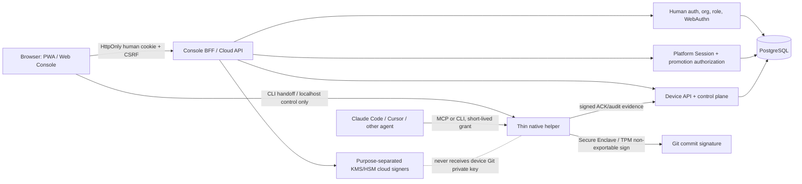
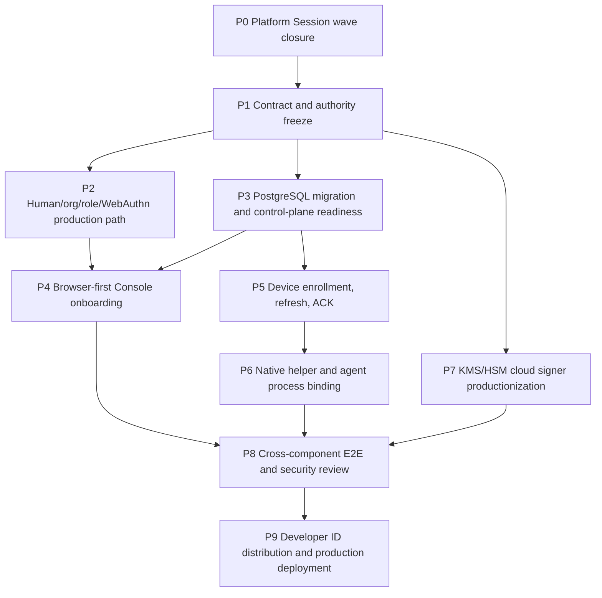

# AgentPass implementation roadmap

Status: active implementation plan; not a production-readiness claim
Baseline: `codex/agent-platform` after the Platform Session authorization wave
Date: 2026-08-15

Related proposed product expansion: [AgentPass Small Software Cloud — Product
and Implementation Specification](SMALL_SOFTWARE_CLOUD_SPEC.md). That document
defines the future `agentpass publish` product and does not supersede the
production gates in this roadmap.

The ordered, issue-level execution backlog for this roadmap is maintained in
[`EXECUTION_PLAN.md`](./EXECUTION_PLAN.md).

This document is the execution plan for turning AgentPass into a browser-first product for coding agents. It deliberately distinguishes code that exists in this repository from boundaries that still need integration, live qualification, operational controls, or independent review.

## 1. Product outcome and non-goals

### 1.1 Product outcome

A person uses a PWA/Web Console to create an organization, authenticate with WebAuthn, enroll a Mac, configure Claude Code or Cursor, and grant a narrowly scoped, expiring agent session. The coding agent can request a Git commit signature while the private signing key remains inside the Mac hardware boundary. The person can see the request in the Console, revoke the device/session, and verify the resulting audit record without opening a native application during normal use.

The native component is a thin, signed helper/daemon. It exists for operations that cannot be provided safely by a browser or server, especially Secure Enclave/TPM-backed key generation and signing, local process binding, protected state, and local policy enforcement. It is not the primary product UI.

### 1.2 Non-goals for the first production release

- Exporting a Git signing private key, even for backup.
- Letting a browser, Console, Cloud API, MCP server, or cloud signer sign with the device Git key.
- Treating an API token, a long-lived agent secret, or a plaintext file as an equivalent to an Agent Session.
- Supporting every editor/agent integration before the common protocol and process-binding boundary is qualified.
- Calling a local unit-test signer, file-backed key, simulated WebAuthn response, or localhost-only deployment production evidence.

## 2. Current state versus gaps

The following assessment is based on the repository as it exists at this baseline. “Present” means that a reviewed implementation, contract, or test exists in the tree; it does not mean that the production gate has passed.

| Area | Present in the repository | Remaining gap before the area can be called production-ready |
| --- | --- | --- |
| Core protocol and schemas | Shared protocol/capability packages, JSON Schemas, fixtures, contract catalog, validation scripts, and multiple versioned evidence contracts exist. | Freeze the Platform v1 OpenAPI/JSON Schema semantics, complete catalog/authority-manifest updates for migration 0055, and prohibit implementation-only fields from entering browser contracts. |
| Platform Session | Migrations 0053–0055 define platform credentials/sessions, one-use challenges, request binding, CSRF binding, proof consumption, atomic promotion reservation, and the Human Session bootstrap function. The HTTP boundary now reduces the browser request to public intent. | Complete the repository/service adapter, compose it into the hosted route, prove that the old Human-session promotion path cannot remain a production bypass, and run real-PostgreSQL race/replay tests. The current wave is still an integration checkpoint, not a shipped feature. |
| Human identity, organization, role, and WebAuthn | Human session/auth modules, recent-auth handling, organization/membership/invitation contracts and services, WebAuthn registration/authentication paths, and PostgreSQL repositories exist. | Finish browser journey coverage, session/epoch invalidation qualification, recovery and credential-management UX, abuse controls, and operational evidence for high-risk actions. |
| Console | `apps/web-console` contains a web UI, BFF/client modules, organization/security/auth/recovery/device-related tests, and browser E2E specs. | Replace any sample/presentation state, connect every supported page to production Cloud API read/write paths, make loading/error/empty/revoked states explicit, and qualify accessibility, CSRF, origin, and cross-tenant behavior in a deployed-like environment. |
| PostgreSQL control plane | Forward-only migration runner, control-plane repositories, durable idempotency/replay structures, audit/activity, device refresh, agent-session, recovery, managed-signer, and platform authority tables/functions are present. | Apply and qualify the current migration head on a real PostgreSQL service, add migration 0055 to every catalog/role/readiness/qualification surface, validate indexes/locks/retention, and prove backup/PITR restore. |
| Device API | Device enrollment, possession verification, refresh hints, signed control bundles, bundle ACK contracts, device audit, and agent-session device APIs are implemented in parts of the Cloud API/native stack. | Finish the end-to-end enrollment-to-ACK path with a real native device, immediate revoke/refresh propagation, offline/reconnect behavior, and physical-Mac evidence. |
| Local native boundary | macOS native code and Secure Enclave-oriented signing/lifecycle components exist, along with setup/doctor/release qualification infrastructure. | Complete the thin helper contract, process binding, key lifecycle and uninstall-preserve/purge semantics, then pass physical Apple Silicon and Intel/T2 scenarios with a Developer ID/notarized candidate. |
| Cloud signer | KMS/provider and managed-signer abstractions, purpose registry, lifecycle/fencing/reliability code, and signer-related tests exist. | Provision production provider identities, separate key purposes, verify exact key-version selection/rotation/fencing, remove unsafe fallback paths, and qualify provider outages and uncertain results. |
| Distribution | Release validation, SBOM/manifest/signing/notarization verification scripts and package/native assembly exist. | Produce and verify a real universal PKG/CLI release, publish a browser-first onboarding path, document upgrade/rollback, and qualify clean-machine installation without Xcode. |
| E2E/security/operations | Many focused tests, PostgreSQL integration tests, qualification scripts, audit/recovery runbooks, and threat-model material exist. | Run the complete cross-component matrix, commission independent security review, deploy with alerts/PITR/rollback, and retain tamper-evident evidence for every production gate. |

### 2.1 Platform-session wave: exact boundary to preserve

The browser may send only a public promotion intent for the currently supported operation:

```json
{
  "operation": "platform.promotion.issue",
  "organization_id": "...",
  "promotion_id": "...",
  "deployment_id": "...",
  "environment": "...",
  "candidate_id": "..."
}
```

`Idempotency-Key` is transport metadata and is included in the canonical request digest. The browser must not send `principal_id`, `member_id`, `assignment_id`, authority generation, role, credential authority IDs, approval identity, or provider claim material. The trusted bootstrap/resolver derives those values from the hashed Human Session and PostgreSQL state. The WebAuthn assertion proves the challenge issued for that intent; it does not become a general bearer credential.

The next implementation must keep the following properties intact:

1. Human-session authentication, platform-session authentication, and device authentication remain separate namespaces.
2. The challenge, assertion proof, CSRF binding, JTI, and idempotency binding are consumed or reserved atomically where the operation requires it.
3. The production route can issue only through the authorized Platform Session service. Unauthenticated legacy replay/get or direct database replay paths must not be exposed as the replacement route.
4. On uncertainty, expired session, revoked assignment, stale generation, credential clone detection, proof replay, or database failure, the result is denial or an explicit retry-safe error.

## 3. Target architecture and trust boundaries



The core trust rules are:

- PostgreSQL is authoritative for tenant membership, role, session epochs, platform assignment, platform credential state, proof consumption, idempotency, and audit linkage.
- The browser is an untrusted presentation and intent surface. Browser storage must not contain bearer sessions or private keys.
- The Cloud API may mint signed control artifacts and cloud-owned evidence, but cannot sign with the Mac Git key.
- The native helper is the only component allowed to invoke the hardware-backed Git signing key. It must enforce agent/process/repository/branch/session constraints locally.
- The cloud signer is purpose-separated from the device signer. A cloud signer outage must not silently select a local or file-backed production key.

## 4. Dependency graph and phase gates



Parallelism is allowed only after the shared contract at the preceding edge is frozen. A phase exit is a gate, not a progress percentage: code plus tests plus operational evidence must exist.

| Phase | Scope | Depends on | Exit gate |
| --- | --- | --- | --- |
| P0 | Close the current Platform Session authorization wave. | Existing 0053/0054 model. | Fresh PostgreSQL head recognizes 0055; public-intent challenge, assertion, CSRF, proof replay, idempotency and atomic reserve tests pass; hosted runtime is fail-closed; no unauthorized legacy path is used. |
| P1 | Freeze protocol/schema/OpenAPI and threat model. | P0 findings. | Versioned Platform v1 contract, catalog, fixtures, error taxonomy, compatibility rules, and threat-model changes reviewed and pinned. |
| P2 | Complete Human Session, organization, role, session epoch, WebAuthn and recovery flows. | P1 + PostgreSQL. | Browser can sign in, select only an active organization, perform role-gated high-risk actions with recent WebAuthn, and observe durable audit; revocation invalidates affected sessions. |
| P3 | Make PostgreSQL the production control-plane authority. | P1. | Migration, role grants, readiness, connection/TLS, idempotency, locks, backup/PITR and restore qualification pass on a managed PostgreSQL service. |
| P4 | Deliver real Console/BFF and browser-first onboarding. | P2 + P3. | A new user completes onboarding without a native UI; native helper installation is the only platform-specific handoff; all pages are real data and fail safely. |
| P5 | Complete Device API lifecycle and propagation. | P3 + P4. | Enroll, refresh, ACK, revoke and recover a real device; changes propagate within the stated bound and survive reconnect/restart. |
| P6 | Complete thin helper, Secure Enclave/TPM boundary, and agent adapters. | P5 + native contracts. | Two unattended agent runs sign only through the bound helper; process/repository/session substitution is denied; key export is impossible. |
| P7 | Productionize cloud signing. | P1 + P3. | Each purpose uses the configured KMS/HSM key, rotation/fencing is tested, provider uncertainty is handled, and no unsafe fallback is available. |
| P8 | Run E2E, security review and resilience. | P4–P7. | Cross-component matrix passes on production-like TLS/DB; critical/high findings are closed or formally accepted by the security owner. |
| P9 | Release, deploy, monitor and operate. | P8. | Notarized distribution, rollback, PITR restore, alert routing, incident runbooks and evidence bundle pass; production approval is recorded. |

## 5. Concrete deliverables by phase

### P0 — Platform Session wave closure

Deliverables:

- Complete `0055_platform_session_bootstrap.sql` integration and add its migration/catalog/role/readiness references.
- Keep one canonical request-digest implementation shared by the HTTP contract and PostgreSQL contract tests.
- Implement the authorized promotion repository adapter around the atomic proof-consume/reserve function.
- Compose the trusted Human Session bootstrap resolver into the hosted runtime; hash raw session/CSRF material at the boundary and never pass raw bearer material to SQL.
- Route Platform Session challenge/assertion/revoke through the server without generic Cloud authentication reinterpretation.
- Expose only the supported issue operation from the new authorized boundary until authenticated replay is implemented.
- Preserve safe response projection: no bearer, raw challenge, JTI, assertion, signature, token, or authority internals in JSON.

Exit evidence:

- Fresh database migration head and exact N4→N5 qualification.
- Unit, contract, fake-repository, and real-PostgreSQL integration tests for concurrency and replay.
- Runtime composition test proving missing bootstrap/repository/authenticator fails startup or returns a non-success response.
- Diff/contract/lint checks and a focused review of the changed trust boundary.

### P1 — Contract and authority freeze

Deliverables:

- `contracts/openapi/platform-v1.json` with explicit cookie, CSRF, origin, body, error, idempotency and response rules.
- Versioned JSON Schemas and fixtures for challenge, assertion, session response, revoke, and authorized promotion request/result.
- Contract catalog entries with authority owner, tenant binding, actor binding, expiry, replay/idempotency semantics, and implementation references.
- A threat-model section for browser-first onboarding, thin helper installation, platform sessions, cloud signing, and agent process binding.
- A compatibility matrix for legacy file/evaluation mode versus hosted PostgreSQL mode.

Exit evidence: schema validation, OpenAPI structural validation, fixture round trips, unknown-field rejection, duplicate-key rejection, canonical digest vectors, and security review sign-off on the boundary document.

### P2 — Human/org/role/WebAuthn

Deliverables:

- Production browser sign-in and session bootstrap with HttpOnly/Secure/SameSite cookies and CSRF protection.
- Organization selector that discloses only active memberships; role matrix for owner/admin/auditor/viewer and platform operator as a separate namespace.
- WebAuthn registration, authentication, credential rename/revoke, sign-count/clone handling, and recent-auth operation binding.
- Session epoch invalidation for membership removal, role downgrade, credential revoke, organization security events, and recovery transitions.
- Durable audit entries for invitations, role changes, device actions, credential actions, recovery, platform-session issue/revoke, and promotion issue.

Exit evidence: browser tests for every role and invalidation path; PostgreSQL lock/race tests; no caller-supplied member/role/organization authority is trusted; audit records are tenant-bound and immutable.

### P3 — PostgreSQL and control-plane readiness

Deliverables:

- Apply migrations through the current head using the forward-only migration runner; reject checksum drift, dirty state, gaps, and partial migration.
- Update least-privilege `roles.sql`, authority manifest, readiness checks, migration inventory and CI qualification for every new function/table.
- Define connection pool limits, statement/lock timeouts, TLS verification, transaction retry policy, and graceful drain behavior.
- Validate indexes for tenant, session, challenge, credential, idempotency, activity and audit queries.
- Configure encrypted backups, PITR, restore-to-isolated-environment, retention, and restore comparison.

Exit evidence: fresh install, upgrade, concurrent migration, interrupted transaction, restore, checksum mismatch, and privilege-negative tests; readiness is false until DB/schema/role/signer dependencies all pass.

### P4 — Browser-first Console and onboarding

Deliverables:

- Dashboard: organization, active session/device state, policy summary, last activity, and clear revoke controls.
- Onboarding: sign-in → organization → WebAuthn → device enrollment → helper handoff → agent configuration → verification.
- Device page: enrollment status, last seen, key fingerprint (public only), refresh/ACK state, revoke, and recovery path.
- Agent setup page: copy/paste or CLI handoff for Claude Code/Cursor; show the scope and expiry of the resulting session without displaying secret material.
- Activity page: authoritative cursor pagination, filters, audit verification state, and safe error/empty/revoked states.
- Security page: WebAuthn credentials, recent sessions, platform sessions, recovery status, and high-risk confirmation UX.

Exit evidence: deployed-like browser E2E with keyboard/accessibility checks, CSP/CORS/origin checks, no secrets in local/session storage, and cross-tenant negative cases.

### P5 — Device API

Deliverables:

- Enrollment issue/complete with one-time challenge, possession proof, device public key and idempotent completion.
- Device-authenticated refresh and signed ControlBundle delivery with sequence/epoch/rollback rejection.
- Signed bundle ACK persistence, retry/reconnect behavior, refresh hints, manual wake, and durable activity projection.
- Device revoke and organization security changes that invalidate future grants and force bounded refresh.
- Offline state machine with explicit denial when authority is expired or stale.

Exit evidence: real native client against PostgreSQL over TLS; duplicate/reordered/old/future ACK and refresh tests; process kill/restart; revoke propagation measurement; no private key in HTTP payloads or logs.

### P6 — Thin native helper and agents

Deliverables:

- Stable local helper protocol: request ID, agent session grant/lease, repository/worktree/branch binding, one-signature transaction, result/error taxonomy, and audit correlation.
- Secure Enclave/TPM key generation and signing; public-key attestation/fingerprint only; explicit unsupported-hardware behavior.
- Process binding using executable identity, PID/parent/ancestry or equivalent platform evidence, configured agent identity, and bounded TTL.
- Claude Code and Cursor adapters behind the same common session contract; MCP/CLI setup must not create a reusable secret.
- Setup/doctor/upgrade/uninstall-preserve/uninstall-purge state machine with crash recovery and protected-state policy.

Exit evidence: two real unattended signed commits, restart/kill/replay/expiry tests, argv/environment/stdout/log/repository secret scans, process substitution denial, wrong-repo/branch denial, and physical-hardware qualification on supported Mac classes.

### P7 — Cloud signer

Deliverables:

- Purpose-separated keys for control bundles, capabilities, agent-session grants, refresh hints, audit anchors, promotion evidence, and release/qualification manifests as applicable.
- Provider adapter with exact key ID/version, signature metadata, health/readiness, rate limits, timeout, retry, fencing and uncertain-result handling.
- Rotation runbook: introduce new verification key, dual-read verification window, switch issuance, retire old key only after retention/verification window.
- No file-backed or development signer in hosted production configuration; startup/readiness must fail closed when the configured signer is unavailable or mismatched.

Exit evidence: provider integration tests with a real sandbox KMS/HSM, key-version substitution denial, rotation, outage, timeout, duplicate request, and provider-operation reconciliation tests.

### P8 — E2E, security review and production deployment

Deliverables:

- One production-like environment with managed PostgreSQL, TLS, Console, Cloud API, signer provider, browser, CLI, helper and real Mac.
- Full scenario suite from account creation through two unattended commits, Console observation, immediate revoke, blocked third commit, audit export/verification, recovery and reinstall.
- Threat-led adversarial suite, dependency/SBOM review, secret scanning, fuzzing for parsers, race/chaos tests, and independent security review.
- Production deployment manifests, migration gate, health/readiness endpoints, structured redacted logs, metrics, traces, alerts, on-call ownership and incident runbooks.

Exit evidence: all P0/P1 security findings closed or formally accepted; evidence bundle binds commit, schemas, migrations, container/package digests, signer key metadata, test results, and operator approvals.

## 6. Issue-sized work packages

Priorities: P0 blocks the next gate or creates a security bypass; P1 is required for beta/production use; P2 improves scale, ergonomics, or post-launch hardening.

| ID | Priority | Work package | Definition of done |
| --- | --- | --- | --- |
| PS-01 | P0 | Register migration 0055 everywhere | Catalog, loader, authority manifest, roles, readiness and CI all identify the same head; fresh DB and upgrade tests pass; no unrelated files are changed by the migration registration. |
| PS-02 | P0 | PostgreSQL Platform Session bootstrap repository | Only hashed Human Session input crosses the adapter; SQL derives member/principal/assignment/generation/allowed credentials; zero/multiple candidate assignment fails closed; integration test proves tenant isolation. |
| PS-03 | P0 | Atomic promotion authorization service | Proof consumption, request digest, idempotency, reservation and audit linkage are one transaction; same request returns the same safe result; conflict/replay/uncertain outcomes are explicit and tested. |
| PS-04 | P0 | Hosted Platform Session route cutover | Challenge/assertion/revoke and issue use the new boundary; legacy route cannot issue through a weaker authority; startup/readiness fails when the authorized service is absent. |
| PS-05 | P0 | Platform HTTP negative matrix | Reject wrong origin, missing/duplicate cookie, missing CSRF, forbidden authority headers, unknown fields, duplicate JSON keys, oversized bodies, replayed proof and cross-tenant intent. |
| CT-01 | P0 | Freeze Platform v1 contracts | OpenAPI, schemas, fixtures and catalog agree on public intent, cookies, headers, error codes and redaction; canonical digest vectors are checked in. |
| CT-02 | P1 | Contract compatibility and deprecation policy | Define hosted/evaluation profiles, version negotiation, legacy route retirement, and an explicit no-downgrade rule; CI detects unreviewed breaking changes. |
| ID-01 | P0 | Human session epoch invalidation | Membership/role/credential/recovery changes invalidate the correct sessions and recent-auth records atomically; concurrent requests cannot use stale authority. |
| ID-02 | P1 | WebAuthn credential lifecycle UX | Register, authenticate, rename, revoke and clone-detect flows are usable and fully tested; high-risk operations require recent WebAuthn and explicit confirmation. |
| DB-01 | P0 | Managed PostgreSQL production profile | TLS, least privilege, pool/timeouts, migration gate, readiness and connection failure behavior are configured and verified against a managed service. |
| DB-02 | P1 | Backup/PITR and restore drill | Restore into isolation, run integrity/tenant/audit checks, compare expected projections, record RTO/RPO evidence, and document rollback decision points. |
| CO-01 | P0 | Remove Console sample state | Every production page reads authoritative API data; loading, empty, stale, revoked, unauthorized and server-error states are represented and tested. |
| CO-02 | P1 | Browser-first onboarding | A new user completes onboarding using PWA/Web UI plus a CLI/thin-helper handoff; no native app window is required for normal setup. |
| CO-03 | P1 | Console security/accessibility E2E | Playwright/browser tests cover roles, CSRF/origin, storage inspection, keyboard navigation, screen-reader labels, cross-tenant denial and revocation. |
| DV-01 | P0 | Device enrollment and ACK closure | Real device enrollment, signed bundle, ACK, refresh, reconnect and revoke work with durable PostgreSQL state and bounded propagation. |
| DV-02 | P1 | Offline/restart state machine | Expiry, stale sequence, process kill, clock skew, duplicate delivery and recovery all converge to safe states with no secret persistence. |
| NA-01 | P0 | Thin helper protocol and process binding | Common request/response contract, grant/lease validation, executable/process/repository binding and one-signature transaction pass adversarial tests. |
| NA-02 | P0 | Secure Enclave/TPM key lifecycle | Generate non-exportable key, sign, rotate/revoke, preserve by default on uninstall, and destroy only through separately confirmed purge; unsupported hardware fails closed. |
| NA-03 | P1 | Claude Code and Cursor adapters | Both adapters use the common short-lived session contract, expose no secret in argv/env/logs, and pass real unattended commit tests. |
| SG-01 | P0 | Production KMS/HSM signer wiring | Hosted startup/readiness requires provider-backed purpose-separated signers; development/file-backed signer is impossible in production configuration. |
| SG-02 | P1 | Signer rotation and uncertainty | Exact key version is recorded in safe metadata; rotation, timeout, duplicate, fencing and provider-uncertain results have deterministic retry/reconcile behavior. |
| OP-01 | P0 | Redacted telemetry and alerts | Logs/metrics/traces contain request IDs and decision codes but no bearer, assertion, raw challenge, private key, claim token or sensitive payload; alert routes are tested. |
| OP-02 | P1 | Incident and recovery runbooks | Revoke organization/device/session, rotate signer, restore DB, quarantine release, recover failed migration, and communicate an incident with owners and timings. |
| RT-01 | P0 | Full production-like E2E | Account → organization → WebAuthn → device → agent → two signed commits → Console audit → revoke → blocked request passes on real boundaries. |
| RT-02 | P0 | Independent security review | Threat model, code, dependency/SBOM, deployment, key management and E2E evidence reviewed; critical/high findings have verified fixes or written risk acceptance. |
| RL-01 | P0 | Developer ID/notarized release | Universal package/CLI is signed, notarized and independently verified; clean Mac install/upgrade/rollback/uninstall-preserve/reinstall/purge pass. |
| RL-02 | P0 | Production deployment gate | Immutable artifacts, migration approval, readiness, canary, drain, rollback, PITR restore, alert routing and evidence retention are operationally rehearsed. |

## 7. Threat and security acceptance criteria

The following are release-blocking criteria, not aspirations:

1. **Secret containment:** no raw private key, bearer token, CSRF token, challenge, JTI, WebAuthn assertion, provider claim, or reusable agent secret appears in browser storage, URL, HTML, argv, environment, stdin, repository files, logs, metrics, traces, crash reports, or audit JSON.
2. **Hardware boundary:** the device Git signing key is generated/imported only where the selected hardware supports non-exportability; export, backup, debug dump and software fallback are rejected or clearly limited to a non-production evaluation profile.
3. **Authority derivation:** member, role, principal, assignment, generation, credential authority and allowed WebAuthn IDs come from trusted server/database state. Caller-supplied copies are ignored or rejected before authority is granted.
4. **Tenant isolation:** every human, device, platform and audit read/write is tenant-qualified where applicable; an organization ID in a body cannot elevate or select an organization outside the authenticated membership.
5. **One-use proof and replay:** challenge, assertion proof, JTI, request digest and idempotency state have one authoritative consumption/reservation path. Concurrent duplicates yield one durable outcome and never two promotions/signatures.
6. **Session reduction:** platform sessions have bounded absolute and idle expiry, CSRF binding, assignment/credential/generation snapshots, self-revoke, administrative revoke, and fail-closed checks on every privileged mutation.
7. **Process binding:** a stolen grant is insufficient on another PID/process/executable/repository/worktree/branch or after expiry/revocation. Substitution tests must fail before signing.
8. **Cloud signer separation:** the cloud signer cannot request or receive the device private key. Hosted readiness fails if a purpose is mapped to the wrong key, old version, local file signer, or unavailable provider.
9. **Audit integrity:** privileged decisions have immutable, tenant-bound, correlation-linked audit records. Audit export verification detects missing, reordered, modified, or cross-tenant records.
10. **Failure safety:** database outage, signer timeout, stale migration, invalid origin, clock uncertainty, provider uncertainty, crashed helper, or incomplete uninstall never silently authorizes a signature.

## 8. Test strategy and evidence matrix

| Layer | Required coverage | Evidence |
| --- | --- | --- |
| Static/schema | Node syntax/lint, JSON Schema, OpenAPI, catalog, SQL transactional/destructive-statement checks, migration ordering/checksum, secret-pattern scan. | CI logs tied to commit and contract catalog version. |
| Unit/property | Canonical JSON/digest, parsers, cookie/header normalization, error mapping, session expiry, role matrix, capability narrowing, process-binding predicates. | Deterministic test output and negative fixtures. |
| Repository/SQL | Real PostgreSQL for locks, unique conflicts, transaction rollback, idempotency, replay, epochs, migration upgrades, privileges and tenant isolation. | Database version, migration head/checksums, sanitized SQL test report. |
| HTTP contract | Browser-safe intent, unknown/duplicate fields, body limits, origin/CSRF/cookie rules, safe projection, error/status mapping, retry semantics. | Contract fixtures plus HTTP integration report. |
| Browser E2E | Sign-in, organization selection, roles, WebAuthn, onboarding, device state, activity, revoke/recovery, storage inspection, accessibility. | Playwright report, screenshots/video only after secret scan. |
| Native/device | Secure Enclave/TPM generation/signing, process binding, grant/lease, crash/restart, offline/reconnect, uninstall-preserve/purge, physical Mac matrix. | Signed hardware qualification evidence with no sensitive material. |
| Agent integration | Claude Code/Cursor setup, two unattended commits, wrong repo/branch/process, expiry/revoke, MCP/CLI failure and retry. | Reproducible integration logs with redacted payloads and Git verification. |
| Cloud signer | KMS/HSM sandbox, exact key version, rotation, fencing, timeout/duplicate/uncertain provider response, no fallback. | Provider operation receipts and verifier output. |
| Chaos/recovery | Kill API/helper during each irreversible boundary, DB failover, signer outage, migration interruption, lost refresh, duplicate browser request. | State-transition evidence showing convergence and safe retry. |
| Security review | Threat model, dependency/SBOM, code, deployment, IAM/TLS review, fuzzing/parser abuse, and red-team scenarios. | Independent report and closure/acceptance record. |

## 9. Operational readiness

### 9.1 Required controls

- Separate development, staging, and production organizations, databases, signer keys, cookies, origins, and telemetry sinks.
- Secret-free structured logs with request/correlation IDs, operation codes, outcome codes, latency, migration head, signer purpose/key ID (not key material), and safe tenant pseudonyms where needed.
- Metrics for authorization denials, proof replay, CSRF/origin failures, stale epochs, device refresh lag, ACK lag, signer latency/errors, migration/readiness state, helper crashes, and blocked signatures.
- Alerts with owners and tested notification routes for authorization spikes, cross-tenant invariant failures, signer unavailability, backup/PITR failure, migration dirty state, refresh lag, and repeated helper/process-binding failures.
- SLOs and runbooks for API availability, authorization decision latency, revoke propagation, device refresh/ACK, audit availability, signer completion, backup RPO/RTO, and onboarding completion.
- KMS/HSM IAM separation: issuance, verification, rotation, reconciliation, deployment and incident roles are not one shared administrator.
- Data retention policy for audit/activity, WebAuthn metadata, session records, device state, provider receipts and release evidence; purge must not break required audit integrity.

### 9.2 Production readiness gate

Production is blocked until the operator can answer “what authority existed, who/what consumed it, what was signed, which key version signed it, and how to revoke/restore it” from retained evidence without recovering a secret. A green health endpoint alone is insufficient; readiness must include schema, role grants, signer provider, clock, queue/outbox, and critical dependency checks.

## 10. Migration, rollout, and rollback strategy

### 10.1 Database migration rules

- Migrations are forward-only, contiguous, transactional where supported by the runner, checksum-locked, and non-destructive by default.
- Additive schema/function changes land before code that depends on them. Backfill/invalidations are bounded, observable, and idempotent.
- Migration 0054 invalidates pre-request-bound Platform Sessions; migration 0055 adds the server-side Human Session bootstrap boundary. This must be treated as a security migration with an explicit maintenance/readiness gate, not as a transparent cosmetic upgrade.
- Every migration gets: fresh-install test, previous-head upgrade test, interruption/dirty-state test, checksum test, least-privilege test, rollback decision note, and restore test.
- There is no automatic down migration. If a deployment must be rolled back, the previous application version may run only if the schema compatibility matrix explicitly says it can safely ignore the additive state and cannot re-enable a retired authority path.

### 10.2 Application rollout

1. Deploy contract/catalog/DB code that can observe the new head but keeps the new production route disabled.
2. Apply and verify migrations in a maintenance window or controlled canary, then run readiness and invariant queries.
3. Enable the new Platform Session issue route for an internal organization; compare safe decision metrics and audit records with expected fixtures.
4. Expand by organization/device cohort. Keep the old path only behind a time-bounded, separately audited compatibility flag; it must not be able to bypass the new authority boundary.
5. Disable and remove the old route after all clients have migrated and replay/idempotency evidence is stable.

### 10.3 Rollback actions

- **Application defect:** stop canary, disable feature flag, drain instances, restore the last compatible artifact, and preserve new audit/idempotency records. Do not delete proof/session rows.
- **Database defect:** stop writes to the affected operation, use the migration runner’s dirty-state/recovery procedure or restore to an isolated point, validate invariants, then promote a reviewed forward fix. Never edit production migration checksums.
- **Signer defect:** halt issuance for the affected purpose, fence the bad key/version/provider operation, keep verification keys available, reconcile uncertain operations, and rotate through the reviewed runbook.
- **Security incident:** revoke organization/device/platform sessions and credentials, stop agent signing at the helper boundary, preserve evidence, rotate affected cloud keys/tokens, and communicate using the incident runbook.
- **Release defect:** quarantine the package/manifest, revoke distribution metadata if necessary, publish a fixed signed release, and record which installations were exposed.

Rollback is complete only after readiness is green, authority invariants are rechecked, blocked/retried requests have deterministic outcomes, and the incident/change record contains the evidence.

## 11. Release gates and definition of done

### Gate A — Contract/security boundary

All schemas, OpenAPI, catalog entries, threat-model changes and error semantics are reviewed; public intent contains no authority claims; compatibility/deprecation behavior is specified.

### Gate B — Hosted authority

PostgreSQL head, roles, readiness, Platform Session bootstrap, WebAuthn proof consumption, CSRF binding, atomic promotion reservation, idempotency, audit and revoke behavior pass real integration and contention tests.

### Gate C — Product journey

Browser-first onboarding works on a clean browser and clean Mac. The native helper is installed only for hardware/process enforcement. Claude Code and Cursor can each complete a real constrained commit and show safe status in the Console.

### Gate D — Security and resilience

Threat-led tests, chaos/restart, backup/PITR, signer rotation/outage, physical hardware, secret scans, accessibility, and cross-tenant negative tests pass. Independent review has no unresolved critical/high issue without documented owner approval.

### Gate E — Distribution and operations

Developer ID signing/notarization verification, SBOM/manifest, clean install/upgrade/rollback/uninstall-preserve/reinstall/purge, immutable deployment, alert routing, on-call, runbooks and retained evidence are complete.

The project is “done” only when all five gates pass on one immutable source/release candidate. Passing focused tests or having a working local Console is not sufficient.

## 12. Suggested execution order for the next implementation cycle

1. Finish and review PS-01 through PS-05, then run the complete Platform Session focused and real-PostgreSQL suite.
2. Freeze CT-01/CT-02 and update the threat model so later UI/native work cannot introduce a second authority path.
3. Run ID-01, DB-01, and DB-02 in parallel once the P1 contract is frozen.
4. Complete CO-01/CO-02/CO-03 and DV-01/DV-02 against the same hosted PostgreSQL environment.
5. Complete NA-01/NA-02, then qualify NA-03 with real Claude Code and Cursor adapters.
6. Complete SG-01/SG-02 and block hosted readiness on provider-backed signers.
7. Execute RT-01, RT-02, RL-01, and RL-02 as one release train; fix findings forward and repeat the evidence bundle after every material change.

This order leaves the browser-first experience as the main product surface while keeping Secure Enclave/TPM, process binding, and cloud authority as separate, testable security boundaries.
