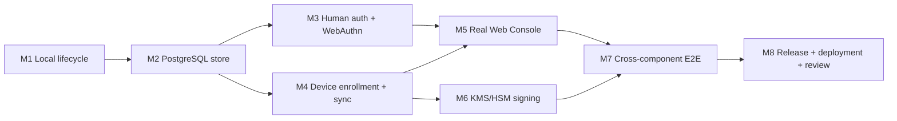

# AgentPass implementation roadmap

Status: active  
Baseline: current `codex/agent-platform` P0-C software-chain checkpoint
Updated: 2026-08-14

The executable PR sequence, security gates, and evidence requirements for the remaining G4–G7 work are maintained in [IMPLEMENTATION_PLAN_G4_G7.md](./IMPLEMENTATION_PLAN_G4_G7.md).

## 1. Target outcome

The first production product slice is complete when a new macOS user can install AgentPass, enroll a device from the Web Console, connect Claude Code or Cursor, create an unattended policy-compliant signed commit, observe the real audit result, and stop the device from the Console. The Git signing private key must remain non-exportable on the Mac throughout installation, operation, recovery, and removal.

The supported product shape is:

- Web Console for people;
- CLI for installation, diagnostics, agent integration, and recovery;
- a background-only signed macOS app host and privileged native service;
- PostgreSQL-backed Cloud API;
- KMS/HSM-backed cloud signatures for control bundles, capabilities, and receipts;
- Developer ID-signed and notarized PKG for production;
- source/npm/Homebrew for evaluation and CLI delivery.

The cloud signer never receives or uses the device Git signing private key. Native enforcement remains the only production authorization path for Git signing.

## 2. Current baseline

Implemented and tested:

- restricted Git SSHSIG signing and Secure Enclave-native service;
- native sessions, control bundle v2, capability narrowing, replay defense, revocation, audit chains, recovery, key lifecycle, retention, and pruning;
- Claude Code/Cursor MCP configuration generation;
- file-backed Cloud API reference implementation;
- initial Web Console and server-only API bridge;
- OpenAPI, JSON Schema, PostgreSQL DDL, and shared Node/Swift fixtures;
- signed release manifest, SBOM, universal app/PKG assembly, notarization workflow, and artifact verification;
- verified `agentpass install` and native/MCP `agentpass setup` dry-run/apply flows.
- production doctor with a versioned report contract;
- crash-resumable setup journal and one-step `setup continue` orchestration through native generation-1 key activation;
- read-only macOS onboarding status adapter;
- two-phase uninstall that removes user/system components while preserving protected state and keys;
- Homebrew evaluation formula with production-install safety guards.
- read-only SwiftUI onboarding app and a hardened status subprocess boundary;
- hardware-qualification v2 validation, release-attestation generation, committed-database-migration inventory, detached operator report signing, physical-Mac gate execution, and two-hardware-class aggregate verification.

Not yet production-complete:

- setup can enroll the cloud device with a service-owned fixed Secure Enclave key, atomically provision root service trust, require an authenticated refresh, verify the exact editor entry and signed current commit, and complete its durable journal; physical-Mac E2E qualification remains open;
- uninstall does not yet offer the separately confirmed current-user-state purge flow;
- the hosted Cloud API control plane now uses PostgreSQL for device, policy, bundle, capability, audit, replay, idempotency, and authenticated rate-limit authority. The single-writer file store remains only in the explicit evaluation profile. Staged cutover/traffic rollback, exact-schema readiness, graceful drain, secret-free metrics, and cryptographic backup/restore comparison are implemented and rehearsed;
- Hash-only human sessions, immutable provider/subject/membership resolution, compact Ed25519 Console assertions, PostgreSQL replay consumption, PostgreSQL one-time WebAuthn registration/authentication ceremonies, maintained verifiers, Human API routing, Console BFF, Touch ID/passkey registration, and credential/session management UI are wired. Destructive credential/current-session actions consume an operation-bound recent WebAuthn authorization. The P1 Human organization, membership, and invitation contract is frozen in `contracts/openapi/human-v1.json`; its PostgreSQL runtime APIs, durable idempotency, strict `If-Match` handling, operation-bound recent authentication, membership-triggered PostgreSQL session/recent-auth/capability invalidation, authenticated cursor pagination, Organization Console, and automated real-PostgreSQL integration tests are wired. Durable capability revocations now enter subsequently fetched signed ControlBundles. The production-mode browser-to-Cloud bootstrap boundary and authoritative Activity source pagination have adversarial, contract, and real-PostgreSQL evidence. Push-triggered refresh, recovery, and full browser E2E remain open;
- Device enrollment, root trust provisioning, and authenticated first refresh are connected; durable bundle ACK and the final physical-Mac E2E remain open;
- Console screens still contain sample presentation state;
- cloud signing keys are file-backed rather than KMS/HSM-backed;
- no published Developer ID/notarized release has yet passed the required Apple Silicon plus Intel T2 physical-hardware qualification; the fail-closed runner and aggregate verifier are implemented, but protected runners, physical gate drivers, operator policies, and retained evidence still need to be provisioned;
- managed hosted deployment, PITR scheduling, production alert routing, and independent security review remain open.

## 3. Delivery rules

1. Machine-readable contracts change before implementations. Breaking changes require a new contract version and migration.
2. Native authorization is canonical. Console, Cloud, MCP, and Node may preview or narrow authority but cannot create another signing path.
3. Every mutation is tenant-qualified, authenticated, authorized, idempotent, and administratively audited.
4. Same-sequence/different-hash state, unknown fields, rollback, expired authority, and unverifiable state fail closed.
5. High-risk human operations require owner/admin role, a recent WebAuthn assertion, explicit confirmation, and an immutable audit record.
6. Protected local state is preserved by default. Key/state destruction is a separately named and separately confirmed operation.
7. A phase is not complete from unit tests alone. Its exit scenario must pass through real component boundaries.

## 4. Critical path

M2 can begin while M1 is being completed because the API and SQL contracts are frozen. M3 and M4 can proceed in parallel after the transaction/repository interface in M2 is stable. Console production wiring waits for both Human and Device APIs. External release credentials and hardware qualification do not block local development, but they block the production-ready claim.

### 4.1 Immediate execution queue from the external-controller checkpoint

This queue is the current implementation order. It supersedes older “next” labels elsewhere in this document when they conflict; completed foundations remain valid.

Immediate status on 2026-08-14: the deterministic signed-manifest-v4-derived qualification configuration provision/restore implementation and its attack tests are complete locally. A root orchestration core now serializes runs with a protected exclusive lock, restarts and mechanically observes the fixed launchd service, requires a terminable execution handle, disarms/removes the controller candidate/restores/restarts on every modeled result, signal, timeout, and failure path, proves the qualification listener unavailable, and exposes a separately gated stale-run recovery operation. After pinned release-v4 verification, a protected materializer derives the controller candidate only from the installed root configuration and signs it with a per-run ephemeral Ed25519 key; no release private key is present on the hardware runner and no private key is written to disk. The fixed six-scenario child-process driver now enforces the closed `armed → fired → disarmed → clean exit` protocol, starts exactly one fixed Agent Host activation, waits for that host to finish, applies independent bounded output limits, escalates termination, validates the fixed disarm response, and accepts listener teardown proof only from the approved fixed probe. The P0-C runner provisioner installs the preceding protected core and verification dependencies as one root-owned, digest-manifested tree, but the new driver is not installed or workflow-invoked yet. The Agent Host also does not yet implement `qualification-activate`, and no fresh Cloud-signed Agent Session Grant is securely handed to it. The next open boundary is therefore the FD-based grant handoff and signed Agent Host activation, followed by protected driver/probe installation, privileged workflow invocation, the real Developer ID identity matrix, six physical scenarios, and retained workflow evidence. Checked-out runner-owned JavaScript must never be executed with `sudo`; production invocation must use the root-owned protected installed copy.

| Order | Slice | Concrete output | Verification / exit gate | Parallel work allowed |
| --- | --- | --- | --- | --- |
| 1 | N3-E2b-1b protected root provisioning | Add one fail-closed provisioner that verifies the signed v4 manifest, selects only the current hardware architecture's controller CDHash, derives candidate/source/identity/run digests, and atomically patches the installed root-owned `0600` service configuration without replacing unrelated production fields. Add an equally strict teardown/restore operation. | Unknown fields, wrong architecture, caller-supplied CDHash, raw run ID persistence, symlink/hardlink/path swap, unsafe ownership/mode, stale expiry, partial qualification block, overwrite, and interrupted publish all fail closed. Reopening the installed bytes proves exact canonical content before launchd is touched. | Threat-model and fault-matrix tests may proceed in parallel; the service configuration schema and writer remain a single-owner boundary. |
| 2 | N3-E2b-1b physical identity matrix | Materialize the independently verified controller archive, then build the approved, missing-entitlement, wrong-Team, and ad-hoc probes with real Developer ID identities/profiles. Execute approved root selector reachability, non-root local denial, negative identity denial before selector, architecture-CDHash substitution denial, and second-live-controller denial against the installed service. | Retained bounded JSONL plus independent identity inspection proves every outcome. No raw run ID, signature blob, local path, or key material enters evidence. Both Apple silicon and Intel/T2 lanes use the same source, manifest, controller archive, and product PKG digests. | Runner image provisioning, evidence redaction tests, and operator policy can proceed together after step 1. |
| 3 | N3-E2b-2 launchd fault driver | For all six fixed phase/scenario pairs: install the exact PKG, provision verified root inputs, run the external controller `arm → fired → status → disarm`, invoke the real Agent request, observe daemon PID/start/boot transitions, and always restore configuration/restart with the qualification listener unreachable. | Kill/restart at every irreversible boundary converges to one authorized result. Interrupted setup/teardown, stale config, replay, wrong phase/digest, clock expiry, controller disconnect, and concurrent invocation fail closed. | Six scenario adapters may be implemented in disjoint files; shared runtime, config mutation, and evidence schema remain serialized. |
| 4 | N3-E2b-2 evidence and N3-E2c aggregation | Emit six canonical secret-free evidence records, independently verify them, sign each lane report, and aggregate unchanged Apple silicon/Secure Enclave and Intel/T2 results. Bind release manifest v4 and the external controller identity/notarization evidence into every level. | Reports bind source, PKG and controller archive digests, all product and controller identities, Team ID, notarization ticket, Cloud/schema/signer versions, OS/hardware/boot facts, and scenario transitions. Any edit, omission, cross-lane mismatch, skipped scenario, or unapproved operator blocks promotion. | Evidence verifier and protected-runner operations can proceed in parallel once step 1 contracts freeze. |
| 5 | N4 production authority | Complete PostgreSQL-backed shared abuse controls and organization/member session epochs; replace file signers with purpose-separated KMS/HSM adapters; finish transactional audit/outbox consumption and device propagation. | Two-instance race/restart tests prove immediate authority reduction, no fallback signer, exact key-version use, transactionally coupled audit/outbox state, and bounded non-secret metrics. | Session epochs/rate limits, managed signer adapter, and audit/outbox completion are independent lanes behind their frozen contracts. |
| 6 | N5–N6 Agent integrations and Console completion | Finish process-bound Agent session lifecycle, then pin and qualify Claude Code and Cursor adapters. Remove remaining Console sample state and complete device/session/activity/recovery UI with WebAuthn for high-risk actions. | Real unattended signed commits expose no reusable secret; PID/exec/ancestry/worktree/repository/branch substitutions fail. Browser role/accessibility/E2E and signed device ACK transitions pass against PostgreSQL over production-like TLS. | Claude and Cursor adapters can run in parallel after the common session contract; Console screens can run in parallel with native adapter work. |
| 7 | N7 release and operations | Produce the notarized universal PKG and CLI bootstrap channel, run install/upgrade/rollback/uninstall-preserve/reinstall/purge qualification, deploy Cloud/Console with PITR and rollback, and complete independent security review. | Clean-machine installation needs no Xcode or separate visible Mac app. Restore/rollback drills pass; SBOM, release manifest, notarization, physical reports, and deployed image bind one source commit; no unresolved critical/high finding remains. | Deployment rehearsal, documentation, and review preparation may proceed while physical lanes execute, but publication waits for every gate. |

### 4.2 Next implementation commits and acceptance gates

The next commits are intentionally small enough to review and revert independently:

1. **Root provisioner contract and deterministic writer.** Freeze a closed input/output contract; verify the release signature and pinned fingerprint before deriving any value; select the controller slice from the signed identity; generate the nine-field all-or-none qualification block; and publish through no-follow opens, ownership/link/mode checks, temporary file fsync, atomic rename, and parent fsync. Preserve unrelated service settings byte-semantically and store only the digest of a protected run identifier. Acceptance is a deterministic fault matrix covering every write boundary and path substitution.
2. **Fixed installed scenario driver and workflow invocation.** The root orchestration core, candidate materializer, and closed child-process driver are implemented. Add a fixed protected grant input, the real signed Agent Host activation, approved listener probe materialization, driver/probe inclusion in the root digest manifest, and the minimal privileged workflow entrypoint. The workflow must derive architecture from the protected runner and must not accept Team ID, CDHash, phase, controller identity, candidate identity, executable path, or grant proof from an untrusted dispatch input. Acceptance is idempotent setup/teardown with both child processes terminated, the candidate and grant removed, configuration restored, launchd restarted, and the listener proven unreachable afterward.
3. **Real controller identity qualification.** Run approved and three negative controller identities against the installed service before any fault scenario. Capture only stable decision codes and signed-file digests. Acceptance requires denial before selector execution for every substituted identity and one successful approved `arm/status/disarm` round trip on each hardware class.
4. **Six launchd fault scenarios.** Connect the existing process-local checkpoints to the protected driver, real Agent XPC request, daemon lifecycle observation, and independent Cloud/session observation. Acceptance requires restart convergence, no duplicate authority/audit, and no surviving listener/configuration after each scenario.
5. **Evidence v3 and two-lane promotion.** Extend the canonical evidence/report contracts to bind release manifest v4, controller archive/identity/notarization, selected architecture CDHash, config digest, and teardown proof. Acceptance requires detached operator signatures and aggregate verification of both lanes from one immutable release candidate.
6. **Production authority completion.** Introduce purpose-separated KMS/HSM signers and rotation, PostgreSQL expiry/revocation scheduling, push refresh, durable ACK projection, audit/outbox consumers, and multi-instance drain/restore qualifications. Acceptance requires no local signing-key fallback and exact retry/race behavior under real PostgreSQL and managed key versions.
7. **Agent and Console product completion.** Finish the native one-signature transaction and lifecycle invalidation, then qualify Claude Code and Cursor adapters. Replace all Console sample state with PostgreSQL-backed organization, role, device, policy, session, activity, recovery, and WebAuthn flows. Acceptance is two unattended verified commits followed by immediate Console revocation, with no reusable secret crossing argv, environment, browser storage, logs, or repository files.
8. **Release and operations closure.** Produce one Developer ID-signed/notarized candidate, pass install/upgrade/rollback/uninstall-preserve/reinstall/purge on clean Macs, deploy Cloud and Console with PITR/rollback/alerts, run an independent security review, and publish only with zero unresolved critical/high findings.

The critical path is 1 → 2 → 3 → 4 → 5 → 8. Steps 6 and 7 can proceed in parallel after the shared protocol/schema boundaries are frozen, but neither can bypass the two-lane physical gate. Real certificates, notarization services, protected hardware runners, KMS/HSM accounts, production deployment, and independent review are external gates and must never be represented by simulated or ad-hoc evidence.

### 4.3 Execution plan from the fixed-driver checkpoint

The next work is divided into reviewable slices with one security boundary owner per slice. A slice is complete only when its code, adversarial tests, operational cleanup, and documentation land together.

| Phase | Implementation | Mandatory tests and evidence | Exit condition |
| --- | --- | --- | --- |
| P1 — protected activation input | Define one closed, bounded qualification activation document containing only the Agent UUID, adapter kind/version, TTL, bootstrap parameters, and canonical Cloud-signed Agent Session Grant. Provision it under a fixed root-owned path with no-follow, single-link, owner/mode, size, inode, and before/after byte checks. Open it once and pass it to the signed Agent Host through inherited file descriptor 3; never use argv, environment, stdin, logs, or repository files. | Unknown/duplicate fields, symlink/hardlink, writable ancestry, ownership/mode, size, expiry, digest substitution, descriptor replacement, inherited extra descriptors, and secret-output scans. | The driver can start the fixed host as the configured Agent UID/GID and repository cwd while the grant exists only in protected storage and FD 3. |
| P2 — Agent Host activation lifecycle | Add the fixed `qualification-activate` mode to `AgentPassNativeAgentHost`. Read FD 3 with a strict byte limit, bootstrap with a fresh 16–64 byte nonce, call `startAgentSession` with the same XPC connection, emit only a closed public receipt, keep the process alive while authority is process-bound, and close the session on TERM/INT or normal completion. Do not add a selector or widen Agent XPC. | Swift parser vectors, malformed/expired grant denial, bootstrap/start substitution, XPC interruption, termination/close races, bounded stdout/stderr, no proof/path in diagnostics, and source gates proving no dynamic Mach service or executable input. | A signed host activates one real session and its exit reliably removes process-bound authority. |
| P3 — protected driver packaging | Install the scenario driver, activation contract, approved listener probe, and exact controller app under root-owned digest-manifested paths. Derive every path and architecture choice from the installed release manifest and protected machine configuration. Wire the existing root orchestrator to the driver, disarm callback, and listener proof. | Digest-manifest omission/substitution, stale tool tree, executable swap, wrong architecture, second invocation, signal/timeout at every setup/cleanup boundary, and recovery after an interrupted prior run. | Only verified installed bytes execute with privilege; teardown always terminates children, disarms, removes candidate/grant, restores config, restarts launchd, and proves denial before selector. |
| P4 — grant issuance and Cloud observation | Add an operator-authorized qualification setup step that issues a fresh grant through the existing Human/WebAuthn API, binds it to the live device/agent/worktree/control/authority tuple, and stores it only through the P1 provisioner. Add an independently authenticated Device API observer for consume/session counts and recovery identity. | Recent-auth and role denial, idempotent exact retry, conflicting retry, expiry, cross-device/agent/worktree substitution, Cloud response loss, database rollback, and observer disagreement. | Each physical scenario starts with exactly one valid fresh grant and can independently prove zero/one Cloud consume and session outcomes. |
| P5 — real controller identity matrix | Materialize approved, missing-entitlement, wrong-Team, and ad-hoc controller/probe applications from the signed release inputs. Execute root/non-root, approved/denied, second-controller, expiry, phase, run, candidate, and architecture-CDHash cases against the installed listener. | Independent `codesign` requirement/entitlement/CDHash inspection plus bounded JSONL decisions. Negative identities must fail before selector; only the exact approved root controller may arm. | Both hardware classes produce retained identity evidence bound to the same controller archive and product PKG. |
| P6 — six physical fault scenarios | Run the fixed scenarios in order: pre-Cloud kill; post-Cloud/pre-local kill; post-activation/pre-audit kill; post-audit/pre-reply loss; audit-fsync failure; transport-reply loss. Observe daemon PID/start identity, boot identity, controller receipt, Cloud consume/session counts, local recovery/audit outcome, host exit, and listener teardown. | Exact retry, no duplicate Cloud consume/audit, no published authority after restart where forbidden, preserved authority only for the defined reply-loss case, concurrent-run denial, clock expiry, controller disconnect, and forced cleanup failure tests. | All six pass against the installed Developer ID-signed/notarized candidate without simulation and independent verification accepts untouched evidence. |
| P7 — two-lane release gate | Execute P5–P6 unchanged on Apple silicon/Secure Enclave and Intel/T2, sign each canonical report, and aggregate without rewriting. Bind source, PKG/controller digests, Team ID, nested CodeDirectory identities, notarization, Cloud image/schema/signer versions, OS/hardware/boot facts, and teardown proof. | Missing/stale/edited/skipped/cross-candidate report rejection, signature/key substitution, secret scan, rerun reproducibility, and aggregate verification from a clean environment. | N3-E is closed only when both lanes accept the same immutable candidate. N4 signing remains disabled until then. |
| P8 — product completion | After P7, enable the durable one-signature Secure Enclave transaction; qualify Claude Code and Cursor adapters; finish Console production data, organization/role/session/WebAuthn flows; replace file signers with purpose-separated KMS/HSM; deploy PostgreSQL/Cloud/Console; complete PITR/rollback and independent security review. | Real `git verify-commit`, 100-way budget contention, revocation during signing, browser E2E, multi-instance DB races, KMS rotation/no-fallback, restore drills, clean-machine install/upgrade/uninstall/reinstall/purge, and zero unresolved critical/high findings. | A user can install headlessly, authorize once, run unattended policy-bound signed commits, audit/revoke them in Console, and recover safely in production. |

Parallelization is limited to disjoint files and contracts: P1/P2 may proceed beside P4; P5 packaging may proceed beside P3 tests; P6 scenario adapters may be split after the shared driver/evidence schema freezes; Console and KMS work may prepare behind disabled feature gates. Agent XPC selectors, OpenAPI/JSON Schema, PostgreSQL migrations, native durable state, entitlements, release identities, and evidence schema each have one integration owner and are serialized.

## 5. Milestone M1 — complete the headless local lifecycle

Goal: one coherent installation and removal experience without requiring a visible Mac application.

### M1.1 Production doctor

- Return stable JSON check IDs, severity, remediation, and exit status.
- Check OS/version/architecture, Node and Git compatibility, PKG receipt, app ownership and permissions, nested code signatures, notarization ticket, Gatekeeper, Team ID, manager status, daemon approval, XPC health, root policy, Secure Enclave key status, control freshness, session state, Git signing configuration, and Claude/Cursor integration.
- Separate `healthy`, `action_required`, `degraded`, and `blocked` states.
- Redact paths and identifiers from default support output; provide an explicit local-only verbose mode.
- Never repair automatically from `doctor`; emit exact next commands.

Acceptance:

- clean install reports only registration/bootstrap actions;
- healthy native install exits zero;
- substituted app/client, stale bundle, missing approval, and broken MCP config each produce a stable nonzero diagnosis;
- diagnostics contain no tokens, private keys, capabilities, request payloads, or repository content.

### M1.2 Setup state machine

- Persist a user-owned setup journal with explicit states: app verified, local config initialized, native bridge selected, service registered, bootstrap started, approval key enrolled, service keys activated, device enrolled, editor connected, test commit verified, complete.
- Make every transition idempotent and crash-resumable.
- Use existing native bootstrap primitives; do not duplicate lifecycle logic in Node.
- Add `agentpass setup status`, `agentpass setup continue`, and machine-readable `next_actions`.
- Support Claude Code and Cursor independently and preserve unrelated MCP configuration.
- Verify the final test commit with Git, then record only metadata and signature verification status.

Acceptance:

- interruption after every durable setup state resumes without generating duplicate identities or keys;
- rerunning completed setup is a no-op;
- root/user ownership boundaries are verified at every handoff;
- arbitrary payload signing remains unavailable during and after setup.

### M1.3 Uninstall and recovery-safe removal

- `agentpass uninstall --execute` removes byte-matched current-user integrations and the legacy LaunchAgent; `sudo agentpass uninstall --system --execute` separately unregisters the service, removes application components, and forgets the receipt. Both preserve root state and non-exportable keys.
- `agentpass uninstall --purge-user-state --confirm PURGE_USER_STATE` removes only current-user configuration after preview.
- A separate root-only `agentpass purge-protected-state --proof ... --confirm DESTROY_PROTECTED_STATE` is deferred until lifecycle archive proof covers every key role.
- Add removal manifests so only AgentPass-owned MCP entries/hooks are removed; unrelated settings survive.
- Document PKG receipt removal behavior and reinstall/recovery paths.

Acceptance:

- uninstall-preserve followed by reinstall resumes the same protected identity;
- unrelated MCP servers/hooks/configuration are byte-preserved;
- no command advertised as ordinary uninstall can delete Secure Enclave/Keychain identities or audit history.

### M1.4 Evaluation distribution

- Add a versioned Homebrew formula/tap for CLI and evaluation broker only.
- Label evaluation mode in `status` and `doctor`; it cannot claim the production XPC identity boundary.
- Pin source/archive digest and run formula smoke tests on supported macOS runners.
- Keep production PKG verification independent of Homebrew.

M1 exit gate:

- install → setup → test signed commit → doctor → uninstall-preserve → reinstall passes on a clean macOS VM for non-Secure-Enclave steps and on physical Apple silicon for the complete path.

## 6. Milestone M2 — PostgreSQL production store

Goal: replace the single-writer file store with transactional shared persistence while retaining the reference store for tests/self-hosted evaluation.

### M2.1 Migration system

- Adopt ordered immutable SQL migrations starting from `contracts/postgres/0001_control_plane.sql`.
- Record checksum, applied timestamp, application version, and transaction outcome.
- Refuse unknown/newer schema versions and checksum drift.
- Provide `migrate up`, `migrate status`, and forward-only recovery documentation.
- Test migration from an empty database and from each supported prior release.

### M2.2 Repository interface

- Extract a storage interface from Cloud API route logic.
- Implement PostgreSQL transactions for organizations, memberships, sessions, credentials, devices, enrollments, agents, policies, revocations, capabilities, bundle heads/ACKs, audit ingestion, idempotency, and admin audit.
- Keep tenant ID in every lookup and composite foreign key.
- Use optimistic versions for policy/device mutations and unique constraints for idempotency/replay.
- Lock bundle sequence allocation and emergency-stop publication in one transaction.
- Use bounded cursor pagination based on immutable `(created_at, id)` tuples.

### M2.3 Multi-instance safety

- Move replay windows, rate-limit state, and idempotency records to shared transactional storage or a deliberately selected shared service.
- Define transaction isolation per operation; emergency stop and bundle sequence allocation require serializable behavior or equivalent advisory locking.
- Add connection limits, statement timeouts, lock timeouts, cancellation, health/readiness checks, and graceful drain.
- Reject startup if TLS requirements, schema version, signer configuration, or database permissions are unsafe.

### M2.4 Data lifecycle

- Define audit retention tiers, export format, deletion eligibility, and legal hold behavior.
- Backups must be encrypted, restore-tested, tenant-consistent, and exclude cloud signing private material when KMS/HSM is used.
- Add point-in-time recovery target, restore runbook, and periodic restore test.

M2 exit gate:

- the full Cloud API suite runs against ephemeral PostgreSQL;
- two API instances pass concurrent idempotency, sequence, replay, rate-limit, and emergency-stop tests;
- cross-tenant mutation/read attempts return indistinguishable denial and leave no state change;
- backup restore reproduces bundle heads, ACKs, memberships, and audit chain state.

## 7. Milestone M3 — Human identity, organization, role, session, and WebAuthn

Goal: eliminate the long-lived Console operator bearer-token model for hosted production.

### M3.0 P1 Human contract freeze

- The Human API contract covers organization list/create/rename, member list/role/revocation, and invitation list/create/revocation/acceptance.
- Every browser mutation requires `humanSession`, `X-CSRF-Token`, and `Idempotency-Key`; updates and revocations also require the quoted `If-Match` resource version. Organization resources are tenant-qualified by `organization_id` and cross-tenant existence is not disclosed.
- Invitations are identity-neutral: roles are limited to `admin`, `auditor`, or `viewer` and never `owner`; acceptance requires the authenticated human identity plus possession of a random, one-time token. The token is returned only by invitation creation and is not email-bound.
- Membership changes preserve the final-owner invariant. State changes, immutable admin audit, and outbox publication intent are documented as one atomic transaction, with stable error envelopes for retry, version, authorization, token, and last-owner failures.

### M3.1 Identity and session foundation

- Implement the Human OpenAPI endpoints behind an identity-provider adapter.
- Hosted production initially supports the platform-verified SIWC identity. The Console BFF converts it into a short-lived compact Ed25519 assertion; generic OIDC remains a future provider adapter. Authorization remains in AgentPass memberships.
- Create opaque, rotated, HttpOnly, Secure, SameSite session cookies; store only hashes server-side.
- Enforce idle and absolute expiry, logout/revocation, CSRF protection, origin checks, session fixation prevention, and bounded concurrent sessions.
- Record login, logout, failure, role change, and session revocation in admin audit.

### M3.2 Organization and roles

- Implement owner/admin/auditor/viewer role matrix from the contract.
- Support organization creation, invitation/acceptance, member listing, role change, removal, and last-owner protection.
- Require expected resource version and idempotency key for every mutation.
- Revoke affected sessions/capabilities when membership or role is removed.

### M3.3 WebAuthn

- Implement registration and authentication options/verification using a maintained server library.
- Persist credential ID, public key, sign counter policy, transports, backup eligibility/state, label, created/last-used timestamps, and revocation.
- Bind RP ID, origin, challenge, user verification, and ceremony type exactly.
- Challenges are one-time, short-lived, rate-limited, and session-bound.
- Support multiple credentials and recovery codes/offline owner recovery without weakening high-risk action requirements.

### M3.4 Recent-auth authorization

- Mint no standalone reusable “recent auth token.” Store a server-side recent-verification timestamp and ceremony binding in the human session.
- Require recent WebAuthn for emergency stop/resume, device revoke, owner/admin role changes, signer rotation, export, and destructive retention changes.
- Add confirmation text and operation-specific expiry; replay or another operation fails.

M3 exit gate:

- browser E2E covers signup/login, credential registration, expiry, logout, role denial, last-owner protection, high-risk reauth, cloned/replayed challenge denial, and session revocation;
- no production Console route accepts the bootstrap owner bearer token;
- authentication secrets and assertions are absent from logs and browser-readable storage.

### M3.5 Immediate execution plan after `349220c`

The next work is split into reviewable slices. A later slice may depend on an earlier contract or repository change, but independent tests and Console work can proceed in parallel.

| Order | Slice | Concrete implementation | Exit evidence |
| --- | --- | --- | --- |
| P1-A | Membership authority invalidation | In the same PostgreSQL transaction as role change/removal, revoke the affected member's organization sessions, invalidate organization-scoped capabilities that are no longer permitted, clear unconsumed recent-auth state, append one immutable admin-audit event, and enqueue one outbox event. Keep the final-owner check under the membership lock. | Real PostgreSQL tests prove the old cookie and capability fail immediately after commit, rollback restores all authority, another tenant is untouched, and concurrent owner changes preserve one owner. |
| P1-B | Exact optimistic-conflict semantics | Distinguish absent/out-of-scope, stale `If-Match`, already-final state, last-owner protection, and idempotency-key reuse without disclosing cross-tenant existence. Map database constraint and zero-row outcomes to the frozen Human API error envelope. | Repository, service, HTTP, and real PostgreSQL tests assert exact status/code pairs and no audit/outbox write on failure. |
| P1-C | Cursor pagination | Implement opaque signed-or-MACed cursors over immutable `(created_at, id)` ordering for organizations, members, invitations, credentials, sessions, and activity. Query `limit + 1`, emit `next_cursor` only when another row exists, reject malformed/cross-resource cursors, and preserve tenant predicates in the cursor query. | Forward traversal has no duplicate/omitted rows under concurrent inserts; tampered and cross-tenant cursors fail; every limit is bounded in OpenAPI, service, and SQL. |
| P1-D | Organization Console | Add organization selection, organization creation/rename, member and invitation tables, role/removal/revoke actions, invitation acceptance, conflict refresh, and operation-specific WebAuthn prompts. Remove sample organization state and keep raw invitation tokens in memory only for the one-time reveal. | Browser tests cover owner/admin/auditor/viewer visibility, loading/empty/error/conflict states, one-time token display, recent-auth replay denial, keyboard flow, and no secret in storage/logs. |
| P1-E | Hosted session boundary | Replace the Console's long-lived Cloud operator bearer-token dependency with browser human-session forwarding to the same-origin BFF. Rotate cookies after authentication and organization switch, bind the selected membership server-side, and enforce no-store/CSP/origin/CSRF consistently. | Production-mode tests prove browser bundles and responses contain no Cloud bearer token; fixation, stale role cookies, CSRF, origin spoofing, and cache replay fail. |
| P1-F | Human recovery and abuse controls | Add owner recovery policy, bounded recovery codes or an explicitly documented offline recovery ceremony, login/ceremony rate limits in shared storage, concurrent-session limits, security notifications/outbox consumers, and emergency organization session revocation. | Recovery never bypasses recent-auth policy; consumed codes cannot replay; two instances share limits; emergency revocation invalidates all targeted sessions. |

Checkpoint after the first P1 implementation slice:

- P1-A/B: PostgreSQL membership mutations now lock authority, enforce exact versions, consume pending recent-auth challenges, revoke affected Human sessions and attributed PostgreSQL capabilities, and commit audit/outbox records atomically. Capability issuance records the exact signed-statement hash and membership version; unexpired durable revocations are merged into the next signed ControlBundle and are enforced by the native broker. Device/agent/policy authority has moved to PostgreSQL; push-triggered refresh remains open, so revocation visibility is bounded by the authenticated native refresh interval rather than being instantaneous on an already-installed bundle.
- P1-C: organizations, members, invitations, credentials, sessions, and Cloud Activity sources use versioned HMAC-SHA256 cursors bound to resource and tenant/member/device scope. Activity now uses descending immutable `(device_timestamp, device_id, event_id)` keysets, `limit + 1`, and authoritative Cloud `next_cursor` pages; the Console deterministically merges device streams and no longer treats a 500-event page as incomplete. Cursor cycles, tampering, scope substitution, request-budget exhaustion, and accumulated-record exhaustion fail closed. Real PostgreSQL traversal covers more than 500 Activity rows with a concurrent newer insert and no duplicate or omission.
- P1-D: the Console now has live organization selection, create/rename, member role/removal, invitation create/revoke/accept, conflict refresh, and one-time in-memory invitation-token reveal. Full browser/virtual-WebAuthn accessibility E2E and removal of sample state from the remaining Console views are still required.
- P1-E: protected Organization, Security, and WebAuthn BFF routes forward only the allow-listed Human session cookie, CSRF proof, and operation-specific control headers. They reject missing/external origins, redirects, duplicate session cookies, unexpected `Set-Cookie`, and cacheable responses. Production session bootstrap uses the fixed compact Ed25519 Console assertion, a pinned Cloud public key, durable one-time JTI consumption, and an exact active `membership_id` insert; the old bearer bridge is explicit development/test compatibility only. Production-mode BFF-to-Cloud E2E now proves exact `{}` forwarding, cookie rotation, conflicting-header removal/rejection, Origin/CSRF enforcement, malformed/tampered/expired assertion rejection, replay `409`, inactive/cross-organization membership denial, and redacted output. The same bootstrap passes against real PostgreSQL with hash-only session credentials. Human Auth no longer loads the evaluation token-record file.
- P1-F: not started. Recovery and shared abuse controls remain blockers for a hosted-production claim.

### M3.7 Next execution queue

Execute these gates in order. Work inside a gate may be parallelized, but a later gate must not be exposed as production-ready before the prior security boundary passes.

| Gate | Implementation | Contract and migration work | Required evidence |
| --- | --- | --- | --- |
| G1 — production session bootstrap (completed 2026-08-12) | `POST /auth/session` (runtime mapping `/api/auth/session`) accepts only the BFF-only `agentpass-console-identity` compact Ed25519 SIWC assertion, resolves immutable `(provider, subject, org)` membership server-side, atomically consumes the namespaced JTI digest, inserts the exact active membership, rotates the opaque Human session cookie, and returns only session/CSRF metadata. No browser redirect, Cloud bearer, `Authorization`, caller identity header, or `redirect_uri` claim is part of this SIWC exchange. | Human OpenAPI freezes the exact canonical header `{alg,kid,typ,version}` and payload `{aud,exp,iat,iss,jti,nbf,org,origin,provider,sub}`, EdDSA verification, exact issuer/audience/origin/provider/org bindings, 60-second maximum TTL, 5-second clock skew, no-store response, and opaque cookie. PostgreSQL migration `0009_human_identity_assertion_replays.sql` adds only digest/expiry/consumption state and an atomic one-time consume function. Runtime requires a protected pinned public-key file and complete assertion configuration; production Human Auth has no token-record dependency. | Unit/contract, production-mode BFF-to-Cloud adversarial E2E, and real-PostgreSQL tests prove exact empty `{}` forwarding, compact assertion shape, no `redirect_uri`, strict no-store/Set-Cookie requirements, immutable active-membership resolution, hash-only session persistence, cookie fixation rotation, forged/conflicting-header denial, stale/tampered assertion denial, replay `409`, storage outage `503`, and inactive/cross-organization denial before session issuance. |
| G2 — Activity source pagination (completed 2026-08-13) | Cloud audit listing uses an opaque HMAC cursor over descending immutable `(device_timestamp, device_id, event_id)`, exact tenant/device binding, `limit + 1`, and stable `next_cursor`. The Console follows authoritative per-device Cloud pages, merges them deterministically, removes boundary duplicates, and has no fixed 500-event completeness assumption. | Device OpenAPI, exact response schema/fixture, forward-only migration `0010_device_audit_activity_keyset.sql`, file-store compatibility, and a dedicated PostgreSQL read repository are implemented. The shared secret uses a separate Cloud-audit HMAC domain and is never exposed. | Unit/HTTP/contract tests cover strict query shape, expiry, tampering, cross-device scope, cursor cycles, and bounded request/memory exhaustion. Real PostgreSQL traverses 600 rows while a newer row is inserted, with no duplicate or omission; Console tests cover multi-device merge and full 500-record upstream pages. Runtime-wide PostgreSQL cutover remains G3. |
| G3 — PostgreSQL control-plane cutover (completed 2026-08-13) | Hosted runtime uses tenant-qualified PostgreSQL repositories for devices, enrollments, agents, policies, revocations, capability reservations, bundle heads/ACKs, audit/admin-audit, idempotency, device replay state, and authenticated organization rate limits. The file store is available only through the explicit evaluation profile. | Forward-only migration `0011_control_plane_hosted_cutover.sql` adds version/actor/completion/bundle/audit/shared-control state and atomic nonce/rate/prune functions. Runtime profiles reject implicit, mixed, partial, or file-backed hosted configuration. Cutover tooling provides preflight/status/apply/validation/readiness/drain and traffic-only rollback. Authority manifests compare tenant row counts and cryptographic heads/hashes after restore. | Real PostgreSQL applies all 11 migrations. Two pools pass concurrent authority tests. A PostgreSQL 17 source was dumped and restored into an isolated PostgreSQL 17 target; three-tenant authority manifests matched exactly. Preflight, constraint validation, readiness, drain/cutover, and traffic rollback passed while down-migration remained forbidden. |
| G4 — revocation propagation and ACK | Publish a refresh hint on authority reduction, have devices immediately fetch and atomically install the later signed ControlBundle, and persist signed applied/blocked ACKs. Signing remains fail-closed at bundle expiry even if notification transport is unavailable. | Define refresh-hint and ACK envelopes, sequence/statement-hash binding, retry/backoff limits, and device status fields. | Membership removal and emergency stop reach an online physical Mac within the SLO; offline devices display stale/pending state; replayed or substituted hints/ACKs do not alter authority. |
| G5 — recovery and abuse controls | Implement shared login/WebAuthn/recovery throttles, concurrent-session ceilings, emergency organization-wide session revocation, security notifications, and threshold offline-owner recovery. Recovery may restore access but cannot bypass operation-bound recent WebAuthn for high-risk actions. | Add hashed single-use recovery material, attempt/lockout records, notification outbox types, retention rules, and recovery policy versions. | Two-instance tests prove shared limits and one-time consumption; recovery replay, enumeration, race, and tenant substitution fail; notification payloads are secret-free. |
| G6 — browser and physical-Mac E2E | Run Playwright with virtual WebAuthn for login, passkey lifecycle, organization administration, conflicts, role denial, session expiry/revocation, and emergency stop. Run install → enroll → Claude/Cursor signed commit → audit → revoke on Apple silicon using the exact release artifact. | Version test fixtures and qualification report schema; bind the physical result to artifact digest, source commit, Team ID, OS, and hardware class. | Zero sample data in production views; accessibility and keyboard paths pass; the exact notarized artifact passes both browser/cloud and physical native scenarios. |
| G7 — hosted release readiness | Replace file signers with purpose-separated KMS/HSM keys, add deployment/rollback/backups/PITR/restore tests, observability/redaction checks, dependency/SAST/DAST review, and independent security review. Publish Developer ID-signed/notarized PKG plus source/npm/Homebrew evaluation channels. | Add signer-provider contracts, key-version metadata, deployment manifests, SLOs, incident runbooks, and signed release evidence. | Staging restore and rollback drills pass; key rotation preserves verification history; no critical/high review findings remain; release manifest, SBOM, notarization, and hardware qualification bind the same artifact digest. |

### M3.8 Detailed execution plan after G2

The following slices are the implementation order, not independent production claims. A slice can be developed in parallel only when it does not weaken an earlier authority boundary.

| Slice | Deliverable | Verification and exit condition | Depends on |
| --- | --- | --- | --- |
| G3.1 — repository boundary | Add tenant-qualified repositories for devices/enrollments, agents/policies, revocations/capabilities, bundle heads/ACKs, device audit, idempotency, device nonce replay, and distributed rate limits. Database errors have constant public responses and schema gaps fail closed. | Repository tests cover tenant predicates, row/advisory locks, optimistic versions, one-time consumption, monotonic heads, hash-chain validation, idempotent replay/conflict, sensitive-response rejection, and bounded pruning. | G2 |
| G3.2 — authoritative schema | Add one forward-only migration for missing actor/version/metadata/enrollment-completion fields, bundle expiry and audit head/gap state, nonce digests, rate-limit buckets, expiry indexes, atomic SQL functions, and required foreign keys. Update schema validation and migration checksums. | Migration applies from every supported prior version, refuses partial/newer history, rolls back atomically on injected failure, and passes repository conformance against real PostgreSQL. No raw nonce, credential, cookie, bearer, private key, or session secret is persisted. | G3.1 |
| G3.3 — server contract adapter | Implement one PostgreSQL control-plane facade with the exact Cloud server method contract. Pass the authenticated actor and principal to every mutation; remove inferred actors and generic secret-bearing idempotency payloads. | The same conformance fixture passes against evaluation and PostgreSQL stores, including response shape, error mapping, audit attribution, conflict semantics, and capability statement-hash binding. | G3.2 |
| G3.4 — explicit runtime profiles | Require `hosted` or `evaluation`. Hosted startup constructs only PostgreSQL authorities, performs schema/version health checks, and refuses file-store variables or partial database/auth configuration. Evaluation is the only profile allowed to open the reference file store. | Startup matrix proves fail-closed behavior for missing, mixed, stale-schema, unavailable-DB, unsafe-TLS, and file-store-in-hosted configurations. A hosted request test asserts the file store is never constructed or read. | G3.3 |
| G3.5 — distributed authority qualification | Run two Cloud instances against one PostgreSQL database and switch requests between them during issue/revoke/emergency-stop/bundle/ACK/audit/idempotency/nonce/rate-limit operations. Restart both processes between mutation and replay. | Concurrent tests prove one authority result, monotonic sequence, exactly-once ACK/idempotency behavior, nonce replay denial, shared throttling, restart persistence, no cross-tenant disclosure, and bounded database contention. | G3.4 |
| G3.6 — cutover operations (completed 2026-08-13) | Preflight, migration/status/validation, exact-schema readiness, graceful drain, traffic-only rollback, and evaluation-import guidance are documented and tooled. Secret-free health reports cover schema/checksum state, pool saturation, drain/in-flight state, lock waits/timeouts, replay/rate denials, stale ACKs, and audit gaps. | Staged cutover and rollback rehearsal preserved committed authority. PostgreSQL 17 dump/restore comparison matched row counts, bundle/ACK state, membership versions, capability hashes/revocation state, and admin/device audit heads. | G3.5 |
| G4.1 — refresh channel | Define a signed, tenant/device-bound refresh hint and an authenticated polling fallback. Publish hints only after the authority transaction commits; transport can accelerate refresh but cannot authorize or extend expiry. | Substitution, replay, reordering, outage, and duplicate delivery do not widen authority. Online propagation latency is measured against the SLO. | G3.6 |
| G4.2 — native apply and ACK | Fetch, verify, atomically install, and durably ACK the current ControlBundle. Persist explicit pending/fetched/applied/blocked/stale/offline states in Cloud and Console. | Kill/restart tests at every write boundary preserve the last valid bundle. ACKs bind exact device, epoch, sequence, and statement hash; stale authority blocks at expiry. | G4.1 |
| G5.1 — shared abuse controls | Apply PostgreSQL token buckets to login, WebAuthn ceremonies, enrollment, recovery, and high-risk mutations. Add concurrent-session ceilings and organization-wide session epochs. | Two-instance race and enumeration tests prove shared limits, stable public errors, emergency invalidation, and no tenant/principal bucket collision. | G3.5 |
| G5.2 — recovery and notifications | Add versioned threshold owner recovery, hashed one-time recovery material, transactional consumption, operation-bound recent WebAuthn after access restoration, and a secret-free notification outbox. | Recovery race/replay/substitution tests fail; no single lost owner or support operator can silently seize an organization; notification retries are idempotent. | G5.1 |
| G6.1 — browser qualification | Remove remaining sample state and run the complete Console journey with Playwright virtual WebAuthn: session bootstrap, organization/member/invitation/passkey administration, conflicts, role denial, expiry, recovery, and emergency stop. | Supported browsers pass keyboard/accessibility checks; storage, logs, traces, HTML, and responses contain no bearer, cookie, assertion, invitation token, capability, or recovery secret. | G4.2, G5.2 |
| G6.2 — physical-Mac qualification | Install the exact candidate artifact on clean Apple-silicon machines; enroll through the Console; run Claude Code/Cursor signed commits; upload audit; revoke; recover; uninstall/upgrade. | The report binds source commit, artifact digest, Team ID, notarization ticket, macOS/hardware, Cloud schema, and test evidence. Revocation blocks the next online signing operation within SLO. | G6.1 |
| G7.1 — hosted cryptography and platform | Replace file signers with purpose-separated KMS/HSM providers and immutable key-version metadata. Add least-privilege deployment identities, encrypted backups/PITR, regional policy, readiness, autoscaling, and secret rotation. | Rotation keeps old verification history valid; signer/network/database outage tests fail closed; restore and rollback drills meet RPO/RTO. | G3.6 |
| G7.2 — release security gate | Produce SBOM/provenance, dependency/SAST/DAST results, threat-model delta, external review findings, incident runbooks, signed/notarized PKG, npm/source/Homebrew evaluation channels, and one release evidence index. | No unresolved critical/high finding remains. Every public production claim links to evidence for the same source commit and artifact digest. | G6.2, G7.1 |

G3.1 through G3.6 are implemented and qualified against the forward-only schema. The remaining database work belongs to G7 managed-platform deployment: scheduled PITR, production alert routing, regional policy, and repeated restore/rollback drills against the selected provider.

Implementation constraints for P1:

1. P1-A and P1-B share the membership mutation transaction and are delivered together if separating them would create a temporary authorization gap.
2. P1-C changes the response behavior but not the public schema shape; cursor encoding remains server-private and versioned so it can rotate.
3. P1-D may build read-only screens against the frozen BFF while P1-A–C are underway, but destructive controls remain feature-gated until their server exit tests pass.
4. P1-E is required before a hosted-production claim. The existing operator-token bridge remains evaluation-only until removed from production configuration.
5. Every slice updates threat-model claims, OpenAPI/schema fixtures when applicable, unit tests, real PostgreSQL integration tests, and the security checklist in the same change.

### M3.6 Definition of done for the Human/Organization track

The track is complete only when all of the following are true:

- two Cloud API instances pass concurrent role, invitation, idempotency, session-revocation, and pagination tests against PostgreSQL;
- the last-owner invariant and authority invalidation are atomic under failure and concurrency;
- no stale session, recent-auth authorization, or capability survives a membership reduction beyond the committing transaction;
- the Console contains no sample organization/security state and no production bearer token;
- Playwright runs with a virtual WebAuthn authenticator and covers the complete organization administration journey;
- logs, traces, audit payloads, browser storage, error bodies, and support diagnostics contain no cookie, CSRF secret, assertion, invitation token, capability, or raw identity-provider token;
- the authorization matrix is generated or checked against the frozen contract so HTTP, service, SQL, and UI permissions cannot drift.

## 8. Milestone M4 — Device API and macOS cloud enrollment

Goal: establish a cryptographic device identity and real policy/revocation propagation.

### M4.1 Enrollment protocol

- Console creates a one-time, short-lived enrollment challenge bound to organization, intended platform, creator, and requested device label.
- CLI receives the challenge through explicit copy/paste or loopback callback; no secret appears in process arguments or shell history by default.
- Native service creates a non-exportable P-256 device authentication key and signs proof of possession.
- Device API validates challenge, attestation policy if enabled, public key algorithm, proof, and one-time use before activating the device.
- Persist only public key and metadata in Cloud; return pinned issuer/key information and initial signed control bundle.

### M4.2 Signed synchronization

- Native service signs canonical HTTP method/path/query/body-hash/timestamp/nonce requests.
- Fetch policy/revocation bundle, verify issuer/key/audience/sequence/hash/TTL, and atomically install through existing ControlBundle v2 persistence.
- ACK applied/blocked state with format epoch, sequence, statement hash, timestamp, and bounded reason.
- Implement one-sided jitter/backoff, offline deadline reporting, clock-skew handling, and fail-closed expiry.
- Device check-in reports version, platform, last applied head, health categories, and no repository content.

### M4.3 Audit upload

- Add bounded local outbox with exact event cursor, signed batches, retry, deduplication, and gap recovery.
- Redact repository path/remote by policy before persistence and upload.
- Cloud verifies the event hash chain and records gaps without silently repairing them.
- Backpressure cannot bypass local audit fail-closed behavior.

### M4.4 Emergency stop and resume

- Stop publishes a new signed revocation sequence transactionally.
- Online native refresh blocks the next signing request after applying it.
- Resume requires recent WebAuthn and creates a later signed state; it never deletes the stop event.
- Console shows per-device propagation: pending, fetched, applied, blocked, stale, offline, or revoked.

M4 exit gate:

- a real Mac enrolls, fetches, applies, and ACKs a bundle;
- rollback, equivocation, body/path substitution, nonce replay, wrong device key, expired challenge, and cross-tenant enrollment fail;
- emergency stop blocks the next online commit and stale cloud-required state blocks after TTL;
- cloud authority can narrow but never widen the local native policy.

## 9. Milestone M5 — real Web Console

Goal: replace sample state with an accessible operations product backed only by authenticated APIs.

### M5.1 Application shell and data model

- Remove default sample operational data from production builds.
- Add authenticated organization selection, server-rendered initial state, bounded query cache, error boundaries, and no-store handling for sensitive routes.
- Every status includes source timestamp and freshness; unavailable data is labeled unavailable, never synthesized.

### M5.2 Guided setup

- Show eight explicit states: account secured, organization ready, enrollment created, device connected, service healthy, agent connected, policy applied, test commit verified.
- Generate copyable CLI commands containing only short-lived enrollment material.
- Poll bounded setup status and allow safe resume after browser/device interruption.
- Explain required macOS approval without pretending it was completed.

### M5.3 Operational surfaces

- Overview: device health, policy head, propagation, session state, audit ingestion/chain health.
- Agents/devices: identity, platform, last seen, capability/session expiry, revoke/rotate with reauth.
- Policies: plain-language presets plus exact advanced scope; preview effective intersection before save.
- Activity: cursor pagination, filters, stable denial explanations, gap/chain indicators, privacy-safe export.
- Emergency stop: scoped confirmation, recent WebAuthn, immutable result, propagation timeline, separately authorized resume.

### M5.4 UX quality

- Keyboard complete, screen-reader labeled, reduced-motion compliant, responsive, and localized Japanese/English.
- Test loading, empty, partial, stale, offline, denied, conflict, retry, and fatal states.
- Prevent duplicate mutation through disabled state plus server idempotency—not client state alone.

M5 exit gate:

- a non-engineer can complete the clean-machine setup script with no undocumented command;
- all displayed production data is API-backed;
- accessibility checks and browser E2E pass for setup, policy, activity, device revoke, emergency stop, and resume;
- browser bundles contain no Cloud API bearer token, signing key, or server-only configuration.

## 10. Milestone M6 — Cloud signer boundary

Goal: protect cloud authority keys without turning Cloud into a remote Git signer.

### M6.1 Signer interface

- Define a small interface for sign/verify/public-key/key-version operations over canonical prehashed statements.
- Separate key purposes: control bundle/capability issuer, audit/anchor receipt, and release manifest. Never reuse keys across purposes or environments.
- Bind algorithm, issuer, key ID/version, organization/audience, format epoch, and statement hash.

### M6.2 KMS/HSM providers

- Implement one production provider first; retain in-memory/file providers only for tests and self-hosted evaluation.
- Use workload identity, least-privilege key policy, no exported private key, operation audit logs, rate limits, timeout/circuit breaker, and explicit region configuration.
- Normalize ECDSA form if selected; prefer deterministic protocol-compatible algorithms already supported by clients.

### M6.3 Rotation and outage behavior

- Publish overlapping verification keys before issuer rotation.
- Rotation is a versioned ceremony with recent WebAuthn, two-person approval for production, immutable audit, staged activation, and rollback prohibition after first accepted new sequence.
- Define KMS outage behavior: no new authority is issued; already valid bounded bundles continue only within policy TTL.

M6 exit gate:

- production runtime has no file containing a cloud authority private key;
- signer substitution, wrong purpose/key version, high-S equivalent where relevant, timeout, and partial rotation fail closed;
- rotation is tested through old-only, overlap, new-active, and old-retired states.

## 11. Milestone M7 — cross-component E2E and security verification

Goal: prove the product behavior rather than isolated components.

### M7.1 Test environments

- PostgreSQL integration environment on every PR.
- Browser E2E environment with a deterministic virtual WebAuthn authenticator.
- macOS integration harness for PKG/app/manager/XPC without production credentials.
- Physical Apple-silicon and Intel qualification for exact release candidate hashes.

### M7.2 Required product journeys

1. Clean install and first signed commit through Claude Code.
2. Clean install and first signed commit through Cursor.
3. Denied repository, branch, replay, arbitrary payload, expired session, expired control, and revoked device.
4. Cloud policy narrowing and impossible widening.
5. Emergency stop propagation and separately authorized resume.
6. Offline within TTL, TTL expiry, reconnection, and sequence advance.
7. Audit upload retry, duplicate, gap, export, and chain verification.
8. Upgrade preserving keys/state; uninstall-preserve and reinstall recovery.
9. Database backup/restore and API rolling deployment.
10. Signer rotation and KMS outage.

### M7.3 Adversarial work

- Contract fuzzing for duplicate keys, invalid UTF-8, deep/oversized JSON, integer/boolean substitution, unknown fields, path confusion, and canonicalization differences.
- Tenant isolation property tests and authorization matrix tests.
- TOCTOU/link/ownership tests across installer, setup, state, executable, and archive paths.
- Browser CSRF/XSS/header spoofing/open redirect/cache tests.
- Dependency, secret, SAST, SBOM, provenance, and container/image scanning.
- Independent review of native key queries, process/session binding, recovery/deletion, installer preservation, WebAuthn, tenant authorization, signer policy, and log redaction.

M7 exit gate:

- all ten journeys pass against a release-like environment;
- no open critical/high security findings; medium findings have owners and release decisions;
- threat model and security claims match observed enforcement boundaries.

## 12. Milestone M8 — release, deployment, and operations

Goal: publish and operate a production release with recoverable procedures.

### M8.1 macOS release

- Configure protected GitHub environments, signed annotated tags, Developer ID Application/Installer identities, provisioning profiles, notarization credentials, and release-manifest key.
- Build once from the verified tag, notarize/staple, generate SBOM/provenance, sign manifest, reverify before publishing, and publish immutable artifacts.
- Qualify exact candidate hashes on physical Apple silicon and Intel hardware.
- Publish pinned release-key fingerprint and expected Team ID through an independent trusted channel.

### M8.2 Hosted services

- Provision separate development/staging/production accounts and databases.
- Use workload identity and managed secret/KMS systems; no production secrets in repository, image, browser bundle, or ordinary environment dumps.
- Apply migrations as an explicit deployment stage with compatibility checks.
- Use canary/rolling deployment, readiness, graceful drain, rollback artifact, and database forward-fix procedure.
- Define TLS, domains, CSP/HSTS, CORS/origin policy, WAF/connection limits, and private admin access.

### M8.3 Observability and response

- Metrics: auth failure, WebAuthn failure, enrollment failure, bundle issue/fetch/apply/ACK lag, stale devices, stop propagation, audit gaps, signer latency/error, DB saturation, queue depth, and backup/restore age.
- Structured logs use request/organization/device pseudonymous IDs and explicit redaction; never log credentials, assertions, capabilities, payloads, repository content, or private paths.
- Alerts map to runbooks and severity. Add emergency signer disable, session revocation, and organization stop procedures.
- Define SLOs only after baseline load tests; do not invent availability claims before measurement.

M8 exit gate:

- staging disaster-recovery exercise and production rollback rehearsal pass;
- on-call runbooks, owner assignments, disclosure process, and key-rotation calendar exist;
- signed/notarized artifact, hosted Console/API, migrations, backups, monitoring, and independent review evidence are linked from the release record.

## 13. Recommended implementation sequence

### Sprint group 1 — finish the local product edge

1. Production doctor model and tests.
2. Setup journal and resumable states.
3. Uninstall-preserve plus integration removal.
4. Homebrew evaluation formula and smoke test.

### Sprint group 2 — durable control plane foundation

1. Migration runner and PostgreSQL test container.
2. Store interface extraction.
3. Organization/membership/session/idempotency repositories.
4. Device/policy/bundle/audit repositories.
5. Multi-instance concurrency and backup/restore tests.

### Sprint group 3 — parallel identity and device tracks

Human track:

1. identity-provider adapter and server sessions;
2. organization/member APIs;
3. WebAuthn registration/authentication;
4. recent-auth high-risk middleware.

Device track:

1. enrollment challenge and native P-256 key creation;
2. signed Device API client;
3. bundle fetch/apply/ACK/check-in;
4. audit outbox/upload;
5. emergency stop/resume E2E.

### Sprint group 4 — Console and cloud key hardening

1. Replace sample Console state and add authenticated shell.
2. Guided setup against real enrollment state.
3. Agents/policies/activity/emergency surfaces.
4. KMS/HSM signer provider and rotation ceremony.
5. Accessibility, browser security, and propagation E2E.

### Sprint group 5 — release candidate

1. Full product journeys and adversarial suite.
2. Performance/load/failure testing and runbooks.
3. Independent security review and remediation.
4. Physical hardware qualification.
5. Signed/notarized publication and production deployment.

## 14. Pull request boundaries

Keep changes reviewable and avoid one cross-system mega-PR. Recommended boundaries:

1. doctor result schema and local checks;
2. setup journal/state machine;
3. uninstall-preserve/integration removal;
4. PostgreSQL migration runner;
5. store interface and organization repositories;
6. device/policy/audit repositories;
7. human session middleware;
8. WebAuthn ceremonies;
9. organization/member routes;
10. enrollment challenge and Device API routes;
11. native enrollment client;
12. native bundle sync/ACK;
13. audit uploader;
14. Console authenticated data shell;
15. Console setup journey;
16. Console operational surfaces;
17. KMS/HSM signer;
18. cross-component E2E harness;
19. deployment/operations configuration;
20. release qualification evidence.

Each PR must include contract impact, threat-model impact, migrations, rollback behavior, tests, documentation, and observable failure behavior.

## 15. Release blockers and external gates

The following cannot be completed from source code alone and must remain explicit blockers rather than mocked success:

- Apple Developer Program team, Developer ID certificates, provisioning profiles, and notarization credentials;
- physical Apple silicon and Intel Macs for exact-artifact qualification;
- production PostgreSQL, identity provider, KMS/HSM, DNS/TLS, hosting, and backup accounts;
- protected CI environments and independently published release trust pins;
- an independent security reviewer and remediation window;
- operational owner/on-call assignments and incident communication channels.

Until these gates pass, the project may be described as implementation-complete for a local/evaluation slice, but not as production-hardened or generally available.

## 16. Final definition of done

AgentPass is complete for the first production release only when:

- the clean-machine scenario in section 1 passes for Claude Code and Cursor;
- native keys remain non-exportable and no alternate/general signer exists;
- Human API uses durable sessions and WebAuthn for high-risk operations;
- Device API enrollment, signed sync, ACK, audit upload, and emergency stop work end to end;
- PostgreSQL multi-instance, tenant isolation, backup, and restore tests pass;
- Console contains no sample operational state and every status is traceable to real data;
- cloud authority keys are in KMS/HSM and rotation/outage behavior is tested;
- install, upgrade, uninstall-preserve, reinstall, and recovery are documented and tested;
- all release artifacts are signed, notarized, manifest-bound, SBOM/provenance-bearing, and hardware-qualified;
- production deployment, monitoring, rollback, incident response, and independent security review are complete;
- no critical/high finding or undocumented security exception remains.
