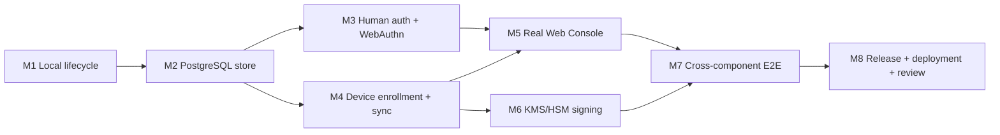

# AgentPass implementation roadmap

Status: active  
Baseline: current `codex/agent-platform` branch
Updated: 2026-08-12

## 1. Target outcome

The first production product slice is complete when a new macOS user can install AgentPass, enroll a device from the Web Console, connect Claude Code or Cursor, create an unattended policy-compliant signed commit, observe the real audit result, and stop the device from the Console. The Git signing private key must remain non-exportable on the Mac throughout installation, operation, recovery, and removal.

The supported product shape is:

- Web Console for people;
- CLI for installation, diagnostics, agent integration, and recovery;
- a background-only signed macOS app host and privileged native service;
- PostgreSQL-backed Cloud API;
- KMS/HSM-backed cloud signatures for control bundles, capabilities, and receipts;
- Developer ID-signed and notarized PKG for production;
- source/npm/Homebrew for evaluation and CLI delivery.

The cloud signer never receives or uses the device Git signing private key. Native enforcement remains the only production authorization path for Git signing.

## 2. Current baseline

Implemented and tested:

- restricted Git SSHSIG signing and Secure Enclave-native service;
- native sessions, control bundle v2, capability narrowing, replay defense, revocation, audit chains, recovery, key lifecycle, retention, and pruning;
- Claude Code/Cursor MCP configuration generation;
- file-backed Cloud API reference implementation;
- initial Web Console and server-only API bridge;
- OpenAPI, JSON Schema, PostgreSQL DDL, and shared Node/Swift fixtures;
- signed release manifest, SBOM, universal app/PKG assembly, notarization workflow, and artifact verification;
- verified `agentpass install` and native/MCP `agentpass setup` dry-run/apply flows.
- production doctor with a versioned report contract;
- crash-resumable setup journal and one-step `setup continue` orchestration through native generation-1 key activation;
- read-only macOS onboarding status adapter;
- two-phase uninstall that removes user/system components while preserving protected state and keys;
- Homebrew evaluation formula with production-install safety guards.

Not yet production-complete:

- setup can enroll the cloud device with a service-owned fixed Secure Enclave key, atomically provision root service trust, require an authenticated refresh, verify the exact editor entry and signed current commit, and complete its durable journal; physical-Mac E2E qualification remains open;
- uninstall does not yet offer the separately confirmed current-user-state purge flow;
- the Cloud API still uses a single-writer file store in its reference runtime;
- Hash-only human sessions, PostgreSQL one-time operation-bound WebAuthn ceremonies, maintained verifier, Human API routing, Console BFF, and Touch ID/passkey enrollment UI are wired. WebAuthn registration, per-user identity/membership mapping, automated real-PostgreSQL multi-instance E2E, and session-management UI remain open;
- Device enrollment, root trust provisioning, and authenticated first refresh are connected; durable bundle ACK and the final physical-Mac E2E remain open;
- Console screens still contain sample presentation state;
- cloud signing keys are file-backed rather than KMS/HSM-backed;
- no published Developer ID/notarized release has passed physical-hardware qualification;
- hosted deployment, backups, rollback, observability, and independent security review remain open.

## 3. Delivery rules

1. Machine-readable contracts change before implementations. Breaking changes require a new contract version and migration.
2. Native authorization is canonical. Console, Cloud, MCP, and Node may preview or narrow authority but cannot create another signing path.
3. Every mutation is tenant-qualified, authenticated, authorized, idempotent, and administratively audited.
4. Same-sequence/different-hash state, unknown fields, rollback, expired authority, and unverifiable state fail closed.
5. High-risk human operations require owner/admin role, a recent WebAuthn assertion, explicit confirmation, and an immutable audit record.
6. Protected local state is preserved by default. Key/state destruction is a separately named and separately confirmed operation.
7. A phase is not complete from unit tests alone. Its exit scenario must pass through real component boundaries.

## 4. Critical path

M2 can begin while M1 is being completed because the API and SQL contracts are frozen. M3 and M4 can proceed in parallel after the transaction/repository interface in M2 is stable. Console production wiring waits for both Human and Device APIs. External release credentials and hardware qualification do not block local development, but they block the production-ready claim.

## 5. Milestone M1 — complete the headless local lifecycle

Goal: one coherent installation and removal experience without requiring a visible Mac application.

### M1.1 Production doctor

- Return stable JSON check IDs, severity, remediation, and exit status.
- Check OS/version/architecture, Node and Git compatibility, PKG receipt, app ownership and permissions, nested code signatures, notarization ticket, Gatekeeper, Team ID, manager status, daemon approval, XPC health, root policy, Secure Enclave key status, control freshness, session state, Git signing configuration, and Claude/Cursor integration.
- Separate `healthy`, `action_required`, `degraded`, and `blocked` states.
- Redact paths and identifiers from default support output; provide an explicit local-only verbose mode.
- Never repair automatically from `doctor`; emit exact next commands.

Acceptance:

- clean install reports only registration/bootstrap actions;
- healthy native install exits zero;
- substituted app/client, stale bundle, missing approval, and broken MCP config each produce a stable nonzero diagnosis;
- diagnostics contain no tokens, private keys, capabilities, request payloads, or repository content.

### M1.2 Setup state machine

- Persist a user-owned setup journal with explicit states: app verified, local config initialized, native bridge selected, service registered, bootstrap started, approval key enrolled, service keys activated, device enrolled, editor connected, test commit verified, complete.
- Make every transition idempotent and crash-resumable.
- Use existing native bootstrap primitives; do not duplicate lifecycle logic in Node.
- Add `agentpass setup status`, `agentpass setup continue`, and machine-readable `next_actions`.
- Support Claude Code and Cursor independently and preserve unrelated MCP configuration.
- Verify the final test commit with Git, then record only metadata and signature verification status.

Acceptance:

- interruption after every durable setup state resumes without generating duplicate identities or keys;
- rerunning completed setup is a no-op;
- root/user ownership boundaries are verified at every handoff;
- arbitrary payload signing remains unavailable during and after setup.

### M1.3 Uninstall and recovery-safe removal

- `agentpass uninstall --execute` removes byte-matched current-user integrations and the legacy LaunchAgent; `sudo agentpass uninstall --system --execute` separately unregisters the service, removes application components, and forgets the receipt. Both preserve root state and non-exportable keys.
- `agentpass uninstall --purge-user-state --confirm PURGE_USER_STATE` removes only current-user configuration after preview.
- A separate root-only `agentpass purge-protected-state --proof ... --confirm DESTROY_PROTECTED_STATE` is deferred until lifecycle archive proof covers every key role.
- Add removal manifests so only AgentPass-owned MCP entries/hooks are removed; unrelated settings survive.
- Document PKG receipt removal behavior and reinstall/recovery paths.

Acceptance:

- uninstall-preserve followed by reinstall resumes the same protected identity;
- unrelated MCP servers/hooks/configuration are byte-preserved;
- no command advertised as ordinary uninstall can delete Secure Enclave/Keychain identities or audit history.

### M1.4 Evaluation distribution

- Add a versioned Homebrew formula/tap for CLI and evaluation broker only.
- Label evaluation mode in `status` and `doctor`; it cannot claim the production XPC identity boundary.
- Pin source/archive digest and run formula smoke tests on supported macOS runners.
- Keep production PKG verification independent of Homebrew.

M1 exit gate:

- install → setup → test signed commit → doctor → uninstall-preserve → reinstall passes on a clean macOS VM for non-Secure-Enclave steps and on physical Apple silicon for the complete path.

## 6. Milestone M2 — PostgreSQL production store

Goal: replace the single-writer file store with transactional shared persistence while retaining the reference store for tests/self-hosted evaluation.

### M2.1 Migration system

- Adopt ordered immutable SQL migrations starting from `contracts/postgres/0001_control_plane.sql`.
- Record checksum, applied timestamp, application version, and transaction outcome.
- Refuse unknown/newer schema versions and checksum drift.
- Provide `migrate up`, `migrate status`, and forward-only recovery documentation.
- Test migration from an empty database and from each supported prior release.

### M2.2 Repository interface

- Extract a storage interface from Cloud API route logic.
- Implement PostgreSQL transactions for organizations, memberships, sessions, credentials, devices, enrollments, agents, policies, revocations, capabilities, bundle heads/ACKs, audit ingestion, idempotency, and admin audit.
- Keep tenant ID in every lookup and composite foreign key.
- Use optimistic versions for policy/device mutations and unique constraints for idempotency/replay.
- Lock bundle sequence allocation and emergency-stop publication in one transaction.
- Use bounded cursor pagination based on immutable `(created_at, id)` tuples.

### M2.3 Multi-instance safety

- Move replay windows, rate-limit state, and idempotency records to shared transactional storage or a deliberately selected shared service.
- Define transaction isolation per operation; emergency stop and bundle sequence allocation require serializable behavior or equivalent advisory locking.
- Add connection limits, statement timeouts, lock timeouts, cancellation, health/readiness checks, and graceful drain.
- Reject startup if TLS requirements, schema version, signer configuration, or database permissions are unsafe.

### M2.4 Data lifecycle

- Define audit retention tiers, export format, deletion eligibility, and legal hold behavior.
- Backups must be encrypted, restore-tested, tenant-consistent, and exclude cloud signing private material when KMS/HSM is used.
- Add point-in-time recovery target, restore runbook, and periodic restore test.

M2 exit gate:

- the full Cloud API suite runs against ephemeral PostgreSQL;
- two API instances pass concurrent idempotency, sequence, replay, rate-limit, and emergency-stop tests;
- cross-tenant mutation/read attempts return indistinguishable denial and leave no state change;
- backup restore reproduces bundle heads, ACKs, memberships, and audit chain state.

## 7. Milestone M3 — Human identity, organization, role, session, and WebAuthn

Goal: eliminate the long-lived Console operator bearer-token model for hosted production.

### M3.1 Identity and session foundation

- Implement the Human OpenAPI endpoints behind an identity-provider adapter.
- Initially support GitHub OAuth/OIDC or the existing trusted SIWC identity only as an upstream identity assertion; authorization remains in AgentPass memberships.
- Create opaque, rotated, HttpOnly, Secure, SameSite session cookies; store only hashes server-side.
- Enforce idle and absolute expiry, logout/revocation, CSRF protection, origin checks, session fixation prevention, and bounded concurrent sessions.
- Record login, logout, failure, role change, and session revocation in admin audit.

### M3.2 Organization and roles

- Implement owner/admin/auditor/member role matrix from the contract.
- Support organization creation, invitation/acceptance, member listing, role change, removal, and last-owner protection.
- Require expected resource version and idempotency key for every mutation.
- Revoke affected sessions/capabilities when membership or role is removed.

### M3.3 WebAuthn

- Implement registration and authentication options/verification using a maintained server library.
- Persist credential ID, public key, sign counter policy, transports, backup eligibility/state, label, created/last-used timestamps, and revocation.
- Bind RP ID, origin, challenge, user verification, and ceremony type exactly.
- Challenges are one-time, short-lived, rate-limited, and session-bound.
- Support multiple credentials and recovery codes/offline owner recovery without weakening high-risk action requirements.

### M3.4 Recent-auth authorization

- Mint no standalone reusable “recent auth token.” Store a server-side recent-verification timestamp and ceremony binding in the human session.
- Require recent WebAuthn for emergency stop/resume, device revoke, owner/admin role changes, signer rotation, export, and destructive retention changes.
- Add confirmation text and operation-specific expiry; replay or another operation fails.

M3 exit gate:

- browser E2E covers signup/login, credential registration, expiry, logout, role denial, last-owner protection, high-risk reauth, cloned/replayed challenge denial, and session revocation;
- no production Console route accepts the bootstrap owner bearer token;
- authentication secrets and assertions are absent from logs and browser-readable storage.

## 8. Milestone M4 — Device API and macOS cloud enrollment

Goal: establish a cryptographic device identity and real policy/revocation propagation.

### M4.1 Enrollment protocol

- Console creates a one-time, short-lived enrollment challenge bound to organization, intended platform, creator, and requested device label.
- CLI receives the challenge through explicit copy/paste or loopback callback; no secret appears in process arguments or shell history by default.
- Native service creates a non-exportable P-256 device authentication key and signs proof of possession.
- Device API validates challenge, attestation policy if enabled, public key algorithm, proof, and one-time use before activating the device.
- Persist only public key and metadata in Cloud; return pinned issuer/key information and initial signed control bundle.

### M4.2 Signed synchronization

- Native service signs canonical HTTP method/path/query/body-hash/timestamp/nonce requests.
- Fetch policy/revocation bundle, verify issuer/key/audience/sequence/hash/TTL, and atomically install through existing ControlBundle v2 persistence.
- ACK applied/blocked state with format epoch, sequence, statement hash, timestamp, and bounded reason.
- Implement one-sided jitter/backoff, offline deadline reporting, clock-skew handling, and fail-closed expiry.
- Device check-in reports version, platform, last applied head, health categories, and no repository content.

### M4.3 Audit upload

- Add bounded local outbox with exact event cursor, signed batches, retry, deduplication, and gap recovery.
- Redact repository path/remote by policy before persistence and upload.
- Cloud verifies the event hash chain and records gaps without silently repairing them.
- Backpressure cannot bypass local audit fail-closed behavior.

### M4.4 Emergency stop and resume

- Stop publishes a new signed revocation sequence transactionally.
- Online native refresh blocks the next signing request after applying it.
- Resume requires recent WebAuthn and creates a later signed state; it never deletes the stop event.
- Console shows per-device propagation: pending, fetched, applied, blocked, stale, offline, or revoked.

M4 exit gate:

- a real Mac enrolls, fetches, applies, and ACKs a bundle;
- rollback, equivocation, body/path substitution, nonce replay, wrong device key, expired challenge, and cross-tenant enrollment fail;
- emergency stop blocks the next online commit and stale cloud-required state blocks after TTL;
- cloud authority can narrow but never widen the local native policy.

## 9. Milestone M5 — real Web Console

Goal: replace sample state with an accessible operations product backed only by authenticated APIs.

### M5.1 Application shell and data model

- Remove default sample operational data from production builds.
- Add authenticated organization selection, server-rendered initial state, bounded query cache, error boundaries, and no-store handling for sensitive routes.
- Every status includes source timestamp and freshness; unavailable data is labeled unavailable, never synthesized.

### M5.2 Guided setup

- Show eight explicit states: account secured, organization ready, enrollment created, device connected, service healthy, agent connected, policy applied, test commit verified.
- Generate copyable CLI commands containing only short-lived enrollment material.
- Poll bounded setup status and allow safe resume after browser/device interruption.
- Explain required macOS approval without pretending it was completed.

### M5.3 Operational surfaces

- Overview: device health, policy head, propagation, session state, audit ingestion/chain health.
- Agents/devices: identity, platform, last seen, capability/session expiry, revoke/rotate with reauth.
- Policies: plain-language presets plus exact advanced scope; preview effective intersection before save.
- Activity: cursor pagination, filters, stable denial explanations, gap/chain indicators, privacy-safe export.
- Emergency stop: scoped confirmation, recent WebAuthn, immutable result, propagation timeline, separately authorized resume.

### M5.4 UX quality

- Keyboard complete, screen-reader labeled, reduced-motion compliant, responsive, and localized Japanese/English.
- Test loading, empty, partial, stale, offline, denied, conflict, retry, and fatal states.
- Prevent duplicate mutation through disabled state plus server idempotency—not client state alone.

M5 exit gate:

- a non-engineer can complete the clean-machine setup script with no undocumented command;
- all displayed production data is API-backed;
- accessibility checks and browser E2E pass for setup, policy, activity, device revoke, emergency stop, and resume;
- browser bundles contain no Cloud API bearer token, signing key, or server-only configuration.

## 10. Milestone M6 — Cloud signer boundary

Goal: protect cloud authority keys without turning Cloud into a remote Git signer.

### M6.1 Signer interface

- Define a small interface for sign/verify/public-key/key-version operations over canonical prehashed statements.
- Separate key purposes: control bundle/capability issuer, audit/anchor receipt, and release manifest. Never reuse keys across purposes or environments.
- Bind algorithm, issuer, key ID/version, organization/audience, format epoch, and statement hash.

### M6.2 KMS/HSM providers

- Implement one production provider first; retain in-memory/file providers only for tests and self-hosted evaluation.
- Use workload identity, least-privilege key policy, no exported private key, operation audit logs, rate limits, timeout/circuit breaker, and explicit region configuration.
- Normalize ECDSA form if selected; prefer deterministic protocol-compatible algorithms already supported by clients.

### M6.3 Rotation and outage behavior

- Publish overlapping verification keys before issuer rotation.
- Rotation is a versioned ceremony with recent WebAuthn, two-person approval for production, immutable audit, staged activation, and rollback prohibition after first accepted new sequence.
- Define KMS outage behavior: no new authority is issued; already valid bounded bundles continue only within policy TTL.

M6 exit gate:

- production runtime has no file containing a cloud authority private key;
- signer substitution, wrong purpose/key version, high-S equivalent where relevant, timeout, and partial rotation fail closed;
- rotation is tested through old-only, overlap, new-active, and old-retired states.

## 11. Milestone M7 — cross-component E2E and security verification

Goal: prove the product behavior rather than isolated components.

### M7.1 Test environments

- PostgreSQL integration environment on every PR.
- Browser E2E environment with a deterministic virtual WebAuthn authenticator.
- macOS integration harness for PKG/app/manager/XPC without production credentials.
- Physical Apple-silicon and Intel qualification for exact release candidate hashes.

### M7.2 Required product journeys

1. Clean install and first signed commit through Claude Code.
2. Clean install and first signed commit through Cursor.
3. Denied repository, branch, replay, arbitrary payload, expired session, expired control, and revoked device.
4. Cloud policy narrowing and impossible widening.
5. Emergency stop propagation and separately authorized resume.
6. Offline within TTL, TTL expiry, reconnection, and sequence advance.
7. Audit upload retry, duplicate, gap, export, and chain verification.
8. Upgrade preserving keys/state; uninstall-preserve and reinstall recovery.
9. Database backup/restore and API rolling deployment.
10. Signer rotation and KMS outage.

### M7.3 Adversarial work

- Contract fuzzing for duplicate keys, invalid UTF-8, deep/oversized JSON, integer/boolean substitution, unknown fields, path confusion, and canonicalization differences.
- Tenant isolation property tests and authorization matrix tests.
- TOCTOU/link/ownership tests across installer, setup, state, executable, and archive paths.
- Browser CSRF/XSS/header spoofing/open redirect/cache tests.
- Dependency, secret, SAST, SBOM, provenance, and container/image scanning.
- Independent review of native key queries, process/session binding, recovery/deletion, installer preservation, WebAuthn, tenant authorization, signer policy, and log redaction.

M7 exit gate:

- all ten journeys pass against a release-like environment;
- no open critical/high security findings; medium findings have owners and release decisions;
- threat model and security claims match observed enforcement boundaries.

## 12. Milestone M8 — release, deployment, and operations

Goal: publish and operate a production release with recoverable procedures.

### M8.1 macOS release

- Configure protected GitHub environments, signed annotated tags, Developer ID Application/Installer identities, provisioning profiles, notarization credentials, and release-manifest key.
- Build once from the verified tag, notarize/staple, generate SBOM/provenance, sign manifest, reverify before publishing, and publish immutable artifacts.
- Qualify exact candidate hashes on physical Apple silicon and Intel hardware.
- Publish pinned release-key fingerprint and expected Team ID through an independent trusted channel.

### M8.2 Hosted services

- Provision separate development/staging/production accounts and databases.
- Use workload identity and managed secret/KMS systems; no production secrets in repository, image, browser bundle, or ordinary environment dumps.
- Apply migrations as an explicit deployment stage with compatibility checks.
- Use canary/rolling deployment, readiness, graceful drain, rollback artifact, and database forward-fix procedure.
- Define TLS, domains, CSP/HSTS, CORS/origin policy, WAF/connection limits, and private admin access.

### M8.3 Observability and response

- Metrics: auth failure, WebAuthn failure, enrollment failure, bundle issue/fetch/apply/ACK lag, stale devices, stop propagation, audit gaps, signer latency/error, DB saturation, queue depth, and backup/restore age.
- Structured logs use request/organization/device pseudonymous IDs and explicit redaction; never log credentials, assertions, capabilities, payloads, repository content, or private paths.
- Alerts map to runbooks and severity. Add emergency signer disable, session revocation, and organization stop procedures.
- Define SLOs only after baseline load tests; do not invent availability claims before measurement.

M8 exit gate:

- staging disaster-recovery exercise and production rollback rehearsal pass;
- on-call runbooks, owner assignments, disclosure process, and key-rotation calendar exist;
- signed/notarized artifact, hosted Console/API, migrations, backups, monitoring, and independent review evidence are linked from the release record.

## 13. Recommended implementation sequence

### Sprint group 1 — finish the local product edge

1. Production doctor model and tests.
2. Setup journal and resumable states.
3. Uninstall-preserve plus integration removal.
4. Homebrew evaluation formula and smoke test.

### Sprint group 2 — durable control plane foundation

1. Migration runner and PostgreSQL test container.
2. Store interface extraction.
3. Organization/membership/session/idempotency repositories.
4. Device/policy/bundle/audit repositories.
5. Multi-instance concurrency and backup/restore tests.

### Sprint group 3 — parallel identity and device tracks

Human track:

1. identity-provider adapter and server sessions;
2. organization/member APIs;
3. WebAuthn registration/authentication;
4. recent-auth high-risk middleware.

Device track:

1. enrollment challenge and native P-256 key creation;
2. signed Device API client;
3. bundle fetch/apply/ACK/check-in;
4. audit outbox/upload;
5. emergency stop/resume E2E.

### Sprint group 4 — Console and cloud key hardening

1. Replace sample Console state and add authenticated shell.
2. Guided setup against real enrollment state.
3. Agents/policies/activity/emergency surfaces.
4. KMS/HSM signer provider and rotation ceremony.
5. Accessibility, browser security, and propagation E2E.

### Sprint group 5 — release candidate

1. Full product journeys and adversarial suite.
2. Performance/load/failure testing and runbooks.
3. Independent security review and remediation.
4. Physical hardware qualification.
5. Signed/notarized publication and production deployment.

## 14. Pull request boundaries

Keep changes reviewable and avoid one cross-system mega-PR. Recommended boundaries:

1. doctor result schema and local checks;
2. setup journal/state machine;
3. uninstall-preserve/integration removal;
4. PostgreSQL migration runner;
5. store interface and organization repositories;
6. device/policy/audit repositories;
7. human session middleware;
8. WebAuthn ceremonies;
9. organization/member routes;
10. enrollment challenge and Device API routes;
11. native enrollment client;
12. native bundle sync/ACK;
13. audit uploader;
14. Console authenticated data shell;
15. Console setup journey;
16. Console operational surfaces;
17. KMS/HSM signer;
18. cross-component E2E harness;
19. deployment/operations configuration;
20. release qualification evidence.

Each PR must include contract impact, threat-model impact, migrations, rollback behavior, tests, documentation, and observable failure behavior.

## 15. Release blockers and external gates

The following cannot be completed from source code alone and must remain explicit blockers rather than mocked success:

- Apple Developer Program team, Developer ID certificates, provisioning profiles, and notarization credentials;
- physical Apple silicon and Intel Macs for exact-artifact qualification;
- production PostgreSQL, identity provider, KMS/HSM, DNS/TLS, hosting, and backup accounts;
- protected CI environments and independently published release trust pins;
- an independent security reviewer and remediation window;
- operational owner/on-call assignments and incident communication channels.

Until these gates pass, the project may be described as implementation-complete for a local/evaluation slice, but not as production-hardened or generally available.

## 16. Final definition of done

AgentPass is complete for the first production release only when:

- the clean-machine scenario in section 1 passes for Claude Code and Cursor;
- native keys remain non-exportable and no alternate/general signer exists;
- Human API uses durable sessions and WebAuthn for high-risk operations;
- Device API enrollment, signed sync, ACK, audit upload, and emergency stop work end to end;
- PostgreSQL multi-instance, tenant isolation, backup, and restore tests pass;
- Console contains no sample operational state and every status is traceable to real data;
- cloud authority keys are in KMS/HSM and rotation/outage behavior is tested;
- install, upgrade, uninstall-preserve, reinstall, and recovery are documented and tested;
- all release artifacts are signed, notarized, manifest-bound, SBOM/provenance-bearing, and hardware-qualified;
- production deployment, monitoring, rollback, incident response, and independent security review are complete;
- no critical/high finding or undocumented security exception remains.
